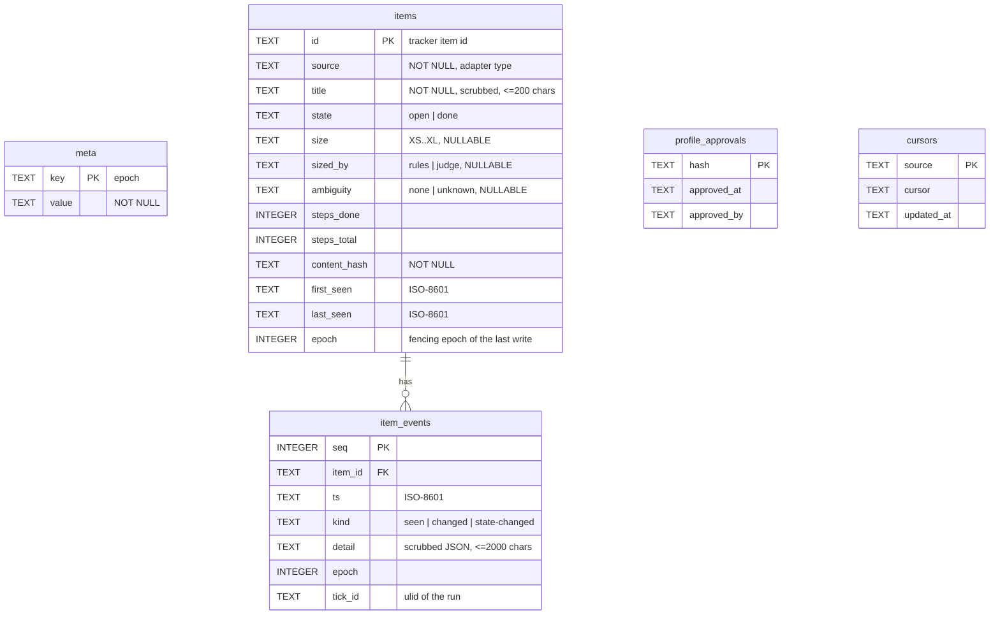

# Sindri Plan 2: Core Package Implementation Plan

> **For agentic workers:** REQUIRED SUB-SKILL: Use superpowers:subagent-driven-development (recommended) or superpowers:executing-plans to implement this plan task-by-task. Steps use checkbox (`- [ ]`) syntax for tracking.

**Goal:** Create the `sindri/` package: profile tooling, the ledger, the singleton lock with fencing, the scrubber, a `plan-file` tracker, `sindri observe`, `sindri doctor` and the CLI output contract. Then **switch them on** for this repo (ring 0), so the remaining Sindri plans are tracked in the ledger, observed as a backlog, and guarded by a secret-scanning pre-commit (spec §13.3, rows 4–6).

**Architecture:** One new TypeScript package, `sindri/`, shaped like `judge/` and `scorer/` (ESM, strict, Vitest, 100% coverage, a thin `cli.ts`). Every command is a function `(args, deps) → CommandResult`, so it is tested without spawning a process; `cli.ts` only wires real dependencies and writes the result. Host facts (hostname, boot id, pid liveness, disk type) and git calls sit behind two small interfaces (`SystemProbe`, `GitRunner`) with real implementations in two files that are the only coverage exclusions besides `cli.ts` and `gen.ts`.

**Tech Stack:** TypeScript 5.7 strict, ESM (Node16 resolution), Node >= 20, Vitest 2 with v8 coverage, Zod 3, better-sqlite3 13 (WAL), `yaml` 2, `zod-to-json-schema` 3; bash for the installer and its test.

**Spec:** `docs/superpowers/specs/2026-10-07-sindri-design.md`. This plan implements, from §13 step 1, "Profile schema and tooling, lock and fencing, scrubber", plus the §13.3 ladder rows for Plan 2: profile + ledger + lock + CLI skeleton, the scrubber pre-commit, and the `plan-file` tracker with `sindri observe`. Sections used: §5.1, §5.2, §8.4, §8.7, §9.1, §9.4, §10.3, §11.1, §11.2, §11.3, §11.5, §13.3, §14.

**Depends on:** Plan 1 merged and switched on (its Task 6 evidence posted). Nothing in this plan imports Plan 1 code.

**Later plans build on this one:**
- Plan 3 (host code index) adds `index` keys to the profile, `sindri repo add`, `sindri index …` and the shape signals.
- Plan 4 (scoping harness) adds the `Source` adapters and `sindri scope`.
- Plan 5 (reuse ports, artifact registry, offline self-evolution) adds the registry tables and `sindri evolve …`.

## Spec amendments in this plan

These are the smallest changes that make the spec buildable as written. Each one is also edited into the spec in Task 11.

1. **New error areas** `CLI`, `LEDGER`, `SCRUB`, `TRACKER` join §10.3's list (the spec's areas don't cover argument errors, schema skew, scrubber refusals or adapter errors).
2. **Plan 2's `observe` sizes items with a deterministic rubric**, labelled `sizedBy: rules`. Model triage (§6, Triage Step) arrives with rollout step 2. The ladder row (§13.3) said "with sizes"; it now says "with rule-based sizes".
3. **The ledger records items, not build sessions, in Plan 2.** §13.3 said "every later build session is recorded in the ledger (items = plan tasks)". Linking sessions to items needs the spool and the tick (step 2). Plan 2 records every plan task and each state change on every `observe` run. The row is reworded to match.
4. **The profile schema is strict and grows by plan.** Unknown keys are errors, so typos fail `validate`. Plan 2 defines only the keys that Plans 2–5 read. Later plans add keys in the same `schemaVersion: 1` (new optional keys are not a breaking change); renames or removals bump `schemaVersion` and add a migration.
5. **`budget.perItem` and `budget.perDay` are optional in Plan 2.** Nothing enforces budgets before rollout step 3a, so `doctor` reports an unset budget as `ok` with "not enforced before step 3a".

## Global Constraints

- Node >= 20, TypeScript 5.7 strict mode, ESM with Node16 module resolution (AGENTS.md Tech Stack).
- No `any` types. No `/* v8 ignore */` annotations (AGENTS.md Merge Gate 5–6).
- 100% line, function, branch and statement coverage, enforced by `npm run test:coverage` (`.agents/rules/testing.md`). Coverage excludes only `src/cli.ts`, `src/gen.ts`, `src/system-real.ts` and `src/git-real.ts`, each a thin wiring file with a smoke test.
- One heavy job at a time: run `npm test` and `npm run typecheck` once per commit, not per edit, and never two at once (global CLAUDE.md).
- Core stays generic: no workplace names, labels, hosts or ticket prefixes in code, defaults or examples (spec §2 Goals, memory "generic core").
- **Never write a full secret-shaped literal in any file.** Build test secrets at runtime by concatenation (`"AKIA" + "ABCDEFGHIJKLMNOP"`). From Task 10 on, the pre-commit scrubber refuses such literals, and this repo is public.
- State lives under `$AW_STATE_DIR/sindri/` (default `~/.agentic-workflow/sindri/`), mode 0700. The ledger is the only database and Sindri is its only writer (spec §5.2).
- CLI output contract (spec §10.3): plain-text state words, `--json` on every read command, no color in Plan 2 (so `NO_COLOR` is trivially honored), exit codes `0` ok, `1` attention needed, `2` error, error codes `SND-<AREA>-<NNN>` registered in `sindri/src/errors.ts` and documented in the generated `docs/sindri/errors.md`.
- Commit format: `type: short description`, atomic commits, attribution lines from the session (AGENTS.md Commit Conventions).

## Review Focus

1. **A crashed `observe` leaves `sindri.lock` behind.** The next run must take it over when the owner is provably dead (dead pid, different boot id, reused pid, or an owner file that's unreadable and older than 60 s) and must respect a live owner. Pinned in Task 4.
2. **Two ticks racing to take over the same stale lock.** Exactly one wins. The loser exits as a no-op and never writes the ledger. Pinned in Task 4 (rename race test) and Task 3 (stale-epoch write rejected).
3. **Plan files with fenced code that contains `### Task` headings or `- [ ]` checkboxes** (the plan template itself shows both inside ```` ```` ```` fences). They must not create tasks or count as steps. Pinned in Task 7.
4. **A profile value that is a real secret** (a pasted token instead of `env:NAME`). `validate` must refuse it and name the key path, without printing the value. Pinned in Task 5.
5. **Scrubber false positives on ordinary engineering text**: git SHAs, UUIDs, ULIDs, ISO dates, phone numbers, semver strings and `sk-` words shorter than a key must survive unchanged. Pinned in Task 2.

---

## File Structure

| File | Responsibility |
|---|---|
| `sindri/package.json`, `tsconfig.json`, `vitest.config.ts` | Package scaffold (mirrors `judge/`) |
| `sindri/src/errors.ts` | Error-code registry and `SindriError` |
| `sindri/src/output.ts` | `CommandResult`, exit codes, text/JSON rendering, error rendering |
| `sindri/src/deps.ts` | The `Deps` bag every command receives; `stateDir()` |
| `sindri/src/ids.ts` | `ulid()` (lowercase Crockford base32) |
| `sindri/src/main.ts` | Command table and `runCli(argv, deps)` |
| `sindri/src/args.ts` | `parseFlags()`: strict `node:util` flag parsing → `SND-CLI-002` |
| `sindri/src/cli.ts` | Process entry: real deps, write output, exit (coverage-excluded) |
| `sindri/src/gen.ts` | Writes generated docs and JSON Schemas (coverage-excluded) |
| `sindri/src/docs/errors-doc.ts` | `renderErrorsDoc()` |
| `sindri/src/scrub/patterns.ts`, `scrub.ts` | Secret and identifier patterns; `makeScrubber()` |
| `sindri/src/ledger/db.ts` | Open, migrate, schema version, epoch, `withEpoch()` |
| `sindri/src/ledger/items.ts` | Item upsert, events, cursors, queries |
| `sindri/src/system.ts` | `SystemProbe` interface |
| `sindri/src/system-real.ts` | Real `SystemProbe` for macOS and Linux (coverage-excluded) |
| `sindri/src/lock/lock.ts` | Singleton tick lock with stale takeover and fencing epoch |
| `sindri/src/profile/schema.ts` | Zod schemas for `profile.yaml` and `repos/<repo>.yaml` |
| `sindri/src/profile/load.ts` | Root resolution, YAML loading, issues, secret-value check, hash |
| `sindri/src/profile/explain.ts` | Effective value plus where it came from |
| `sindri/src/profile/approve.ts` | Approval snapshots, diff, `isApproved()` |
| `sindri/src/profile/commands.ts` | `profile init|validate|explain|migrate|approve` |
| `sindri/src/docs/profile-doc.ts` | `renderProfileDoc()` and `renderSchemas()` |
| `sindri/profile/examples/generic/` | Example profile (shadow mode, `plan-file` tracker) |
| `sindri/schema/profile.schema.json`, `repo.schema.json` | Generated JSON Schemas for editors |
| `sindri/src/git.ts` | `GitRunner` interface |
| `sindri/src/git-real.ts` | Real `GitRunner` via `execFile` (coverage-excluded) |
| `sindri/src/adapters/types.ts` | `Result`, `AdapterError`, `Tracker`, `WorkItem` |
| `sindri/src/adapters/contract.ts` | `trackerContractTests()` (reusable Vitest helper) |
| `sindri/src/adapters/fake-tracker.ts` | In-memory `Tracker` for later plans' tests |
| `sindri/src/adapters/plan-file/parse.ts` | Plan markdown → tasks |
| `sindri/src/adapters/plan-file/tracker.ts` | `plan-file` `Tracker` |
| `sindri/src/adapters/registry.ts` | `makeTracker(profile, repos, deps)` |
| `sindri/src/observe/size.ts` | Rule-based size, ambiguity, trust, next-ness |
| `sindri/src/observe/observe.ts` | `sindri observe` and `sindri ledger` |
| `sindri/src/doctor/doctor.ts` | `sindri doctor` checks (Task 10) |
| `sindri/src/scrub/commands.ts` | `sindri scrub` (stdin, `--staged`, `--install-pre-commit`) |
| `scripts/install-sindri.sh` | Build and install the `~/.local/bin/sindri` wrapper |
| `scripts/tests/install-sindri.test.sh` | Installer test |
| `setup.sh` (modify) | `--with-sindri` opt-in |
| `docs/sindri/README.md`, `errors.md`, `profile.md` | Docs (the last two generated) |
| `planning/ERD.md`, `planning/TESTING.md`, `AGENTS.md`, `.agents/rules/testing.md` (modify) | Ledger schema, merge gate, commands, test baseline |

---

### Task 1: Package scaffold, error registry and output contract

**Files:**
- Create: `sindri/package.json`, `sindri/tsconfig.json`, `sindri/vitest.config.ts`
- Create: `sindri/src/errors.ts`, `sindri/src/output.ts`, `sindri/src/deps.ts`, `sindri/src/ids.ts`, `sindri/src/main.ts`, `sindri/src/cli.ts`, `sindri/src/gen.ts`, `sindri/src/docs/errors-doc.ts`
- Create: `docs/sindri/errors.md` (generated)
- Test: `sindri/tests/errors.test.ts`, `sindri/tests/output.test.ts`, `sindri/tests/ids.test.ts`, `sindri/tests/main.test.ts`, `sindri/tests/helpers.ts`

**Interfaces:**
- Produces:
  - `ERRORS` (a `const` record `code → { summary, fix }`; each task registers the codes it uses, because the registry test fails on a registered-but-unused code), `type ErrorCode = keyof typeof ERRORS`, `class SindriError(code: ErrorCode, message: string)`.
  - `type ExitCode = 0 | 1 | 2`; `interface CommandResult { exitCode: ExitCode; stdout: string; stderr: string }`; `success(text, data, json, exitCode?)`; `failure(code, message, json)`; `fromError(e, json)`.
  - `interface Deps { env; cwd; home; now(): Date }` (later tasks add fields); `awStateDir(deps): string` (`$AW_STATE_DIR`); `stateDir(deps): string` (`$AW_STATE_DIR/sindri`).
  - `ulid(now?: Date): string` — 26 lowercase Crockford base32 characters.
  - `type Command = (args: string[], deps: Deps) => Promise<CommandResult>`; `COMMANDS: Record<string, { summary: string; run: Command }>`; `runCli(argv: string[], deps: Deps): Promise<CommandResult>`.
  - `renderErrorsDoc(): string`.
  - Test helper `makeDeps(overrides?: Partial<Deps>): Deps` in `tests/helpers.ts`, with a fresh temp `AW_STATE_DIR`.

- [ ] **Step 1: Create the package scaffold**

`sindri/package.json`:

```json
{
  "name": "@agentic-workflow/sindri",
  "version": "0.1.0",
  "description": "Sindri: always-on local agent-work harness (core package)",
  "type": "module",
  "bin": {
    "sindri": "dist/cli.js"
  },
  "scripts": {
    "build": "tsc",
    "gen": "npm run build && node dist/gen.js",
    "test": "vitest run",
    "test:coverage": "vitest run --coverage",
    "typecheck": "tsc --noEmit"
  },
  "engines": {
    "node": ">=20"
  },
  "dependencies": {
    "better-sqlite3": "^13.0.3",
    "yaml": "^2.8.1",
    "zod": "^3.24.2",
    "zod-to-json-schema": "^3.24.6"
  },
  "devDependencies": {
    "@types/better-sqlite3": "^7.6.12",
    "@types/node": "^22.10.0",
    "@vitest/coverage-v8": "^2.1.9",
    "typescript": "^5.7.0",
    "vitest": "^2.1.9"
  },
  "allowScripts": {
    "better-sqlite3@13.0.3": true
  }
}
```

`sindri/tsconfig.json` is a copy of `judge/tsconfig.json` (same compiler options, `rootDir: src`, `outDir: dist`, excludes `tests`).

`sindri/vitest.config.ts`:

```ts
import { defineConfig } from "vitest/config";

export default defineConfig({
  test: {
    globals: false,
    testTimeout: 10_000,
    coverage: {
      provider: "v8",
      include: ["src/**/*.ts"],
      // Thin wiring files: process entry, doc generator, and the two real
      // host/git implementations (each has a smoke test in tests/real.test.ts).
      exclude: ["src/cli.ts", "src/gen.ts", "src/system-real.ts", "src/git-real.ts"],
      thresholds: { lines: 100, functions: 100, branches: 100, statements: 100 },
    },
  },
});
```

Run: `cd sindri && npm install`
Expected: `added N packages` and a new `sindri/package-lock.json`.

- [ ] **Step 2: Write the failing tests**

`sindri/tests/helpers.ts`:

```ts
import fs from "node:fs";
import os from "node:os";
import path from "node:path";

import type { Deps } from "../src/deps.js";

export function tempDir(prefix = "sindri-test-"): string {
  return fs.mkdtempSync(path.join(os.tmpdir(), prefix));
}

// A Deps bag that never touches the real ~/.agentic-workflow: AW_STATE_DIR
// points at a fresh temp dir. Later tasks add fields here as Deps grows.
export function makeDeps(overrides: Partial<Deps> = {}): Deps {
  const home = tempDir("sindri-home-");
  return {
    env: { AW_STATE_DIR: path.join(home, ".agentic-workflow") },
    cwd: home,
    home,
    now: () => new Date("2026-10-08T12:00:00.000Z"),
    ...overrides,
  };
}
```

`sindri/tests/errors.test.ts`:

```ts
import fs from "node:fs";
import path from "node:path";
import { describe, expect, it } from "vitest";

import { ERRORS, SindriError } from "../src/errors.js";
import { renderErrorsDoc } from "../src/docs/errors-doc.js";

const SRC = path.resolve(import.meta.dirname, "../src");
const CODE_RE = /SND-[A-Z]+-\d{3}/g;

function sourceFiles(dir: string): string[] {
  return fs.readdirSync(dir, { withFileTypes: true }).flatMap((e) => {
    const p = path.join(dir, e.name);
    if (e.isDirectory()) return sourceFiles(p);
    return p.endsWith(".ts") ? [p] : [];
  });
}

describe("error registry", () => {
  it("every code matches SND-<AREA>-<NNN> and has a summary and a fix", () => {
    for (const [code, def] of Object.entries(ERRORS)) {
      expect(code).toMatch(/^SND-[A-Z]+-\d{3}$/);
      expect(def.summary.length).toBeGreaterThan(0);
      expect(def.fix.length).toBeGreaterThan(0);
    }
  });

  it("every code used in src is registered, and every registered code is used", () => {
    const used = new Set<string>();
    for (const file of sourceFiles(SRC)) {
      if (file.endsWith(path.join("src", "errors.ts"))) continue;
      for (const m of fs.readFileSync(file, "utf8").matchAll(CODE_RE)) used.add(m[0]);
    }
    const registered = new Set(Object.keys(ERRORS));
    expect([...used].filter((c) => !registered.has(c))).toEqual([]);
    expect([...registered].filter((c) => !used.has(c))).toEqual([]);
  });

  it("docs/sindri/errors.md is up to date (run: cd sindri && npm run gen)", () => {
    const doc = fs.readFileSync(path.resolve(import.meta.dirname, "../../docs/sindri/errors.md"), "utf8");
    expect(doc).toBe(renderErrorsDoc());
  });

  it("SindriError carries its code", () => {
    const e = new SindriError("SND-CLI-001", "nope");
    expect(e.code).toBe("SND-CLI-001");
    expect(e.message).toBe("nope");
    expect(e.name).toBe("SindriError");
  });
});
```

`sindri/tests/output.test.ts`:

```ts
import { describe, expect, it } from "vitest";

import { SindriError } from "../src/errors.js";
import { failure, fromError, success } from "../src/output.js";

describe("output contract", () => {
  it("success prints text with a trailing newline, or JSON", () => {
    expect(success("hello", { a: 1 }, false)).toEqual({ exitCode: 0, stdout: "hello\n", stderr: "" });
    expect(success("hello\n", { a: 1 }, false).stdout).toBe("hello\n");
    expect(success("hello", { a: 1 }, true).stdout).toBe('{\n  "a": 1\n}\n');
    expect(success("x", null, false, 1).exitCode).toBe(1);
  });

  it("failure prints code, message and fix to stderr, or a JSON error to stdout", () => {
    const text = failure("SND-CLI-001", "unknown command: frob", false);
    expect(text.exitCode).toBe(2);
    expect(text.stdout).toBe("");
    expect(text.stderr).toBe("SND-CLI-001 unknown command: frob\n  fix: Run `sindri help` for the command list.\n");
    const json = failure("SND-CLI-001", "unknown command: frob", true);
    expect(JSON.parse(json.stdout)).toEqual({
      ok: false,
      error: { code: "SND-CLI-001", message: "unknown command: frob", fix: "Run `sindri help` for the command list." },
    });
    expect(json.stderr).toBe("");
  });

  it("fromError renders a SindriError and rethrows anything else", () => {
    expect(fromError(new SindriError("SND-CLI-001", "bad"), false).stderr).toContain("SND-CLI-001 bad");
    expect(() => fromError(new Error("boom"), false)).toThrow("boom");
  });
});
```

`sindri/tests/ids.test.ts`:

```ts
import { describe, expect, it } from "vitest";

import { ulid } from "../src/ids.js";

describe("ulid", () => {
  it("is 26 lowercase Crockford base32 characters", () => {
    expect(ulid()).toMatch(/^[0-9a-hjkmnp-tv-z]{26}$/);
  });

  it("sorts by time", () => {
    const a = ulid(new Date("2026-01-01T00:00:00Z"));
    const b = ulid(new Date("2026-01-02T00:00:00Z"));
    expect(a < b).toBe(true);
  });
});
```

`sindri/tests/main.test.ts`:

```ts
import { describe, expect, it } from "vitest";

import { stateDir } from "../src/deps.js";
import { runCli } from "../src/main.js";
import { makeDeps } from "./helpers.js";

describe("runCli", () => {
  it("prints help for no args, help and --help", async () => {
    for (const argv of [[], ["help"], ["--help"]]) {
      const r = await runCli(argv, makeDeps());
      expect(r.exitCode).toBe(0);
      expect(r.stdout).toContain("Usage: sindri <command>");
      expect(r.stdout).toContain("help");
    }
  });

  it("prints the version", async () => {
    const r = await runCli(["--version"], makeDeps());
    expect(r.stdout).toMatch(/^\d+\.\d+\.\d+\n$/);
  });

  it("rejects an unknown command with SND-CLI-001 and exit 2", async () => {
    const r = await runCli(["frob"], makeDeps());
    expect(r.exitCode).toBe(2);
    expect(r.stderr).toContain("SND-CLI-001 unknown command: frob");
  });

  it("stateDir honors AW_STATE_DIR and falls back to ~/.agentic-workflow", () => {
    expect(stateDir(makeDeps({ env: { AW_STATE_DIR: "/x" } }))).toBe("/x/sindri");
    expect(stateDir(makeDeps({ env: {}, home: "/h" }))).toBe("/h/.agentic-workflow/sindri");
  });
});
```

- [ ] **Step 3: Run the tests to verify they fail**

Run: `cd sindri && npx vitest run`
Expected: FAIL, every file with `Failed to load url ../src/errors.js` (or the matching module).

- [ ] **Step 4: Implement**

`sindri/src/errors.ts`:

```ts
// Stable error codes: SND-<AREA>-<NNN>. Every code used in src/ must be
// registered here, and every registered code must be used (tests/errors.test.ts).
// docs/sindri/errors.md is generated from this table (npm run gen).
export interface ErrorDef {
  readonly summary: string;
  readonly fix: string;
}

export const ERRORS = {
  "SND-CLI-001": { summary: "Unknown command.", fix: "Run `sindri help` for the command list." },
} as const satisfies Record<string, ErrorDef>;

export type ErrorCode = keyof typeof ERRORS;

export class SindriError extends Error {
  constructor(
    readonly code: ErrorCode,
    message: string,
  ) {
    super(message);
    this.name = "SindriError";
  }
}
```

`sindri/src/output.ts`:

```ts
import { ERRORS, SindriError, type ErrorCode } from "./errors.js";

// Spec §10.3: 0 ok, 1 attention needed, 2 error.
export type ExitCode = 0 | 1 | 2;

export interface CommandResult {
  exitCode: ExitCode;
  stdout: string;
  stderr: string;
}

function line(text: string): string {
  return text.endsWith("\n") ? text : `${text}\n`;
}

export function success(text: string, data: unknown, json: boolean, exitCode: ExitCode = 0): CommandResult {
  return { exitCode, stdout: json ? `${JSON.stringify(data, null, 2)}\n` : line(text), stderr: "" };
}

export function failure(code: ErrorCode, message: string, json: boolean): CommandResult {
  const fix = ERRORS[code].fix;
  if (json) {
    return { exitCode: 2, stdout: `${JSON.stringify({ ok: false, error: { code, message, fix } }, null, 2)}\n`, stderr: "" };
  }
  return { exitCode: 2, stdout: "", stderr: `${code} ${message}\n  fix: ${fix}\n` };
}

export function fromError(e: unknown, json: boolean): CommandResult {
  if (e instanceof SindriError) return failure(e.code, e.message, json);
  throw e;
}
```

`sindri/src/deps.ts`:

```ts
import path from "node:path";

// Everything a command needs from the outside world. Commands never read
// process.env, process.cwd() or the clock directly, so tests pass a fake.
export interface Deps {
  env: NodeJS.ProcessEnv;
  cwd: string;
  home: string;
  now: () => Date;
}

// $AW_STATE_DIR, default ~/.agentic-workflow (shared with judge and scorer).
export function awStateDir(deps: Deps): string {
  return deps.env.AW_STATE_DIR ?? path.join(deps.home, ".agentic-workflow");
}

export function stateDir(deps: Deps): string {
  return path.join(awStateDir(deps), "sindri");
}
```

`sindri/src/ids.ts`:

```ts
import { randomBytes } from "node:crypto";

// ULID (https://github.com/ulid/spec), lowercased so it fits snd-<ulid> names
// (spec §8.6: ^snd-[0-9a-z]{26}$). 48-bit ms timestamp + 80 random bits.
const ALPHABET = "0123456789abcdefghjkmnpqrstvwxyz";

export function ulid(now: Date = new Date()): string {
  let t = now.getTime();
  let time = "";
  for (let i = 0; i < 10; i++) {
    time = ALPHABET[t % 32] + time;
    t = Math.floor(t / 32);
  }
  const bytes = randomBytes(16);
  let rand = "";
  for (let i = 0; i < 16; i++) rand += ALPHABET[bytes[i] % 32];
  return time + rand;
}
```

`sindri/src/main.ts`:

```ts
import { createRequire } from "node:module";

import type { Deps } from "./deps.js";
import { failure, success, type CommandResult } from "./output.js";

export type Command = (args: string[], deps: Deps) => Promise<CommandResult>;

// Later tasks register their commands here.
export const COMMANDS: Record<string, { summary: string; run: Command }> = {};

function version(): string {
  const require = createRequire(import.meta.url);
  return (require("../package.json") as { version: string }).version;
}

function help(): string {
  const rows = Object.entries(COMMANDS)
    .sort(([a], [b]) => a.localeCompare(b))
    .map(([name, c]) => `  ${name.padEnd(10)} ${c.summary}`);
  return ["Usage: sindri <command> [flags]", "", "Commands:", "  help       Show this list", ...rows, "", "Every read command takes --json."].join("\n");
}

export async function runCli(argv: string[], deps: Deps): Promise<CommandResult> {
  const [name, ...rest] = argv;
  if (name === undefined || name === "help" || name === "--help") return success(help(), null, false);
  if (name === "--version") return success(version(), null, false);
  const command = COMMANDS[name];
  if (command === undefined) return failure("SND-CLI-001", `unknown command: ${name}`, rest.includes("--json"));
  return command.run(rest, deps);
}
```

`sindri/src/cli.ts`:

```ts
#!/usr/bin/env node
import os from "node:os";

import { runCli } from "./main.js";

const result = await runCli(process.argv.slice(2), {
  env: process.env,
  cwd: process.cwd(),
  home: os.homedir(),
  now: () => new Date(),
});
process.stdout.write(result.stdout);
process.stderr.write(result.stderr);
process.exitCode = result.exitCode;
```

`sindri/src/docs/errors-doc.ts`:

```ts
import { ERRORS } from "../errors.js";

export function renderErrorsDoc(): string {
  const rows = Object.entries(ERRORS)
    .sort(([a], [b]) => a.localeCompare(b))
    .map(([code, d]) => `| \`${code}\` | ${d.summary} | ${d.fix} |`);
  return [
    "# Sindri error codes",
    "",
    "Generated from `sindri/src/errors.ts` by `cd sindri && npm run gen`. Do not edit by hand.",
    "",
    "| Code | Meaning | Fix |",
    "|---|---|---|",
    ...rows,
    "",
  ].join("\n");
}
```

`sindri/src/gen.ts` (Task 5 adds the schema and profile docs to it):

```ts
import fs from "node:fs";
import path from "node:path";
import { fileURLToPath } from "node:url";

import { renderErrorsDoc } from "./docs/errors-doc.js";

const repoRoot = path.resolve(path.dirname(fileURLToPath(import.meta.url)), "../..");
function write(rel: string, text: string): void {
  const file = path.join(repoRoot, rel);
  fs.mkdirSync(path.dirname(file), { recursive: true });
  fs.writeFileSync(file, text);
  console.log(`wrote ${rel}`);
}

write("docs/sindri/errors.md", renderErrorsDoc());
```

- [ ] **Step 5: Generate the doc and run the tests**

Run: `cd sindri && npm run gen && npx vitest run`
Expected: `wrote docs/sindri/errors.md`, then all tests in `errors`, `output`, `ids` and `main` PASS.

Run: `cd sindri && npm run typecheck && npm run test:coverage`
Expected: no type errors; coverage 100% on all four metrics.

- [ ] **Step 6: Commit**

```bash
git add sindri/package.json sindri/package-lock.json sindri/tsconfig.json sindri/vitest.config.ts sindri/src sindri/tests docs/sindri/errors.md
git commit -m "feat: sindri package scaffold, error registry and output contract"
```

---

### Task 2: Scrubber

The scrubber (spec §8.4) runs on every fetched record, every ledger free-text field and, later, every pack and egress. Hits record a kind and a span, never the matched value.

**Files:**
- Create: `sindri/src/scrub/patterns.ts`, `sindri/src/scrub/scrub.ts`
- Modify: `sindri/src/errors.ts` (add `SND-SCRUB-001`)
- Test: `sindri/tests/scrub.test.ts`

**Interfaces:**
- Produces:
  - `interface ScrubPattern { kind: string; re: RegExp; valueGroup?: number }` (when `valueGroup` is set, only that capture group is redacted, so `GITHUB_TOKEN=` stays readable).
  - `BUILTIN_PATTERNS: readonly ScrubPattern[]`.
  - `interface ScrubHit { kind: string; start: number; end: number }`.
  - `interface Scrubber { find(text: string): ScrubHit[]; scrub(text: string): { text: string; hits: ScrubHit[] }; scrubDeep<T>(value: T): T }`.
  - `makeScrubber(extra?: readonly ScrubPattern[]): Scrubber`.
  - `compileExtraPatterns(specs: readonly { kind: string; regex: string }[]): ScrubPattern[]` — throws `SindriError("SND-SCRUB-001")` naming the index of a pattern that doesn't compile.

- [ ] **Step 1: Write the failing tests**

`sindri/tests/scrub.test.ts` (every secret is built by concatenation; never paste a whole one):

```ts
import { describe, expect, it } from "vitest";

import { SindriError } from "../src/errors.js";
import { compileExtraPatterns, makeScrubber } from "../src/scrub/scrub.js";

const s = makeScrubber();

// [input, kind, the part that must disappear]
const CASES: [string, string, string][] = [
  ["key: -----BEGIN " + "RSA PRIVATE KEY-----\nMIIabc\n-----END RSA PRIVATE KEY-----", "private-key", "MIIabc"],
  ["token " + "sk-" + "ant-oat01-" + "a".repeat(30), "anthropic-key", "a".repeat(30)],
  ["key " + "sk-" + "proj-" + "b".repeat(30), "openai-key", "b".repeat(30)],
  ["aws " + "AKIA" + "ABCDEFGHIJKLMNOP", "aws-access-key", "ABCDEFGHIJKLMNOP"],
  ["gh " + "ghp" + "_" + "c".repeat(36), "github-token", "c".repeat(36)],
  ["pat " + "github" + "_pat_" + "d".repeat(30), "github-token", "d".repeat(30)],
  ["slack " + "xox" + "b-" + "1234567890-abcdef", "slack-token", "1234567890-abcdef"],
  ["linear " + "lin" + "_api_" + "e".repeat(40), "linear-key", "e".repeat(40)],
  ["jwt " + "eyJ" + "hbGciOiJIUzI1" + "." + "eyJzdWIiOiIx" + "." + "SflKxwRJSMeKKF2", "jwt", "SflKxwRJSMeKKF2"],
  ["Authorization: " + "Bearer " + "f".repeat(30), "bearer", "f".repeat(30)],
  ["https://" + "user:" + "hunter2pass" + "@example.com/x", "credentialed-url", "hunter2pass"],
  ["GITHUB_" + "TOKEN=" + "g".repeat(24), "secret-assignment", "g".repeat(24)],
  ["ssn " + "123" + "-45-" + "6789", "ssn", "6789"],
  ["MRN" + ": 12345678", "mrn", "12345678"],
];

describe("scrubber", () => {
  it.each(CASES)("redacts %#", (input, kind, secret) => {
    const hits = s.find(input);
    expect(hits.map((h) => h.kind)).toEqual([kind]);
    const out = s.scrub(input);
    expect(out.text).not.toContain(secret);
    expect(out.text).toContain(`[REDACTED:${kind}]`);
    expect(JSON.stringify(out.hits)).not.toContain(secret);
  });

  it("keeps the variable name and URL host readable", () => {
    expect(s.scrub("GITHUB_" + "TOKEN=" + "g".repeat(24)).text).toBe("GITHUB_TOKEN=[REDACTED:secret-assignment]");
    expect(s.scrub("https://" + "user:" + "hunter2pass" + "@example.com/x").text).toBe(
      "https://user:[REDACTED:credentialed-url]@example.com/x",
    );
  });

  it("reports one hit for overlapping matches, using the first pattern's kind", () => {
    const hits = s.find("sk-" + "ant-api03-" + "h".repeat(40));
    expect(hits).toHaveLength(1);
    expect(hits[0].kind).toBe("anthropic-key");
  });

  it("leaves ordinary engineering text alone (Review Focus 5)", () => {
    const text = [
      "commit 3f786850e387550fdab836ed7e6dc881de23001b",
      "uuid 123e4567-e89b-12d3-a456-426614174000",
      "ulid 01k6zq7v8m3n4p5q6r7s8t9v0w",
      "date 2026-10-08T12:00:00Z",
      "phone 555-123-4567",
      "version 1.2.3-beta.4",
      "use sk-learn for this",
      "the risk-assessment-for-the-quarterly-plan doc",
      "token: short",
    ].join("\n");
    expect(s.find(text)).toEqual([]);
    expect(s.scrub(text).text).toBe(text);
  });

  it("scrubs strings and keys deep inside objects and arrays", () => {
    const secret = "AKIA" + "ABCDEFGHIJKLMNOP";
    const out = s.scrubDeep({ a: [secret, 1, null], [secret]: { b: secret }, n: 2 });
    expect(JSON.stringify(out)).not.toContain(secret);
    expect(out).toEqual({
      a: ["[REDACTED:aws-access-key]", 1, null],
      "[REDACTED:aws-access-key]": { b: "[REDACTED:aws-access-key]" },
      n: 2,
    });
  });

  it("adds profile patterns (add-only) and rejects ones that don't compile", () => {
    const extra = compileExtraPatterns([{ kind: "employee-id", regex: "\\bEMP-\\d{6}\\b" }]);
    const withExtra = makeScrubber(extra);
    expect(withExtra.scrub("id EMP-123456").text).toBe("id [REDACTED:employee-id]");
    expect(withExtra.find("AKIA" + "ABCDEFGHIJKLMNOP")[0].kind).toBe("aws-access-key");
    expect(() => compileExtraPatterns([{ kind: "ok", regex: "a" }, { kind: "bad", regex: "(" }])).toThrow(SindriError);
    try {
      compileExtraPatterns([{ kind: "bad", regex: "(" }]);
    } catch (e) {
      expect((e as SindriError).code).toBe("SND-SCRUB-001");
      expect((e as SindriError).message).toContain("scrub.extraPatterns[0]");
    }
  });
});
```

- [ ] **Step 2: Run the tests to verify they fail**

Run: `cd sindri && npx vitest run tests/scrub.test.ts`
Expected: FAIL with `Failed to load url ../src/scrub/scrub.js`.

- [ ] **Step 3: Implement**

`sindri/src/scrub/patterns.ts`:

```ts
// Secret and identifier shapes (spec §8.4): config/hooks/detect-secrets.sh,
// judge/src/redact.ts, plus private keys, credentialed URLs and MRN/SSN shapes.
// Order matters: when two patterns overlap, the earlier one names the hit.
// Deliberately absent: judge's bare 40-hex rule, which would erase git SHAs.
export interface ScrubPattern {
  kind: string;
  re: RegExp;
  valueGroup?: number;
}

export const BUILTIN_PATTERNS: readonly ScrubPattern[] = [
  { kind: "private-key", re: /-----BEGIN [A-Z ]*PRIVATE KEY-----[\s\S]*?-----END [A-Z ]*PRIVATE KEY-----/g },
  { kind: "anthropic-key", re: /\bsk-ant-[A-Za-z0-9_-]{20,}/g },
  { kind: "openai-key", re: /\bsk-(?:proj-)?[A-Za-z0-9_-]{20,}/g },
  { kind: "aws-access-key", re: /\bA(?:KIA|SIA)[0-9A-Z]{16}\b/g },
  { kind: "github-token", re: /\b(?:gh[pousr]_[A-Za-z0-9_]{30,}|github_pat_[A-Za-z0-9_]{22,})/g },
  { kind: "slack-token", re: /\bxox[abprs]-[A-Za-z0-9-]{10,}/g },
  { kind: "linear-key", re: /\blin_(?:api|oauth)_[A-Za-z0-9]{32,}/g },
  { kind: "jwt", re: /\beyJ[A-Za-z0-9_-]{8,}\.[A-Za-z0-9_-]{8,}\.[A-Za-z0-9_-]{8,}/g },
  { kind: "bearer", re: /\bBearer\s+([A-Za-z0-9._~+/=-]{20,})/gi, valueGroup: 1 },
  { kind: "credentialed-url", re: /\b[a-z][a-z0-9+.-]*:\/\/[^\s/:@]+:([^\s/@]+)@/gi, valueGroup: 1 },
  {
    kind: "secret-assignment",
    re: /\b(?:[A-Za-z0-9]+_)*(?:API_?KEY|SECRET(?:_KEY)?|TOKEN|PASSWORD|PRIVATE_KEY|ACCESS_KEY)\s*[=:]\s*['"]?([A-Za-z0-9+/=_.,-]{20,})/gi,
    valueGroup: 1,
  },
  { kind: "ssn", re: /\b\d{3}-\d{2}-\d{4}\b/g },
  { kind: "mrn", re: /\bMRN[\s:#-]*(\d{6,10})\b/gi, valueGroup: 1 },
];
```

`sindri/src/scrub/scrub.ts`:

```ts
import { SindriError } from "../errors.js";
import { BUILTIN_PATTERNS, type ScrubPattern } from "./patterns.js";

export type { ScrubPattern } from "./patterns.js";

export interface ScrubHit {
  kind: string;
  start: number;
  end: number;
}

export interface Scrubber {
  find(text: string): ScrubHit[];
  scrub(text: string): { text: string; hits: ScrubHit[] };
  scrubDeep<T>(value: T): T;
}

function withFlags(re: RegExp): RegExp {
  const flags = new Set([...re.flags, "g", "d"]);
  return new RegExp(re.source, [...flags].join(""));
}

export function makeScrubber(extra: readonly ScrubPattern[] = []): Scrubber {
  const patterns = [...BUILTIN_PATTERNS, ...extra].map((p, order) => ({ ...p, re: withFlags(p.re), order }));

  function find(text: string): ScrubHit[] {
    const raw: (ScrubHit & { order: number })[] = [];
    for (const p of patterns) {
      for (const m of text.matchAll(p.re)) {
        const span = p.valueGroup !== undefined && m.indices?.[p.valueGroup] ? m.indices[p.valueGroup] : [m.index, m.index + m[0].length];
        raw.push({ kind: p.kind, start: span[0], end: span[1], order: p.order });
      }
    }
    raw.sort((a, b) => a.start - b.start || a.order - b.order);
    const merged: ScrubHit[] = [];
    for (const h of raw) {
      const last = merged.at(-1);
      if (last !== undefined && h.start < last.end) {
        last.end = Math.max(last.end, h.end);
      } else {
        merged.push({ kind: h.kind, start: h.start, end: h.end });
      }
    }
    return merged;
  }

  function scrub(text: string): { text: string; hits: ScrubHit[] } {
    const hits = find(text);
    let out = text;
    for (const h of [...hits].reverse()) out = `${out.slice(0, h.start)}[REDACTED:${h.kind}]${out.slice(h.end)}`;
    return { text: out, hits };
  }

  function scrubDeep<T>(value: T): T {
    const walk = (v: unknown): unknown => {
      if (typeof v === "string") return scrub(v).text;
      if (Array.isArray(v)) return v.map(walk);
      if (v !== null && typeof v === "object") {
        return Object.fromEntries(Object.entries(v).map(([k, x]) => [scrub(k).text, walk(x)]));
      }
      return v;
    };
    return walk(value) as T;
  }

  return { find, scrub, scrubDeep };
}

export function compileExtraPatterns(specs: readonly { kind: string; regex: string }[]): ScrubPattern[] {
  return specs.map((spec, i) => {
    try {
      return { kind: spec.kind, re: new RegExp(spec.regex, "g") };
    } catch (e) {
      throw new SindriError("SND-SCRUB-001", `scrub.extraPatterns[${i}] does not compile: ${(e as Error).message}`);
    }
  });
}
```

Add to `ERRORS` in `sindri/src/errors.ts`:

```ts
  "SND-SCRUB-001": { summary: "A profile scrub pattern does not compile.", fix: "Fix the regex at the named scrub.extraPatterns index, then run `sindri profile validate`." },
```

- [ ] **Step 4: Run the tests**

Run: `cd sindri && npm run gen && npx vitest run`
Expected: all tests PASS (including `errors.test.ts`, which now finds `SND-SCRUB-001` in `scrub.ts` and in the regenerated `errors.md`).

- [ ] **Step 5: Commit**

```bash
git add sindri/src/scrub sindri/src/errors.ts sindri/tests/scrub.test.ts docs/sindri/errors.md
git commit -m "feat: sindri scrubber for secrets and identifier shapes"
```

---

### Task 3: Ledger (SQLite, migrations, fencing epoch)

**Files:**
- Create: `sindri/src/ledger/db.ts`, `sindri/src/ledger/items.ts`
- Modify: `sindri/src/errors.ts` (add `SND-LEDGER-001`, `SND-LOCK-003`)
- Modify: `planning/ERD.md` (add a "Sindri ledger" section)
- Test: `sindri/tests/ledger.test.ts`

**Interfaces:**
- Consumes: `Scrubber` (Task 2), `SindriError` (Task 1).
- Produces (`ledger/db.ts`):
  - `type Ledger = Database.Database`; `LEDGER_SCHEMA_VERSION = 1`.
  - `openLedger(file: string): Ledger` (WAL, `foreign_keys`, `busy_timeout`, migrations; file 0600, dir 0700); `openMemoryLedger(): Ledger`; `ledgerPath(stateDirPath: string): string`.
  - `schemaVersion(db): number`; `currentEpoch(db): number`; `bumpEpoch(db): number`; `withEpoch<T>(db, epoch: number, fn: () => T): T` (throws `SND-LOCK-003` when `epoch` isn't current, without running `fn`).
- Produces (`ledger/items.ts`):
  - `interface ObservedItem { id: string; source: string; title: string; state: "open" | "done"; size: string | null; sizedBy: string | null; ambiguity: string | null; stepsDone: number; stepsTotal: number; contentHash: string }`.
  - `interface WriteCtx { epoch: number; tickId: string; now: Date; scrubber: Scrubber }`.
  - `upsertItem(db, ctx, item): "new" | "changed" | "same"` — call inside `withEpoch`.
  - `listItems(db, filter?: { state?: "open" | "done" }): ItemRow[]`; `listEvents(db, filter: { itemId?: string; since?: Date; limit?: number }): EventRow[]`.
  - `getCursor(db, source): string | null`; `setCursor(db, source, cursor, now: Date): void`.

- [ ] **Step 1: Write the failing tests**

`sindri/tests/ledger.test.ts`:

```ts
import fs from "node:fs";
import path from "node:path";
import Database from "better-sqlite3";
import { describe, expect, it } from "vitest";

import { SindriError } from "../src/errors.js";
import {
  bumpEpoch, currentEpoch, LEDGER_SCHEMA_VERSION, ledgerPath, openLedger, openMemoryLedger, schemaVersion, withEpoch,
} from "../src/ledger/db.js";
import { getCursor, listEvents, listItems, setCursor, upsertItem, type ObservedItem, type WriteCtx } from "../src/ledger/items.js";
import { makeScrubber } from "../src/scrub/scrub.js";
import { tempDir } from "./helpers.js";

const item = (over: Partial<ObservedItem> = {}): ObservedItem => ({
  id: "plan-x.t1", source: "plan-file", title: "Task one", state: "open", size: "S", sizedBy: "rules",
  ambiguity: "none", stepsDone: 0, stepsTotal: 5, contentHash: "h1", ...over,
});

function ctx(db: ReturnType<typeof openMemoryLedger>, now = "2026-10-08T12:00:00.000Z"): WriteCtx {
  return { epoch: currentEpoch(db), tickId: "tick-1", now: new Date(now), scrubber: makeScrubber() };
}

describe("ledger db", () => {
  it("creates a WAL ledger with private permissions and migrates idempotently", () => {
    const dir = path.join(tempDir(), "sindri");
    const file = ledgerPath(dir);
    expect(file).toBe(path.join(dir, "ledger.db"));
    const db = openLedger(file);
    expect(db.pragma("journal_mode", { simple: true })).toBe("wal");
    expect(schemaVersion(db)).toBe(LEDGER_SCHEMA_VERSION);
    expect(fs.statSync(file).mode & 0o777).toBe(0o600);
    expect(fs.statSync(dir).mode & 0o777).toBe(0o700);
    db.close();
    const again = openLedger(file);
    expect(schemaVersion(again)).toBe(LEDGER_SCHEMA_VERSION);
    again.close();
  });

  it("refuses a ledger written by a newer sindri (SND-LEDGER-001)", () => {
    const file = path.join(tempDir(), "ledger.db");
    const raw = new Database(file);
    raw.pragma("user_version = 99");
    raw.close();
    expect(() => openLedger(file)).toThrow(/SND-LEDGER-001|newer than this sindri/);
    try {
      openLedger(file);
    } catch (e) {
      expect((e as SindriError).code).toBe("SND-LEDGER-001");
    }
  });

  it("bumps the epoch and rejects writes under a stale one (SND-LOCK-003)", () => {
    const db = openMemoryLedger();
    expect(currentEpoch(db)).toBe(0);
    expect(bumpEpoch(db)).toBe(1);
    expect(withEpoch(db, 1, () => "ran")).toBe("ran");
    expect(bumpEpoch(db)).toBe(2);
    let ran = false;
    expect(() => withEpoch(db, 1, () => { ran = true; })).toThrow(SindriError);
    expect(ran).toBe(false);
  });
});

describe("ledger items", () => {
  it("records new, same and changed items with events", () => {
    const db = openMemoryLedger();
    bumpEpoch(db);
    expect(withEpoch(db, 1, () => upsertItem(db, ctx(db), item()))).toBe("new");
    expect(withEpoch(db, 1, () => upsertItem(db, ctx(db, "2026-10-08T13:00:00.000Z"), item()))).toBe("same");
    expect(withEpoch(db, 1, () => upsertItem(db, ctx(db), item({ contentHash: "h2", stepsDone: 2 })))).toBe("changed");
    expect(withEpoch(db, 1, () => upsertItem(db, ctx(db), item({ contentHash: "h3", state: "done", stepsDone: 5 })))).toBe("changed");
    const [row] = listItems(db);
    expect(row).toMatchObject({ id: "plan-x.t1", state: "done", steps_done: 5, last_seen: "2026-10-08T12:00:00.000Z", epoch: 1 });
    expect(listItems(db, { state: "open" })).toEqual([]);
    expect(listEvents(db, { itemId: "plan-x.t1" }).map((e) => e.kind)).toEqual(["seen", "changed", "state-changed"]);
    const stateEvent = listEvents(db, { itemId: "plan-x.t1" })[2];
    expect(JSON.parse(stateEvent.detail)).toEqual({ from: "open", to: "done" });
  });

  it("scrubs and caps the stored title", () => {
    const db = openMemoryLedger();
    bumpEpoch(db);
    const secret = "AKIA" + "ABCDEFGHIJKLMNOP";
    withEpoch(db, 1, () => upsertItem(db, ctx(db), item({ title: `leak ${secret} ${"x".repeat(400)}` })));
    const [row] = listItems(db);
    expect(row.title).not.toContain(secret);
    expect(row.title.length).toBeLessThanOrEqual(200);
  });

  it("filters events by time and limit, and stores cursors", () => {
    const db = openMemoryLedger();
    bumpEpoch(db);
    withEpoch(db, 1, () => upsertItem(db, ctx(db, "2026-10-01T00:00:00.000Z"), item({ id: "a.t1" })));
    withEpoch(db, 1, () => upsertItem(db, ctx(db, "2026-10-08T00:00:00.000Z"), item({ id: "a.t2" })));
    expect(listEvents(db, { since: new Date("2026-10-05T00:00:00.000Z") }).map((e) => e.item_id)).toEqual(["a.t2"]);
    expect(listEvents(db, { limit: 1 })).toHaveLength(1);
    expect(getCursor(db, "plan-file")).toBeNull();
    setCursor(db, "plan-file", "c1", new Date("2026-10-08T00:00:00.000Z"));
    setCursor(db, "plan-file", "c2", new Date("2026-10-08T01:00:00.000Z"));
    expect(getCursor(db, "plan-file")).toBe("c2");
  });
});
```

- [ ] **Step 2: Run the tests to verify they fail**

Run: `cd sindri && npx vitest run tests/ledger.test.ts`
Expected: FAIL with `Failed to load url ../src/ledger/db.js`.

- [ ] **Step 3: Implement**

`sindri/src/ledger/db.ts`:

```ts
import fs from "node:fs";
import path from "node:path";
import Database from "better-sqlite3";

import { SindriError } from "../errors.js";

export type Ledger = Database.Database;

// MIGRATIONS[i] moves the schema from version i to i+1 (PRAGMA user_version).
// Append only. Never edit an entry that has shipped. planning/ERD.md mirrors it.
const MIGRATIONS: readonly string[] = [
  `
  CREATE TABLE meta (key TEXT PRIMARY KEY, value TEXT NOT NULL);
  INSERT INTO meta (key, value) VALUES ('epoch', '0');
  CREATE TABLE items (
    id TEXT PRIMARY KEY,
    source TEXT NOT NULL,
    title TEXT NOT NULL,
    state TEXT NOT NULL,
    size TEXT,
    sized_by TEXT,
    ambiguity TEXT,
    steps_done INTEGER NOT NULL DEFAULT 0,
    steps_total INTEGER NOT NULL DEFAULT 0,
    content_hash TEXT NOT NULL,
    first_seen TEXT NOT NULL,
    last_seen TEXT NOT NULL,
    epoch INTEGER NOT NULL
  );
  CREATE TABLE item_events (
    seq INTEGER PRIMARY KEY AUTOINCREMENT,
    item_id TEXT NOT NULL REFERENCES items(id),
    ts TEXT NOT NULL,
    kind TEXT NOT NULL,
    detail TEXT NOT NULL,
    epoch INTEGER NOT NULL,
    tick_id TEXT NOT NULL
  );
  CREATE INDEX item_events_item_ts ON item_events(item_id, ts);
  CREATE INDEX item_events_ts ON item_events(ts);
  CREATE TABLE profile_approvals (hash TEXT PRIMARY KEY, approved_at TEXT NOT NULL, approved_by TEXT NOT NULL);
  CREATE TABLE cursors (source TEXT PRIMARY KEY, cursor TEXT NOT NULL, updated_at TEXT NOT NULL);
  `,
];

export const LEDGER_SCHEMA_VERSION = MIGRATIONS.length;

export function schemaVersion(db: Ledger): number {
  return db.pragma("user_version", { simple: true }) as number;
}

function migrate(db: Ledger): void {
  const current = schemaVersion(db);
  if (current > LEDGER_SCHEMA_VERSION) {
    throw new SindriError("SND-LEDGER-001", `ledger schema v${current} is newer than this sindri (v${LEDGER_SCHEMA_VERSION})`);
  }
  for (let v = current; v < LEDGER_SCHEMA_VERSION; v++) {
    db.transaction(() => {
      db.exec(MIGRATIONS[v]);
      db.pragma(`user_version = ${v + 1}`);
    })();
  }
}

export function ledgerPath(stateDirPath: string): string {
  return path.join(stateDirPath, "ledger.db");
}

export function openLedger(file: string): Ledger {
  fs.mkdirSync(path.dirname(file), { recursive: true, mode: 0o700 });
  fs.chmodSync(path.dirname(file), 0o700);
  const db = new Database(file);
  db.pragma("journal_mode = WAL");
  db.pragma("foreign_keys = ON");
  db.pragma("busy_timeout = 5000");
  try {
    migrate(db);
  } catch (e) {
    db.close();
    throw e;
  }
  fs.chmodSync(file, 0o600);
  return db;
}

export function openMemoryLedger(): Ledger {
  const db = new Database(":memory:");
  db.pragma("foreign_keys = ON");
  migrate(db);
  return db;
}

export function currentEpoch(db: Ledger): number {
  const row = db.prepare("SELECT value FROM meta WHERE key = 'epoch'").get() as { value: string };
  return Number(row.value);
}

export function bumpEpoch(db: Ledger): number {
  return db
    .transaction(() => {
      const next = currentEpoch(db) + 1;
      db.prepare("UPDATE meta SET value = ? WHERE key = 'epoch'").run(String(next));
      return next;
    })
    .immediate();
}

// Fencing (spec §9.1): every write carries the epoch the writer acquired the
// lock under. A writer whose epoch is no longer current has been taken over.
export function withEpoch<T>(db: Ledger, epoch: number, fn: () => T): T {
  return db
    .transaction(() => {
      const cur = currentEpoch(db);
      if (cur !== epoch) throw new SindriError("SND-LOCK-003", `stale epoch ${epoch} (current ${cur}); another tick took over`);
      return fn();
    })
    .immediate();
}
```

`sindri/src/ledger/items.ts`:

```ts
import type { Scrubber } from "../scrub/scrub.js";
import type { Ledger } from "./db.js";

export interface ObservedItem {
  id: string;
  source: string;
  title: string;
  state: "open" | "done";
  size: string | null;
  sizedBy: string | null;
  ambiguity: string | null;
  stepsDone: number;
  stepsTotal: number;
  contentHash: string;
}

export interface WriteCtx {
  epoch: number;
  tickId: string;
  now: Date;
  scrubber: Scrubber;
}

export interface ItemRow {
  id: string;
  source: string;
  title: string;
  state: string;
  size: string | null;
  sized_by: string | null;
  ambiguity: string | null;
  steps_done: number;
  steps_total: number;
  content_hash: string;
  first_seen: string;
  last_seen: string;
  epoch: number;
}

export interface EventRow {
  seq: number;
  item_id: string;
  ts: string;
  kind: string;
  detail: string;
  epoch: number;
  tick_id: string;
}

const TITLE_CAP = 200;
const DETAIL_CAP = 2000;

function event(db: Ledger, ctx: WriteCtx, itemId: string, kind: string, detail: Record<string, unknown>): void {
  const text = JSON.stringify(ctx.scrubber.scrubDeep(detail)).slice(0, DETAIL_CAP);
  db.prepare("INSERT INTO item_events (item_id, ts, kind, detail, epoch, tick_id) VALUES (?, ?, ?, ?, ?, ?)").run(
    itemId, ctx.now.toISOString(), kind, text, ctx.epoch, ctx.tickId,
  );
}

// Call inside withEpoch(): the caller owns the transaction and the fencing check.
export function upsertItem(db: Ledger, ctx: WriteCtx, item: ObservedItem): "new" | "changed" | "same" {
  const now = ctx.now.toISOString();
  const title = ctx.scrubber.scrub(item.title).text.slice(0, TITLE_CAP);
  const prev = db.prepare("SELECT state, content_hash FROM items WHERE id = ?").get(item.id) as
    | { state: string; content_hash: string }
    | undefined;
  if (prev === undefined) {
    db.prepare(
      `INSERT INTO items (id, source, title, state, size, sized_by, ambiguity, steps_done, steps_total, content_hash, first_seen, last_seen, epoch)
       VALUES (?, ?, ?, ?, ?, ?, ?, ?, ?, ?, ?, ?, ?)`,
    ).run(item.id, item.source, title, item.state, item.size, item.sizedBy, item.ambiguity, item.stepsDone, item.stepsTotal, item.contentHash, now, now, ctx.epoch);
    event(db, ctx, item.id, "seen", { state: item.state, size: item.size });
    return "new";
  }
  if (prev.content_hash === item.contentHash && prev.state === item.state) {
    db.prepare("UPDATE items SET last_seen = ?, epoch = ? WHERE id = ?").run(now, ctx.epoch, item.id);
    return "same";
  }
  db.prepare(
    `UPDATE items SET title = ?, state = ?, size = ?, sized_by = ?, ambiguity = ?, steps_done = ?, steps_total = ?,
       content_hash = ?, last_seen = ?, epoch = ? WHERE id = ?`,
  ).run(title, item.state, item.size, item.sizedBy, item.ambiguity, item.stepsDone, item.stepsTotal, item.contentHash, now, ctx.epoch, item.id);
  if (prev.state !== item.state) event(db, ctx, item.id, "state-changed", { from: prev.state, to: item.state });
  else event(db, ctx, item.id, "changed", {});
  return "changed";
}

export function listItems(db: Ledger, filter: { state?: "open" | "done" } = {}): ItemRow[] {
  if (filter.state !== undefined) return db.prepare("SELECT * FROM items WHERE state = ? ORDER BY id").all(filter.state) as ItemRow[];
  return db.prepare("SELECT * FROM items ORDER BY id").all() as ItemRow[];
}

export function listEvents(db: Ledger, filter: { itemId?: string; since?: Date; limit?: number }): EventRow[] {
  return db
    .prepare(
      `SELECT * FROM item_events
       WHERE (@itemId IS NULL OR item_id = @itemId) AND (@since IS NULL OR ts >= @since)
       ORDER BY seq LIMIT @limit`,
    )
    .all({ itemId: filter.itemId ?? null, since: filter.since?.toISOString() ?? null, limit: filter.limit ?? 1000 }) as EventRow[];
}

export function getCursor(db: Ledger, source: string): string | null {
  const row = db.prepare("SELECT cursor FROM cursors WHERE source = ?").get(source) as { cursor: string } | undefined;
  return row?.cursor ?? null;
}

export function setCursor(db: Ledger, source: string, cursor: string, now: Date): void {
  db.prepare(
    "INSERT INTO cursors (source, cursor, updated_at) VALUES (?, ?, ?) ON CONFLICT(source) DO UPDATE SET cursor = excluded.cursor, updated_at = excluded.updated_at",
  ).run(source, cursor, now.toISOString());
}
```

Add to `ERRORS`:

```ts
  "SND-LEDGER-001": { summary: "The ledger was written by a newer sindri.", fix: "Upgrade sindri (`scripts/install-sindri.sh` from the latest main), then rerun." },
  "SND-LOCK-003": { summary: "This run's fencing epoch is stale; another run took over.", fix: "Nothing to do; the newer run continues. Check `sindri doctor` if this repeats." },
```

Append to `planning/ERD.md`:

````markdown
## Sindri ledger

`$AW_STATE_DIR/sindri/ledger.db` (SQLite, WAL, file 0600, dir 0700). Sindri is the only writer; hooks append to spool files instead (spec §5.2). The schema version is `PRAGMA user_version`; migrations live in `sindri/src/ledger/db.ts` and are append-only. A ledger newer than the running sindri is refused with `SND-LEDGER-001`.



Every write runs inside `withEpoch(db, epoch, …)`, an `IMMEDIATE` transaction that rejects a stale epoch (`SND-LOCK-003`, spec §9.1).
````

- [ ] **Step 4: Run the tests**

Run: `cd sindri && npm run gen && npx vitest run`
Expected: all tests PASS.

- [ ] **Step 5: Commit**

```bash
git add sindri/src/ledger sindri/src/errors.ts sindri/tests/ledger.test.ts docs/sindri/errors.md planning/ERD.md
git commit -m "feat: sindri ledger with versioned migrations and fencing epoch"
```

---

### Task 4: Singleton tick lock with stale takeover (spec §9.1)

**Files:**
- Create: `sindri/src/system.ts`, `sindri/src/system-real.ts`, `sindri/src/lock/lock.ts`
- Modify: `sindri/src/deps.ts` (add `system: SystemProbe`), `sindri/src/cli.ts` (pass `realSystemProbe()`), `sindri/tests/helpers.ts` (add `fakeSystem()` and `system` in `makeDeps`)
- Test: `sindri/tests/lock.test.ts`, `sindri/tests/system.test.ts`, `sindri/tests/real.test.ts`

**Interfaces:**
- Consumes: `Ledger`, `bumpEpoch`, `withEpoch` (Task 3); `ulid` (Task 1).
- Produces (`system.ts`):
  - `interface SystemProbe { readonly platform: NodeJS.Platform; readonly pid: number; hostname(): string; bootId(): string | null; pidAlive(pid: number): boolean; pidStartTime(pid: number): string | null; isLocalDisk(p: string): boolean | null }` (`null` = can't tell).
  - `parseLinuxStartTime(stat: string): string | null`; `parseDarwinLocal(dfOut: string, mountOut: string): boolean | null`; `isRemoteFsType(type: string): boolean`.
- Produces (`system-real.ts`): `realSystemProbe(): SystemProbe`.
- Produces (`lock/lock.ts`):
  - `interface LockOwner { pid: number; pidStartTime: string | null; host: string; bootId: string | null; startedAt: string; epoch: number }`.
  - `type LockResult = { ok: true; owner: LockOwner; release: () => void } | { ok: false; heldBy: LockOwner | null; detail: string }`.
  - `acquireTickLock(o: { dir: string; db: Ledger; sys: SystemProbe; now: () => Date }): LockResult` — on success the epoch has been bumped and is in `owner.epoch`.
  - `inspectLock(dir, sys, now): { state: "free" | "held" | "stale"; owner: LockOwner | null; leftovers: string[] }` (for `doctor`).
- Produces (`tests/helpers.ts`): `fakeSystem(over?: Partial<SystemProbe>): SystemProbe` (host `test-host`, boot `boot-1`, pid 4242, every pid alive with start time `start-<pid>`, local disk).

- [ ] **Step 1: Write the failing tests**

Add to `sindri/tests/helpers.ts`:

```ts
import type { SystemProbe } from "../src/system.js";

export function fakeSystem(over: Partial<SystemProbe> = {}): SystemProbe {
  return {
    platform: "darwin",
    pid: 4242,
    hostname: () => "test-host",
    bootId: () => "boot-1",
    pidAlive: () => true,
    pidStartTime: (pid) => `start-${pid}`,
    isLocalDisk: () => true,
    ...over,
  };
}
```

and add `system: fakeSystem(),` to the object `makeDeps` returns (before `...overrides`).

`sindri/tests/system.test.ts`:

```ts
import { describe, expect, it } from "vitest";

import { isRemoteFsType, parseDarwinLocal, parseLinuxStartTime } from "../src/system.js";

describe("system parsers", () => {
  it("reads field 22 of /proc/<pid>/stat, even when the command name has spaces and parens", () => {
    const stat = "1234 (my (odd) proc) S 1 1234 1234 0 -1 4194560 100 0 0 0 1 2 0 0 20 0 1 0 987654 1000 10";
    expect(parseLinuxStartTime(stat)).toBe("987654");
    expect(parseLinuxStartTime("garbage")).toBeNull();
  });

  it("finds the mount for a df -P line and checks the local flag", () => {
    const df = "Filesystem 512-blocks Used Available Capacity Mounted on\n/dev/disk3s5 1 1 1 1% /System/Volumes/Data\n";
    const mounts = "/dev/disk3s5 on /System/Volumes/Data (apfs, local, journaled)\nsrv:/x on /Volumes/x (nfs, nodev)\n";
    expect(parseDarwinLocal(df, mounts)).toBe(true);
    const nfsDf = "Filesystem 512-blocks Used Available Capacity Mounted on\nsrv:/x 1 1 1 1% /Volumes/x\n";
    expect(parseDarwinLocal(nfsDf, mounts)).toBe(false);
    expect(parseDarwinLocal("header only\n", mounts)).toBeNull();
    expect(parseDarwinLocal(df, "")).toBeNull();
  });

  it("classifies network filesystem types", () => {
    for (const t of ["nfs", "nfs4", "cifs", "smb2", "smbfs", "fuse.sshfs", "9p", "afs"]) expect(isRemoteFsType(t)).toBe(true);
    for (const t of ["ext2/ext3", "xfs", "btrfs", "apfs", "tmpfs"]) expect(isRemoteFsType(t)).toBe(false);
  });
});
```

`sindri/tests/real.test.ts` (smoke tests for the coverage-excluded real implementations; extended in Task 7):

```ts
import os from "node:os";
import { describe, expect, it } from "vitest";

import { realSystemProbe } from "../src/system-real.js";

describe("realSystemProbe (smoke)", () => {
  it("answers for this process on this host", () => {
    const sys = realSystemProbe();
    expect(sys.hostname()).toBe(os.hostname());
    expect(sys.pid).toBe(process.pid);
    expect(sys.pidAlive(process.pid)).toBe(true);
    expect(sys.pidStartTime(process.pid)).not.toBeNull();
    if (process.platform === "darwin" || process.platform === "linux") expect(sys.bootId()).not.toBeNull();
    expect(sys.isLocalDisk(os.tmpdir())).not.toBe(false);
  });
});
```

`sindri/tests/lock.test.ts`:

```ts
import fs from "node:fs";
import path from "node:path";
import { afterEach, describe, expect, it, vi } from "vitest";

import { SindriError } from "../src/errors.js";
import { openMemoryLedger, withEpoch } from "../src/ledger/db.js";
import { acquireTickLock, inspectLock, type LockOwner } from "../src/lock/lock.js";
import { fakeSystem, tempDir } from "./helpers.js";

const now = () => new Date("2026-10-08T12:00:00.000Z");

function plantOwner(dir: string, owner: Partial<LockOwner>, raw?: string): string {
  const lock = path.join(dir, "sindri.lock");
  fs.mkdirSync(lock, { recursive: true });
  const full: LockOwner = { pid: 999, pidStartTime: "start-999", host: "test-host", bootId: "boot-1", startedAt: "2026-10-08T00:00:00.000Z", epoch: 7, ...owner };
  fs.writeFileSync(path.join(lock, "owner.json"), raw ?? JSON.stringify(full));
  return lock;
}

afterEach(() => vi.restoreAllMocks());

describe("acquireTickLock", () => {
  it("acquires a free lock, bumps the epoch and records it in owner.json", () => {
    const dir = tempDir();
    const db = openMemoryLedger();
    const r = acquireTickLock({ dir, db, sys: fakeSystem(), now });
    expect(r.ok).toBe(true);
    if (!r.ok) return;
    expect(r.owner.epoch).toBe(1);
    const onDisk = JSON.parse(fs.readFileSync(path.join(dir, "sindri.lock", "owner.json"), "utf8"));
    expect(onDisk).toMatchObject({ pid: 4242, host: "test-host", bootId: "boot-1", epoch: 1 });
    expect(fs.readdirSync(dir).filter((n) => n.startsWith("lock.tmp-"))).toEqual([]);
  });

  it("respects a live owner, then succeeds after release", () => {
    const dir = tempDir();
    const db = openMemoryLedger();
    const a = acquireTickLock({ dir, db, sys: fakeSystem(), now });
    const b = acquireTickLock({ dir, db, sys: fakeSystem({ pid: 5555 }), now });
    expect(b.ok).toBe(false);
    if (!b.ok) expect(b.detail).toBe("locked by test-host/4242 since 2026-10-08T12:00:00.000Z");
    if (a.ok) a.release();
    expect(fs.existsSync(path.join(dir, "sindri.lock"))).toBe(false);
    const c = acquireTickLock({ dir, db, sys: fakeSystem({ pid: 5555 }), now });
    expect(c.ok && c.owner.epoch).toBe(2);
  });

  it.each([
    ["dead pid", fakeSystem({ pidAlive: (p) => p !== 999 })],
    ["different boot id", fakeSystem({ bootId: () => "boot-2" })],
    ["reused pid (start time differs)", fakeSystem({ pidStartTime: (p) => (p === 999 ? "start-other" : `start-${p}`) })],
  ])("takes over a stale lock: %s (Review Focus 1)", (_name, sys) => {
    const dir = tempDir();
    plantOwner(dir, {});
    const r = acquireTickLock({ dir, db: openMemoryLedger(), sys, now });
    expect(r.ok).toBe(true);
    expect(fs.readdirSync(dir).filter((n) => n.includes("stale-"))).toEqual([]);
  });

  it("never takes over another host's lock", () => {
    const dir = tempDir();
    plantOwner(dir, { host: "other-host" });
    const r = acquireTickLock({ dir, db: openMemoryLedger(), sys: fakeSystem({ pidAlive: () => false }), now });
    expect(r.ok).toBe(false);
  });

  it.each(["{not json", "42"])("treats an unreadable owner (%s) as live for 60 s, then takes over", (raw) => {
    const dir = tempDir();
    const lock = plantOwner(dir, {}, raw);
    const fresh = acquireTickLock({ dir, db: openMemoryLedger(), sys: fakeSystem(), now: () => new Date() });
    expect(fresh.ok).toBe(false);
    if (!fresh.ok) expect(fresh.detail).toBe("locked by an unreadable owner (taken over after 60 s)");
    const old = new Date(Date.now() - 120_000);
    fs.utimesSync(lock, old, old);
    expect(acquireTickLock({ dir, db: openMemoryLedger(), sys: fakeSystem(), now: () => new Date() }).ok).toBe(true);
  });

  it("release does nothing when the lock is no longer ours", () => {
    const dir = tempDir();
    const a = acquireTickLock({ dir, db: openMemoryLedger(), sys: fakeSystem(), now });
    plantOwner(dir, { pid: 7777, startedAt: "later" });
    if (a.ok) a.release();
    expect(JSON.parse(fs.readFileSync(path.join(dir, "sindri.lock", "owner.json"), "utf8")).pid).toBe(7777);
  });

  it("the loser of a takeover race exits without the lock (Review Focus 2)", () => {
    const dir = tempDir();
    const lock = plantOwner(dir, {});
    const real = fs.renameSync;
    let raced = false;
    vi.spyOn(fs, "renameSync").mockImplementation((from, to) => {
      if (!raced && String(to).includes(".stale-")) {
        raced = true;
        // Another taker wins first: it moves the stale lock away and installs itself.
        real(lock, path.join(dir, "elsewhere"));
        plantOwner(dir, { pid: 8888, startedAt: "winner" });
        throw Object.assign(new Error("gone"), { code: "ENOENT" });
      }
      real(from, to);
    });
    const r = acquireTickLock({ dir, db: openMemoryLedger(), sys: fakeSystem({ pidAlive: (p) => p !== 999 }), now });
    expect(r.ok).toBe(false);
    if (!r.ok) expect(r.heldBy?.pid).toBe(8888);
  });

  it("puts a lock back when it changed hands between the check and the rename", () => {
    const dir = tempDir();
    const lock = plantOwner(dir, {});
    const real = fs.renameSync;
    vi.spyOn(fs, "renameSync").mockImplementation((from, to) => {
      if (String(to).includes(".stale-")) {
        fs.writeFileSync(path.join(lock, "owner.json"), JSON.stringify({ pid: 3333, pidStartTime: "start-3333", host: "test-host", bootId: "boot-1", startedAt: "new", epoch: 9 }));
      }
      real(from, to);
    });
    const r = acquireTickLock({ dir, db: openMemoryLedger(), sys: fakeSystem({ pidAlive: (p) => p !== 999 }), now });
    expect(r.ok).toBe(false);
    if (!r.ok) expect(r.detail).toBe("lock changed hands during takeover");
    expect(JSON.parse(fs.readFileSync(path.join(lock, "owner.json"), "utf8")).pid).toBe(3333);
  });

  it("gives up after two lost takeover attempts", () => {
    const dir = tempDir();
    plantOwner(dir, {});
    const real = fs.renameSync;
    vi.spyOn(fs, "renameSync").mockImplementation((from, to) => {
      if (String(to).includes(".stale-")) throw Object.assign(new Error("gone"), { code: "ENOENT" });
      real(from, to);
    });
    const r = acquireTickLock({ dir, db: openMemoryLedger(), sys: fakeSystem({ pidAlive: (p) => p !== 999 }), now });
    expect(r.ok).toBe(false);
    if (!r.ok) expect(r.detail).toBe("lost the takeover race");
  });

  it("retries when the lock vanishes between the failed rename and the check", () => {
    const dir = tempDir();
    const lock = plantOwner(dir, {}, "{not json");
    const real = fs.renameSync;
    let first = true;
    vi.spyOn(fs, "renameSync").mockImplementation((from, to) => {
      if (first && String(to) === lock) {
        first = false;
        fs.rmSync(lock, { recursive: true });
        throw Object.assign(new Error("exists"), { code: "ENOTEMPTY" });
      }
      real(from, to);
    });
    expect(acquireTickLock({ dir, db: openMemoryLedger(), sys: fakeSystem(), now }).ok).toBe(true);
  });

  it("rethrows unexpected filesystem errors", () => {
    const dir = tempDir();
    const real = fs.renameSync;
    vi.spyOn(fs, "renameSync").mockImplementation((from, to) => {
      if (String(to) === path.join(dir, "sindri.lock")) throw Object.assign(new Error("denied"), { code: "EACCES" });
      real(from, to);
    });
    expect(() => acquireTickLock({ dir, db: openMemoryLedger(), sys: fakeSystem(), now })).toThrow("denied");
  });

  it("a taken-over writer's epoch is rejected (fencing)", () => {
    const dir = tempDir();
    const db = openMemoryLedger();
    const a = acquireTickLock({ dir, db, sys: fakeSystem({ pid: 1 }), now });
    const b = acquireTickLock({ dir, db, sys: fakeSystem({ pid: 2, pidAlive: (p) => p !== 1 }), now });
    expect(a.ok && b.ok).toBe(true);
    if (!a.ok) return;
    expect(() => withEpoch(db, a.owner.epoch, () => 0)).toThrow(SindriError);
  });
});

describe("inspectLock", () => {
  it("reports free, held, stale and leftovers", () => {
    const dir = tempDir();
    expect(inspectLock(dir, fakeSystem(), now)).toEqual({ state: "free", owner: null, leftovers: [] });
    plantOwner(dir, {});
    expect(inspectLock(dir, fakeSystem(), now).state).toBe("held");
    expect(inspectLock(dir, fakeSystem({ pidAlive: () => false }), now).state).toBe("stale");
    fs.mkdirSync(path.join(dir, "sindri.lock.stale-abc"));
    expect(inspectLock(dir, fakeSystem(), now).leftovers).toEqual(["sindri.lock.stale-abc"]);
    expect(inspectLock(path.join(dir, "missing"), fakeSystem(), now).state).toBe("free");
  });

  it("falls back to pid liveness when boot id or start time is unknown", () => {
    const dir = tempDir();
    plantOwner(dir, { bootId: null, pidStartTime: null });
    expect(inspectLock(dir, fakeSystem(), now).state).toBe("held");
    expect(inspectLock(dir, fakeSystem({ bootId: () => null, pidAlive: () => false }), now).state).toBe("stale");
  });
});
```

- [ ] **Step 2: Run the tests to verify they fail**

Run: `cd sindri && npx vitest run tests/lock.test.ts tests/system.test.ts tests/real.test.ts`
Expected: FAIL with `Failed to load url ../src/lock/lock.js` (and `../src/system.js`, `../src/system-real.js`).

- [ ] **Step 3: Implement**

`sindri/src/system.ts`:

```ts
// Host facts the lock and doctor need. Real implementation: system-real.ts.
export interface SystemProbe {
  readonly platform: NodeJS.Platform;
  readonly pid: number;
  hostname(): string;
  bootId(): string | null;
  pidAlive(pid: number): boolean;
  pidStartTime(pid: number): string | null;
  isLocalDisk(p: string): boolean | null;
}

// /proc/<pid>/stat: the command name (field 2) is in parens and may contain
// spaces or parens, so split after the last ')'. starttime is field 22.
export function parseLinuxStartTime(stat: string): string | null {
  const close = stat.lastIndexOf(")");
  if (close < 0) return null;
  const fields = stat.slice(close + 2).split(" ");
  return fields[19] ?? null;
}

// macOS: `df -P <path>` names the mount point (last column of line 2);
// `mount` lists "<dev> on <mountpoint> (<type>, local, ...)".
export function parseDarwinLocal(dfOut: string, mountOut: string): boolean | null {
  const row = dfOut.trim().split("\n")[1];
  if (row === undefined) return null;
  const mountPoint = row.trim().split(/\s+/).at(-1) as string;
  const line = mountOut.split("\n").find((l) => l.includes(` on ${mountPoint} (`));
  if (line === undefined) return null;
  return /[(,]\s*local\s*[,)]/.test(line);
}

const REMOTE_FS = new Set(["nfs", "nfs4", "cifs", "smb2", "smbfs", "fuse.sshfs", "9p", "afs"]);

export function isRemoteFsType(type: string): boolean {
  return REMOTE_FS.has(type.trim());
}
```

`sindri/src/system-real.ts`:

```ts
import { execFileSync } from "node:child_process";
import fs from "node:fs";
import os from "node:os";

import { isRemoteFsType, parseDarwinLocal, parseLinuxStartTime, type SystemProbe } from "./system.js";

function run(cmd: string, args: string[]): string | null {
  try {
    return execFileSync(cmd, args, { encoding: "utf8", stdio: ["ignore", "pipe", "ignore"] });
  } catch {
    return null;
  }
}

export function realSystemProbe(): SystemProbe {
  const linux = process.platform === "linux";
  return {
    platform: process.platform,
    pid: process.pid,
    hostname: () => os.hostname(),
    bootId: () => {
      if (linux) {
        try {
          return fs.readFileSync("/proc/sys/kernel/random/boot_id", "utf8").trim() || null;
        } catch {
          return null;
        }
      }
      return run("sysctl", ["-n", "kern.bootsessionuuid"])?.trim() || null;
    },
    pidAlive: (pid) => {
      try {
        process.kill(pid, 0);
        return true;
      } catch (e) {
        return (e as NodeJS.ErrnoException).code === "EPERM";
      }
    },
    pidStartTime: (pid) => {
      if (linux) {
        try {
          return parseLinuxStartTime(fs.readFileSync(`/proc/${pid}/stat`, "utf8"));
        } catch {
          return null;
        }
      }
      return run("ps", ["-o", "lstart=", "-p", String(pid)])?.trim() || null;
    },
    isLocalDisk: (p) => {
      if (linux) {
        const type = run("stat", ["-f", "-c", "%T", p]);
        return type === null ? null : !isRemoteFsType(type);
      }
      const df = run("df", ["-P", p]);
      const mounts = run("mount", []);
      return df === null || mounts === null ? null : parseDarwinLocal(df, mounts);
    },
  };
}
```

`sindri/src/lock/lock.ts`:

```ts
import fs from "node:fs";
import path from "node:path";
import { z } from "zod";

import { ulid } from "../ids.js";
import { bumpEpoch, type Ledger } from "../ledger/db.js";
import type { SystemProbe } from "../system.js";

export interface LockOwner {
  pid: number;
  pidStartTime: string | null;
  host: string;
  bootId: string | null;
  startedAt: string;
  epoch: number;
}

export type LockResult = { ok: true; owner: LockOwner; release: () => void } | { ok: false; heldBy: LockOwner | null; detail: string };

export interface LockOptions {
  dir: string;
  db: Ledger;
  sys: SystemProbe;
  now: () => Date;
}

const LOCK = "sindri.lock";
// An owner file that can't be parsed is treated as live this long, then as dead.
// acquire writes owner.json before the rename, so a readable lock is the norm.
const UNREADABLE_GRACE_MS = 60_000;

const OwnerSchema = z.object({
  pid: z.number().int(),
  pidStartTime: z.string().nullable(),
  host: z.string(),
  bootId: z.string().nullable(),
  startedAt: z.string(),
  epoch: z.number().int(),
});

function readOwner(lockDir: string): LockOwner | null {
  try {
    const parsed = OwnerSchema.safeParse(JSON.parse(fs.readFileSync(path.join(lockDir, "owner.json"), "utf8")));
    return parsed.success ? parsed.data : null;
  } catch {
    return null;
  }
}

function writeOwner(lockDir: string, owner: LockOwner): void {
  const tmp = path.join(lockDir, "owner.json.tmp");
  fs.writeFileSync(tmp, JSON.stringify(owner));
  fs.renameSync(tmp, path.join(lockDir, "owner.json"));
}

// false when the target exists (or the source vanished): the caller re-checks.
function tryRename(from: string, to: string): boolean {
  try {
    fs.renameSync(from, to);
    return true;
  } catch (e) {
    const code = (e as NodeJS.ErrnoException).code;
    if (code === "EEXIST" || code === "ENOTEMPTY" || code === "ENOENT") return false;
    throw e;
  }
}

function sameOwner(a: LockOwner | null, b: LockOwner | null): boolean {
  if (a === null || b === null) return a === b;
  return a.pid === b.pid && a.host === b.host && a.startedAt === b.startedAt;
}

// Throws (ENOENT from statSync) if the lock vanished; callers retry.
function provablyDead(owner: LockOwner | null, lockDir: string, sys: SystemProbe, now: () => Date): boolean {
  if (owner === null) return now().getTime() - fs.statSync(lockDir).mtimeMs > UNREADABLE_GRACE_MS;
  if (owner.host !== sys.hostname()) return false; // v1: one active host; never steal another host's lock
  const boot = sys.bootId();
  if (owner.bootId !== null && boot !== null && owner.bootId !== boot) return true;
  if (!sys.pidAlive(owner.pid)) return true;
  return owner.pidStartTime !== null && sys.pidStartTime(owner.pid) !== owner.pidStartTime;
}

function describe(owner: LockOwner | null): string {
  return owner === null ? "locked by an unreadable owner (taken over after 60 s)" : `locked by ${owner.host}/${owner.pid} since ${owner.startedAt}`;
}

function won(o: LockOptions, lockPath: string, me: LockOwner): LockResult {
  const owner = { ...me, epoch: bumpEpoch(o.db) };
  writeOwner(lockPath, owner);
  const release = (): void => {
    if (!sameOwner(readOwner(lockPath), owner)) return;
    const gone = path.join(o.dir, `${LOCK}.released-${ulid(o.now())}`);
    tryRename(lockPath, gone);
    fs.rmSync(gone, { recursive: true, force: true });
  };
  return { ok: true, owner, release };
}

export function acquireTickLock(o: LockOptions): LockResult {
  fs.mkdirSync(o.dir, { recursive: true, mode: 0o700 });
  const lockPath = path.join(o.dir, LOCK);
  const me: LockOwner = {
    pid: o.sys.pid,
    pidStartTime: o.sys.pidStartTime(o.sys.pid),
    host: o.sys.hostname(),
    bootId: o.sys.bootId(),
    startedAt: o.now().toISOString(),
    epoch: 0,
  };
  const tmp = path.join(o.dir, `lock.tmp-${me.pid}-${ulid(o.now())}`);
  fs.mkdirSync(tmp);
  writeOwner(tmp, me);
  try {
    for (let attempt = 0; attempt < 2; attempt++) {
      // Atomic: rename fails while sindri.lock exists (it is never empty).
      if (tryRename(tmp, lockPath)) return won(o, lockPath, me);
      const holder = readOwner(lockPath);
      let dead: boolean;
      try {
        dead = provablyDead(holder, lockPath, o.sys, o.now);
      } catch {
        continue; // the lock vanished: try again
      }
      if (!dead) return { ok: false, heldBy: holder, detail: describe(holder) };
      // Only one taker wins this rename. The winner confirms it moved the dead owner.
      const stale = path.join(o.dir, `${LOCK}.stale-${ulid(o.now())}`);
      if (!tryRename(lockPath, stale)) continue;
      if (!sameOwner(readOwner(stale), holder)) {
        tryRename(stale, lockPath);
        return { ok: false, heldBy: readOwner(lockPath), detail: "lock changed hands during takeover" };
      }
      fs.rmSync(stale, { recursive: true, force: true });
    }
    return { ok: false, heldBy: readOwner(lockPath), detail: "lost the takeover race" };
  } finally {
    fs.rmSync(tmp, { recursive: true, force: true });
  }
}

export function inspectLock(dir: string, sys: SystemProbe, now: () => Date): { state: "free" | "held" | "stale"; owner: LockOwner | null; leftovers: string[] } {
  if (!fs.existsSync(dir)) return { state: "free", owner: null, leftovers: [] };
  const leftovers = fs.readdirSync(dir).filter((n) => n.startsWith(`${LOCK}.stale-`) || n.startsWith("lock.tmp-")).sort();
  const lockPath = path.join(dir, LOCK);
  if (!fs.existsSync(lockPath)) return { state: "free", owner: null, leftovers };
  const owner = readOwner(lockPath);
  return { state: provablyDead(owner, lockPath, sys, now) ? "stale" : "held", owner, leftovers };
}
```

In `sindri/src/deps.ts`, add `import type { SystemProbe } from "./system.js";` and the field `system: SystemProbe;` to `Deps`. In `sindri/src/cli.ts`, add `import { realSystemProbe } from "./system-real.js";` and pass `system: realSystemProbe(),`.

- [ ] **Step 4: Run the tests**

Run: `cd sindri && npx vitest run && npm run typecheck`
Expected: all tests PASS; no type errors.

Run: `cd sindri && npm run test:coverage`
Expected: 100% on all four metrics. If a branch in `lock.ts` is reported uncovered, add the test for it; don't annotate.

- [ ] **Step 5: Commit**

```bash
git add sindri/src/system.ts sindri/src/system-real.ts sindri/src/lock sindri/src/deps.ts sindri/src/cli.ts sindri/tests
git commit -m "feat: sindri singleton tick lock with stale takeover and fencing"
```

---

### Task 5: Profile schema, loader, explain and generated docs (spec §11.1)

**Files:**
- Create: `sindri/src/profile/schema.ts`, `sindri/src/profile/load.ts`, `sindri/src/profile/explain.ts`, `sindri/src/docs/profile-doc.ts`
- Create: `sindri/profile/examples/generic/profile.yaml`, `sindri/profile/examples/generic/repos/example.yaml`
- Create (generated): `sindri/schema/profile.schema.json`, `sindri/schema/repo.schema.json`, `docs/sindri/profile.md`
- Modify: `sindri/src/gen.ts` (write the schemas and `profile.md`)
- Test: `sindri/tests/profile-load.test.ts`, `sindri/tests/profile-doc.test.ts`

**Interfaces:**
- Consumes: `makeScrubber`, `compileExtraPatterns` (Task 2); `Deps`, `awStateDir` (Task 1).
- Produces (`schema.ts`):
  - `SIZES = ["XS","S","M","L","XL"] as const`; `type Size`; `SizeSchema`; `sizeRank(s: Size): number`.
  - `ProfileSchema`, `type Profile`; `RepoSchema`, `type RepoConfig`; `PROFILE_SCHEMA_VERSION = 1`.
- Produces (`load.ts`):
  - `interface ProfileIssue { file: string; keyPath: string; message: string; hint?: string }`.
  - `interface LoadedProfile { root: string; profile: Profile; repos: Record<string, RepoConfig>; raw: { profile: unknown; repos: Record<string, unknown> }; files: string[]; hash: string }`.
  - `loadProfile(root: string): { ok: true; value: LoadedProfile } | { ok: false; issues: ProfileIssue[] }`.
  - `resolveProfileRoot(deps: Deps, flag?: string): string | null` (`--profile` > `$AW_PROFILE_DIR` > `$AW_STATE_DIR/profile` when it exists).
  - `profileHash(root: string, files: string[]): string` (sha256 hex over `path NUL bytes NUL` per file, in order).
- Produces (`explain.ts`): `explainKey(loaded, key: string, repo?: string): { key: string; value: unknown; source: string } | null`.
- Produces (`profile-doc.ts`): `renderSchemas(): { profile: string; repo: string }`; `renderProfileDoc(): string`; `renderKeyRows(schema: JsonSchemaNode): string[]`.

- [ ] **Step 1: Create the example profile**

`sindri/profile/examples/generic/profile.yaml`:

```yaml
# Example Sindri profile. `sindri profile init` copies it and fills in user and
# hosts.active. Reference: docs/sindri/profile.md. Editor schema:
# sindri/schema/profile.schema.json.
schemaVersion: 1
mode: shadow            # shadow | assist | auto-small; start in shadow
user: me                # namespace for claim refs sindri/<user>/<item>
hosts:
  active: my-host       # the one host allowed to run ticks (spec §9.4)
tracker:
  type: plan-file       # reads plan files as work items (no tracker account needed)
  repo: example
  glob: docs/superpowers/plans/*.md
repos:
  - example
trustedAuthors: []      # immutable account ids; for plan-file, git author emails
trustedBots: []
autoStartMaxSize: XS
selfMerge: human
```

`sindri/profile/examples/generic/repos/example.yaml`:

```yaml
schemaVersion: 1
name: example
path: /path/to/repo     # absolute path of the local checkout
defaultBranch: main
protectedPaths:         # a diff touching these parks for approval (spec §8.5)
  - .github/**
```

- [ ] **Step 2: Write the failing tests**

`sindri/tests/profile-load.test.ts`:

```ts
import fs from "node:fs";
import path from "node:path";
import { describe, expect, it } from "vitest";

import { explainKey } from "../src/profile/explain.js";
import { loadProfile, profileHash, resolveProfileRoot } from "../src/profile/load.js";
import { SIZES, sizeRank } from "../src/profile/schema.js";
import { makeDeps, tempDir } from "./helpers.js";

const EXAMPLE = path.resolve(import.meta.dirname, "../profile/examples/generic");

function copyExample(): string {
  const dir = tempDir("sindri-profile-");
  fs.cpSync(EXAMPLE, dir, { recursive: true });
  return dir;
}

function edit(dir: string, rel: string, fn: (text: string) => string): void {
  const file = path.join(dir, rel);
  fs.writeFileSync(file, fn(fs.readFileSync(file, "utf8")));
}

function issuesOf(dir: string) {
  const r = loadProfile(dir);
  if (r.ok) throw new Error("expected issues");
  return r.issues;
}

describe("loadProfile", () => {
  it("loads the example profile with defaults applied", () => {
    const r = loadProfile(EXAMPLE);
    expect(r.ok).toBe(true);
    if (!r.ok) return;
    expect(r.value.profile.mode).toBe("shadow");
    expect(r.value.profile.providers.allowed).toEqual(["anthropic", "jev"]);
    expect(r.value.profile.scrub.extraPatterns).toEqual([]);
    expect(r.value.profile.budget).toEqual({});
    expect(r.value.repos.example.defaultBranch).toBe("main");
    expect(r.value.files).toEqual(["profile.yaml", "repos/example.yaml"]);
    expect(r.value.hash).toMatch(/^[0-9a-f]{64}$/);
  });

  it("names the file and key path of a typo, with a hint", () => {
    const dir = copyExample();
    edit(dir, "profile.yaml", (t) => `${t}\nautoStartMaxSzie: S\n`);
    const [issue] = issuesOf(dir);
    expect(issue).toMatchObject({ file: "profile.yaml", keyPath: "" });
    expect(issue.message).toContain("autoStartMaxSzie");
    expect(issue.hint).toBe("remove the key or fix its spelling");
  });

  it("reports wrong types at their key path without a hint", () => {
    const dir = copyExample();
    edit(dir, "profile.yaml", (t) => t.replace("mode: shadow", "mode: turbo"));
    const [issue] = issuesOf(dir);
    expect(issue).toMatchObject({ file: "profile.yaml", keyPath: "mode" });
    expect(issue.hint).toBeUndefined();
  });

  it("refuses a pasted secret and never prints it (Review Focus 4)", () => {
    const dir = copyExample();
    const secret = "ghp" + "_" + "z".repeat(36);
    edit(dir, "repos/example.yaml", (t) => t.replace(".github/**", secret));
    const issues = issuesOf(dir);
    const hit = issues.find((i) => i.keyPath === "protectedPaths.0");
    expect(hit?.file).toBe("repos/example.yaml");
    expect(hit?.message).toContain("looks like a secret (github-token)");
    expect(JSON.stringify(issues)).not.toContain(secret);
  });

  it("cross-checks repos, the tracker repo and file names", () => {
    const dir = copyExample();
    edit(dir, "profile.yaml", (t) => t.replace("repos:\n  - example", "repos:\n  - example\n  - other").replace("repo: example", "repo: missing"));
    fs.writeFileSync(path.join(dir, "repos", "stray.yaml"), "schemaVersion: 1\nname: wrong\npath: /x\n");
    const messages = issuesOf(dir).map((i) => `${i.file}|${i.keyPath}|${i.message}`);
    expect(messages).toContain('repos/stray.yaml|name|name "wrong" must match the file name "stray"');
    expect(messages).toContain("profile.yaml|repos|repo \"other\" has no file repos/other.yaml");
    expect(messages).toContain("repos/stray.yaml||repo file is not listed in profile.yaml repos");
    expect(messages).toContain('profile.yaml|tracker.repo|tracker.repo "missing" is not in repos');
  });

  it("reports repo schema errors, YAML errors and a missing profile.yaml", () => {
    const dir = copyExample();
    edit(dir, "repos/example.yaml", (t) => t.replace("/path/to/repo", "relative/path"));
    expect(issuesOf(dir)[0]).toMatchObject({ file: "repos/example.yaml", keyPath: "path", message: "must be an absolute path" });
    edit(dir, "profile.yaml", () => "mode: [unclosed\n");
    expect(issuesOf(dir)[0].message).toMatch(/^YAML: /);
    fs.rmSync(path.join(dir, "profile.yaml"));
    expect(issuesOf(dir)[0]).toMatchObject({ file: "profile.yaml", message: "file not found", hint: "run `sindri profile init`" });
  });

  it("reports a scrub pattern that doesn't compile", () => {
    const dir = copyExample();
    edit(dir, "profile.yaml", (t) => `${t}\nscrub:\n  extraPatterns:\n    - kind: bad\n      regex: "("\n`);
    expect(issuesOf(dir)[0]).toMatchObject({ file: "profile.yaml", keyPath: "scrub.extraPatterns" });
  });

  it("loads a profile with no repos dir as an issue, not a crash", () => {
    const dir = copyExample();
    fs.rmSync(path.join(dir, "repos"), { recursive: true });
    expect(issuesOf(dir).map((i) => i.message)).toContain('repo "example" has no file repos/example.yaml');
  });

  it("hashes content and order, not timestamps", () => {
    const dir = copyExample();
    const files = ["profile.yaml", "repos/example.yaml"];
    const h1 = profileHash(dir, files);
    fs.utimesSync(path.join(dir, "profile.yaml"), new Date(0), new Date(0));
    expect(profileHash(dir, files)).toBe(h1);
    edit(dir, "profile.yaml", (t) => t.replace("selfMerge: human", "selfMerge: auto"));
    expect(profileHash(dir, files)).not.toBe(h1);
  });
});

describe("resolveProfileRoot", () => {
  it("prefers --profile, then AW_PROFILE_DIR, then $AW_STATE_DIR/profile when present", () => {
    const deps = makeDeps();
    expect(resolveProfileRoot(deps)).toBeNull();
    const link = path.join(deps.env.AW_STATE_DIR as string, "profile");
    fs.mkdirSync(link, { recursive: true });
    expect(resolveProfileRoot(deps)).toBe(link);
    expect(resolveProfileRoot({ ...deps, env: { ...deps.env, AW_PROFILE_DIR: "/env/dir" } })).toBe("/env/dir");
    expect(resolveProfileRoot({ ...deps, cwd: "/work" }, "rel/dir")).toBe("/work/rel/dir");
  });
});

describe("explainKey", () => {
  it("names the source: repo override, profile file or default", () => {
    const dir = copyExample();
    edit(dir, "repos/example.yaml", (t) => `${t}overrides:\n  autoStartMaxSize: S\n`);
    const r = loadProfile(dir);
    if (!r.ok) throw new Error(JSON.stringify(r.issues));
    expect(explainKey(r.value, "autoStartMaxSize", "example")).toEqual({ key: "autoStartMaxSize", value: "S", source: "repos/example.yaml (overrides)" });
    expect(explainKey(r.value, "autoStartMaxSize")).toEqual({ key: "autoStartMaxSize", value: "XS", source: "profile.yaml" });
    expect(explainKey(r.value, "hosts.active")).toEqual({ key: "hosts.active", value: "my-host", source: "profile.yaml" });
    expect(explainKey(r.value, "providers.allowed")).toEqual({ key: "providers.allowed", value: ["anthropic", "jev"], source: "default" });
    expect(explainKey(r.value, "selfMerge", "example")?.source).toBe("profile.yaml");
    expect(explainKey(r.value, "mode", "no-such-repo")?.source).toBe("profile.yaml");
    expect(explainKey(r.value, "no.such.key")).toBeNull();
    expect(explainKey(r.value, "mode.deeper")).toBeNull();
  });
});

describe("sizeRank", () => {
  it("orders XS < S < M < L < XL", () => {
    expect(SIZES.map(sizeRank)).toEqual([0, 1, 2, 3, 4]);
  });
});
```

`sindri/tests/profile-doc.test.ts`:

```ts
import fs from "node:fs";
import path from "node:path";
import { describe, expect, it } from "vitest";

import { renderKeyRows, renderProfileDoc, renderSchemas } from "../src/docs/profile-doc.js";

const ROOT = path.resolve(import.meta.dirname, "../..");

describe("generated profile docs (run: cd sindri && npm run gen)", () => {
  it("schema files are up to date", () => {
    const { profile, repo } = renderSchemas();
    expect(fs.readFileSync(path.join(ROOT, "sindri/schema/profile.schema.json"), "utf8")).toBe(profile);
    expect(fs.readFileSync(path.join(ROOT, "sindri/schema/repo.schema.json"), "utf8")).toBe(repo);
  });

  it("docs/sindri/profile.md is up to date", () => {
    expect(fs.readFileSync(path.join(ROOT, "docs/sindri/profile.md"), "utf8")).toBe(renderProfileDoc());
  });

  it("renders enums, consts, unions, arrays, defaults and descriptions", () => {
    const rows = renderKeyRows({
      type: "object",
      required: ["a"],
      properties: {
        a: { enum: ["x", "y"], default: "x", description: "pick one" },
        b: { const: 1 },
        c: { anyOf: [{ type: "object" }, { type: "object" }] },
        d: { type: "array", items: { type: "string" } },
        e: {},
        f: { type: "array" },
      },
    });
    expect(rows).toEqual([
      "| `a` | `x` \\| `y` | yes | `\"x\"` | pick one |",
      "| `b` | `1` | no |  |  |",
      "| `c` | object (one of 2 shapes) | no |  |  |",
      "| `d` | string[] | no |  |  |",
      "| `e` | any | no |  |  |",
      "| `f` | any[] | no |  |  |",
    ]);
    expect(renderKeyRows({})).toEqual([]);
  });
});
```

- [ ] **Step 3: Run the tests to verify they fail**

Run: `cd sindri && npx vitest run tests/profile-load.test.ts tests/profile-doc.test.ts`
Expected: FAIL with `Failed to load url ../src/profile/load.js` (and `../src/docs/profile-doc.js`).

- [ ] **Step 4: Implement**

`sindri/src/profile/schema.ts`:

```ts
import { z } from "zod";

// Spec §11.1. Strict: an unknown key is an error, so typos fail validate.
// Later plans add optional keys in schemaVersion 1; renames bump the version.
export const SIZES = ["XS", "S", "M", "L", "XL"] as const;
export type Size = (typeof SIZES)[number];
export const SizeSchema = z.enum(SIZES);
export const sizeRank = (s: Size): number => SIZES.indexOf(s);

export const PROFILE_SCHEMA_VERSION = 1;

const NAME = /^[a-z0-9][a-z0-9-]{0,38}$/;
const name = (what: string) => z.string().regex(NAME, `${what} must be lowercase letters, digits and dashes (max 39)`);

const PlanFileTracker = z
  .object({
    type: z.literal("plan-file"),
    repo: name("tracker.repo").describe("Repo (from repos) whose plan files are the backlog"),
    glob: z.string().regex(/^[^*]+\/\*\.md$/, "glob must look like <dir>/*.md").default("docs/superpowers/plans/*.md"),
  })
  .strict();

export const ProfileSchema = z
  .object({
    schemaVersion: z.literal(PROFILE_SCHEMA_VERSION).describe("Profile format version"),
    mode: z.enum(["shadow", "assist", "auto-small"]).default("shadow").describe("What sindri may do on its own (spec §7.1)"),
    user: name("user").describe("Namespace for claim refs sindri/<user>/<item> (spec §9.4)"),
    hosts: z.object({ active: z.string().min(1) }).strict().describe("hosts.active: the one host allowed to run ticks"),
    tracker: z.discriminatedUnion("type", [PlanFileTracker]).describe("Where work items come from. Plan 2 ships type: plan-file"),
    repos: z.array(name("repo")).min(1).describe("Repo names; each needs repos/<name>.yaml"),
    trustedAuthors: z.array(z.string().min(1)).default([]).describe("Immutable author ids whose items may auto-start (spec §8.3)"),
    trustedBots: z.array(z.string().min(1)).default([]).describe("Bot ids whose review comments feed fix rounds"),
    providers: z
      .object({ allowed: z.array(z.enum(["anthropic", "jev", "openai", "cursor"])).min(1).default(["anthropic", "jev"]) })
      .strict()
      .default({})
      .describe("providers.allowed: model providers sindri may call (spec §6.1)"),
    budget: z
      .object({ perItem: z.number().int().positive().optional(), perDay: z.number().int().positive().optional() })
      .strict()
      .default({})
      .describe("Token budgets; unset until rollout step 3a enforces them"),
    autoStartMaxSize: SizeSchema.default("XS").describe("Largest size auto-small may start"),
    selfMerge: z.enum(["human", "auto"]).default("human").describe("Who merges toolkit PRs (spec §7.7); protected modules always wait for the human"),
    scrub: z
      .object({
        extraPatterns: z
          .array(z.object({ kind: z.string().regex(/^[a-z][a-z0-9-]{1,30}$/), regex: z.string().min(1).max(200) }).strict())
          .default([]),
      })
      .strict()
      .default({})
      .describe("scrub.extraPatterns: extra secret shapes, added to the built-ins (never removes one)"),
  })
  .strict();

export type Profile = z.infer<typeof ProfileSchema>;

export const RepoSchema = z
  .object({
    schemaVersion: z.literal(PROFILE_SCHEMA_VERSION).describe("Profile format version"),
    name: name("name").describe("Must match the file name repos/<name>.yaml"),
    path: z.string().refine((p) => p.startsWith("/"), "must be an absolute path").describe("Absolute path of the local checkout"),
    defaultBranch: z.string().min(1).default("main").describe("Base branch for claims and indexes"),
    protectedPaths: z.array(z.string().min(1)).default([]).describe("Globs; a diff touching one parks for approval (spec §8.5)"),
    overrides: z.object({ autoStartMaxSize: SizeSchema.optional() }).strict().default({}).describe("Per-repo values that win over profile.yaml"),
  })
  .strict();

export type RepoConfig = z.infer<typeof RepoSchema>;
```

`sindri/src/profile/load.ts`:

```ts
import { createHash } from "node:crypto";
import fs from "node:fs";
import path from "node:path";
import YAML from "yaml";
import type { ZodError } from "zod";

import { awStateDir, type Deps } from "../deps.js";
import { compileExtraPatterns, makeScrubber } from "../scrub/scrub.js";
import { ProfileSchema, RepoSchema, type Profile, type RepoConfig } from "./schema.js";

export interface ProfileIssue {
  file: string;
  keyPath: string;
  message: string;
  hint?: string;
}

export interface LoadedProfile {
  root: string;
  profile: Profile;
  repos: Record<string, RepoConfig>;
  raw: { profile: unknown; repos: Record<string, unknown> };
  files: string[];
  hash: string;
}

export function resolveProfileRoot(deps: Deps, flag?: string): string | null {
  if (flag !== undefined) return path.resolve(deps.cwd, flag);
  if (deps.env.AW_PROFILE_DIR) return deps.env.AW_PROFILE_DIR;
  const link = path.join(awStateDir(deps), "profile");
  return fs.existsSync(link) ? link : null;
}

function readYaml(root: string, rel: string, issues: ProfileIssue[]): unknown {
  let text: string;
  try {
    text = fs.readFileSync(path.join(root, rel), "utf8");
  } catch {
    issues.push({ file: rel, keyPath: "", message: "file not found", hint: "run `sindri profile init`" });
    return undefined;
  }
  const doc = YAML.parseDocument(text);
  for (const e of doc.errors) issues.push({ file: rel, keyPath: "", message: `YAML: ${e.message.split("\n")[0]}` });
  return doc.errors.length > 0 ? undefined : doc.toJS();
}

function zodIssues(file: string, error: ZodError): ProfileIssue[] {
  return error.issues.map((i) => {
    const issue: ProfileIssue = { file, keyPath: i.path.join("."), message: i.message };
    return i.code === "unrecognized_keys" ? { ...issue, hint: "remove the key or fix its spelling" } : issue;
  });
}

const scrubber = makeScrubber();

// A profile holds pointers (env:, file:, keychain:, op:), never secret values.
function secretValueIssues(file: string, value: unknown, keyPath: string[] = []): ProfileIssue[] {
  if (typeof value === "string") {
    const hit = scrubber.find(value)[0];
    if (hit === undefined) return [];
    return [{
      file,
      keyPath: keyPath.join("."),
      message: `value looks like a secret (${hit.kind})`,
      hint: "store it elsewhere and use a pointer: env:NAME, file:/path, keychain:service/account or op:vault/item",
    }];
  }
  if (Array.isArray(value)) return value.flatMap((v, i) => secretValueIssues(file, v, [...keyPath, String(i)]));
  if (value !== null && typeof value === "object") {
    return Object.entries(value).flatMap(([k, v]) => secretValueIssues(file, v, [...keyPath, k]));
  }
  return [];
}

export function profileHash(root: string, files: string[]): string {
  const h = createHash("sha256");
  for (const rel of files) {
    h.update(rel).update("\0").update(fs.readFileSync(path.join(root, rel))).update("\0");
  }
  return h.digest("hex");
}

function crossCheck(p: Profile, rawRepos: Record<string, unknown>): ProfileIssue[] {
  const issues: ProfileIssue[] = [];
  for (const repo of p.repos) {
    if (!(repo in rawRepos)) issues.push({ file: "profile.yaml", keyPath: "repos", message: `repo "${repo}" has no file repos/${repo}.yaml` });
  }
  for (const repo of Object.keys(rawRepos)) {
    if (!p.repos.includes(repo)) {
      issues.push({ file: `repos/${repo}.yaml`, keyPath: "", message: "repo file is not listed in profile.yaml repos", hint: `add "${repo}" to repos` });
    }
  }
  if (!p.repos.includes(p.tracker.repo)) {
    issues.push({ file: "profile.yaml", keyPath: "tracker.repo", message: `tracker.repo "${p.tracker.repo}" is not in repos` });
  }
  try {
    compileExtraPatterns(p.scrub.extraPatterns);
  } catch (e) {
    issues.push({ file: "profile.yaml", keyPath: "scrub.extraPatterns", message: (e as Error).message });
  }
  return issues;
}

export function loadProfile(root: string): { ok: true; value: LoadedProfile } | { ok: false; issues: ProfileIssue[] } {
  const issues: ProfileIssue[] = [];
  const rawProfile = readYaml(root, "profile.yaml", issues);
  const repoDir = path.join(root, "repos");
  const repoFiles = fs.existsSync(repoDir) ? fs.readdirSync(repoDir).filter((n) => n.endsWith(".yaml")).sort() : [];
  const rawRepos: Record<string, unknown> = {};
  for (const f of repoFiles) rawRepos[f.slice(0, -".yaml".length)] = readYaml(root, `repos/${f}`, issues);
  if (issues.length > 0) return { ok: false, issues };

  const parsed = ProfileSchema.safeParse(rawProfile);
  if (!parsed.success) issues.push(...zodIssues("profile.yaml", parsed.error));
  const repos: Record<string, RepoConfig> = {};
  for (const [repo, raw] of Object.entries(rawRepos)) {
    const r = RepoSchema.safeParse(raw);
    if (!r.success) {
      issues.push(...zodIssues(`repos/${repo}.yaml`, r.error));
    } else if (r.data.name !== repo) {
      issues.push({ file: `repos/${repo}.yaml`, keyPath: "name", message: `name "${r.data.name}" must match the file name "${repo}"` });
    } else {
      repos[repo] = r.data;
    }
  }
  issues.push(...secretValueIssues("profile.yaml", rawProfile));
  for (const [repo, raw] of Object.entries(rawRepos)) issues.push(...secretValueIssues(`repos/${repo}.yaml`, raw));
  if (!parsed.success) return { ok: false, issues };
  issues.push(...crossCheck(parsed.data, rawRepos));
  if (issues.length > 0) return { ok: false, issues };

  const files = ["profile.yaml", ...repoFiles.map((f) => `repos/${f}`)];
  return {
    ok: true,
    value: { root, profile: parsed.data, repos, raw: { profile: rawProfile, repos: rawRepos }, files, hash: profileHash(root, files) },
  };
}
```

`sindri/src/profile/explain.ts`:

```ts
import type { LoadedProfile } from "./load.js";

function get(value: unknown, segs: string[]): unknown {
  let cur = value;
  for (const s of segs) {
    if (cur === null || typeof cur !== "object" || !(s in cur)) return undefined;
    cur = (cur as Record<string, unknown>)[s];
  }
  return cur;
}

// Precedence (spec §11.1): repo file > profile file > core default.
export function explainKey(loaded: LoadedProfile, key: string, repo?: string): { key: string; value: unknown; source: string } | null {
  const segs = key.split(".");
  if (repo !== undefined) {
    const value = get(loaded.repos[repo]?.overrides, segs);
    if (value !== undefined) return { key, value, source: `repos/${repo}.yaml (overrides)` };
  }
  const value = get(loaded.profile, segs);
  if (value === undefined) return null;
  return { key, value, source: get(loaded.raw.profile, segs) !== undefined ? "profile.yaml" : "default" };
}
```

`sindri/src/docs/profile-doc.ts`:

```ts
import { zodToJsonSchema } from "zod-to-json-schema";

import { ProfileSchema, RepoSchema } from "../profile/schema.js";

export interface JsonSchemaNode {
  type?: string;
  enum?: unknown[];
  const?: unknown;
  anyOf?: JsonSchemaNode[];
  items?: JsonSchemaNode;
  properties?: Record<string, JsonSchemaNode>;
  required?: string[];
  default?: unknown;
  description?: string;
}

function toJson(schema: typeof ProfileSchema | typeof RepoSchema, title: string): JsonSchemaNode {
  return { ...(zodToJsonSchema(schema, { $refStrategy: "none" }) as JsonSchemaNode), description: title };
}

export function renderSchemas(): { profile: string; repo: string } {
  return {
    profile: `${JSON.stringify(toJson(ProfileSchema, "Sindri profile.yaml"), null, 2)}\n`,
    repo: `${JSON.stringify(toJson(RepoSchema, "Sindri repos/<name>.yaml"), null, 2)}\n`,
  };
}

function typeOf(n: JsonSchemaNode): string {
  if (n.enum !== undefined) return n.enum.map((v) => `\`${String(v)}\``).join(" \\| ");
  if (n.const !== undefined) return `\`${String(n.const)}\``;
  if (n.anyOf !== undefined) return `object (one of ${n.anyOf.length} shapes)`;
  if (n.type === "array") return `${typeOf(n.items ?? {})}[]`;
  return n.type ?? "any";
}

export function renderKeyRows(schema: JsonSchemaNode): string[] {
  const required = new Set(schema.required ?? []);
  return Object.entries(schema.properties ?? {}).map(([key, n]) => {
    const def = n.default === undefined ? "" : `\`${JSON.stringify(n.default)}\``;
    return `| \`${key}\` | ${typeOf(n)} | ${required.has(key) ? "yes" : "no"} | ${def} | ${n.description ?? ""} |`;
  });
}

export function renderProfileDoc(): string {
  const header = ["| Key | Type | Required | Default | Meaning |", "|---|---|---|---|---|"];
  return [
    "# Sindri profile reference",
    "",
    "Generated from `sindri/src/profile/schema.ts` by `cd sindri && npm run gen`. Do not edit by hand.",
    "Editor autocomplete: point your YAML extension at `sindri/schema/profile.schema.json` and `repo.schema.json`.",
    "",
    "Precedence: `repos/<repo>.yaml` `overrides` > `profile.yaml` > core default (`sindri profile explain <key> [--repo <name>]`).",
    "A changed profile takes effect only after `sindri profile approve <hash>` (spec §8.7).",
    "",
    "## profile.yaml",
    "",
    ...header,
    ...renderKeyRows(toJson(ProfileSchema, "")),
    "",
    "## repos/<name>.yaml",
    "",
    ...header,
    ...renderKeyRows(toJson(RepoSchema, "")),
    "",
  ].join("\n");
}
```

Append to `sindri/src/gen.ts`:

```ts
import { renderProfileDoc, renderSchemas } from "./docs/profile-doc.js";

const schemas = renderSchemas();
write("sindri/schema/profile.schema.json", schemas.profile);
write("sindri/schema/repo.schema.json", schemas.repo);
write("docs/sindri/profile.md", renderProfileDoc());
```

(Move the new `import` line to the top of the file with the other imports.)

- [ ] **Step 5: Generate and run the tests**

Run: `cd sindri && npm run gen && npx vitest run && npm run typecheck`
Expected: `wrote` lines for `errors.md`, both schema files and `profile.md`; all tests PASS; no type errors.

- [ ] **Step 6: Commit**

```bash
git add sindri/src/profile sindri/src/docs sindri/src/gen.ts sindri/profile sindri/schema sindri/tests docs/sindri/profile.md
git commit -m "feat: sindri profile schema, loader, explain and generated reference"
```

---

### Task 6: `sindri profile init | validate | explain | migrate | approve`

**Files:**
- Create: `sindri/src/git.ts`, `sindri/src/git-real.ts`, `sindri/src/profile/approve.ts`, `sindri/src/profile/commands.ts`, `sindri/src/args.ts`
- Modify: `sindri/src/deps.ts` (add `git: GitRunner`), `sindri/src/cli.ts` (pass `realGitRunner()`), `sindri/src/main.ts` (register `profile`), `sindri/src/errors.ts`, `sindri/tests/helpers.ts` (add `fakeGit()`, `git` in `makeDeps`), `sindri/tests/real.test.ts`
- Test: `sindri/tests/profile-commands.test.ts`, `sindri/tests/approve.test.ts`

**Interfaces:**
- Consumes: `loadProfile`, `resolveProfileRoot`, `LoadedProfile` (Task 5); `openLedger`, `ledgerPath` (Task 3); `SystemProbe` (Task 4); `success`, `failure`, `fromError` (Task 1).
- Produces:
  - `git.ts`: `type GitResult = { ok: true; stdout: string } | { ok: false; stderr: string }`; `interface GitRunner { run(args: string[], cwd: string): Promise<GitResult> }`.
  - `git-real.ts`: `realGitRunner(): GitRunner` (`execFile("git", …)`, 64 MB buffer).
  - `args.ts`: `parseFlags(args, options)` — `node:util` `parseArgs` in strict mode, throwing `SindriError("SND-CLI-002")` on a bad flag.
  - `approve.ts`: `isApproved(db, hash): boolean`; `lastApproved(db): { hash: string; approved_at: string } | null`; `lineDiff(a: string[], b: string[]): string[]`; `profileDiff(deps, db, loaded): string[]`; `approveProfile(deps, db, loaded, approver: string): void`; `snapshotDir(deps, hash): string`.
  - `commands.ts`: `profileCommand: Command`; `requireProfile(deps, flag?: string): LoadedProfile` (throws `SND-PROFILE-002` when no profile is found, `SND-PROFILE-001` when it's invalid); `sanitizeName(s: string): string`.
  - `tests/helpers.ts`: `fakeGit(answers: Record<string, GitResult>): GitRunner` (keyed by `args.join(" ")`; an unknown call returns `{ ok: false, stderr: "unexpected git call: …" }`).

- [ ] **Step 1: Write the failing tests**

Add to `sindri/tests/helpers.ts`:

```ts
import type { GitResult, GitRunner } from "../src/git.js";
import { realGitRunner } from "../src/git-real.js";

export function fakeGit(answers: Record<string, GitResult>): GitRunner {
  return {
    run: async (args) => answers[args.join(" ")] ?? { ok: false, stderr: `unexpected git call: ${args.join(" ")}` },
  };
}
```

and add `git: realGitRunner(),` to the object `makeDeps` returns (before `...overrides`).

Add to `sindri/tests/real.test.ts`:

```ts
import { realGitRunner } from "../src/git-real.js";

describe("realGitRunner (smoke)", () => {
  it("runs git and reports failures", async () => {
    const git = realGitRunner();
    const ok = await git.run(["--version"], process.cwd());
    expect(ok.ok && ok.stdout).toMatch(/^git version /);
    const bad = await git.run(["no-such-subcommand"], process.cwd());
    expect(bad.ok).toBe(false);
  });
});
```

`sindri/tests/approve.test.ts`:

```ts
import { describe, expect, it } from "vitest";

import { lineDiff } from "../src/profile/approve.js";

describe("lineDiff", () => {
  it("marks removed and added lines and keeps common ones", () => {
    expect(lineDiff(["a", "b", "c"], ["a", "x", "c", "d"])).toEqual(["  a", "- b", "+ x", "  c", "+ d"]);
    expect(lineDiff([], ["n"])).toEqual(["+ n"]);
    expect(lineDiff(["o"], [])).toEqual(["- o"]);
  });
});
```

`sindri/tests/profile-commands.test.ts`:

```ts
import fs from "node:fs";
import path from "node:path";
import { describe, expect, it } from "vitest";

import type { Deps } from "../src/deps.js";
import { runCli } from "../src/main.js";
import { sanitizeName } from "../src/profile/commands.js";
import { snapshotDir } from "../src/profile/approve.js";
import { fakeGit, makeDeps, tempDir } from "./helpers.js";

function deps(over: Partial<Deps> = {}): Deps {
  const d = makeDeps(over);
  return { ...d, env: { ...d.env, USER: "Joi.T" } };
}

const profileDir = (d: Deps) => path.join(d.env.AW_STATE_DIR as string, "profile");

function ring0Repo(withPlans = true): string {
  const root = tempDir("sindri-repo-");
  if (withPlans) fs.mkdirSync(path.join(root, "docs/superpowers/plans"), { recursive: true });
  return root;
}

function ring0Git(root: string, email: string | null) {
  return fakeGit({
    "rev-parse --show-toplevel": { ok: true, stdout: `${root}\n` },
    "config user.email": email === null ? { ok: false, stderr: "" } : { ok: true, stdout: `${email}\n` },
  });
}

describe("sanitizeName", () => {
  it("makes a valid claim namespace", () => {
    expect(sanitizeName("Joi.T")).toBe("joi-t");
    expect(sanitizeName("--x--")).toBe("x--");
    expect(sanitizeName("!!!")).toBe("me");
    expect(sanitizeName("a".repeat(50))).toHaveLength(39);
  });
});

describe("profile init", () => {
  it("scaffolds the generic profile with this user and host, then refuses to overwrite", async () => {
    const d = deps();
    const r = await runCli(["profile", "init"], d);
    expect(r.exitCode).toBe(0);
    expect(r.stdout).toContain("(mode: shadow)");
    const text = fs.readFileSync(path.join(profileDir(d), "profile.yaml"), "utf8");
    expect(text).toContain("user: joi-t");
    expect(text).toContain("active: test-host");
    expect((await runCli(["profile", "validate"], d)).stdout).toMatch(/^Profile valid\./);
    const again = await runCli(["profile", "init"], d);
    expect(again.exitCode).toBe(2);
    expect(again.stderr).toContain("SND-PROFILE-007");
    expect((await runCli(["profile", "init", "--force"], d)).exitCode).toBe(0);
  });

  it("links $AW_STATE_DIR/profile to --dir, and says so when the link points elsewhere", async () => {
    const d = deps();
    const a = path.join(tempDir(), "a");
    const b = path.join(tempDir(), "b");
    const first = await runCli(["profile", "init", "--dir", a], d);
    expect(first.stdout).toContain(`Linked ${profileDir(d)} -> ${a}`);
    expect(fs.realpathSync(profileDir(d))).toBe(fs.realpathSync(a));
    const second = await runCli(["profile", "init", "--dir", b], d);
    expect(second.stdout).toContain("points elsewhere");
  });

  it("--ring0 builds a plan-file profile for the current repo (spec §13.3)", async () => {
    const root = ring0Repo();
    const d = deps({ cwd: root, git: ring0Git(root, "me@example.com") });
    const r = await runCli(["profile", "init", "--ring0", "--json"], d);
    expect(r.exitCode).toBe(0);
    const name = sanitizeName(path.basename(root));
    const repoText = fs.readFileSync(path.join(profileDir(d), "repos", `${name}.yaml`), "utf8");
    expect(repoText).toContain(`path: ${root}`);
    const profileText = fs.readFileSync(path.join(profileDir(d), "profile.yaml"), "utf8");
    expect(profileText).toContain("type: plan-file");
    expect(profileText).toContain("- me@example.com");
    expect((await runCli(["profile", "validate"], d)).exitCode).toBe(0);
  });

  it("--ring0 without a git email trusts nobody, and refuses outside a plan repo or git", async () => {
    const root = ring0Repo();
    const d = deps({ cwd: root, git: ring0Git(root, null) });
    await runCli(["profile", "init", "--ring0"], d);
    expect(fs.readFileSync(path.join(profileDir(d), "profile.yaml"), "utf8")).toContain("trustedAuthors: []");
    const noPlans = ring0Repo(false);
    const r1 = await runCli(["profile", "init", "--ring0"], deps({ cwd: noPlans, git: ring0Git(noPlans, null) }));
    expect(r1.stderr).toContain("SND-PROFILE-008");
    const r2 = await runCli(["profile", "init", "--ring0"], deps({ git: fakeGit({}) }));
    expect(r2.stderr).toContain("SND-PROFILE-009");
  });
});

describe("profile validate / explain / migrate", () => {
  it("validate reports no profile, then issues as text and JSON", async () => {
    const d = deps();
    expect((await runCli(["profile", "validate"], d)).stderr).toContain("SND-PROFILE-002");
    await runCli(["profile", "init"], d);
    const file = path.join(profileDir(d), "profile.yaml");
    fs.appendFileSync(file, "\nbogus: 1\n");
    const text = await runCli(["profile", "validate"], d);
    expect(text.exitCode).toBe(2);
    expect(text.stderr).toContain("SND-PROFILE-001 profile has 1 issue(s)");
    expect(text.stderr).toContain("profile.yaml: Unrecognized key(s) in object: 'bogus' (fix: remove the key or fix its spelling)");
    const json = JSON.parse((await runCli(["profile", "validate", "--json"], d)).stdout);
    expect(json.ok).toBe(false);
    expect(json.issues[0].file).toBe("profile.yaml");
  });

  it("explain shows value and source, and rejects unknown keys and repos", async () => {
    const d = deps();
    await runCli(["profile", "init"], d);
    expect((await runCli(["profile", "explain", "mode"], d)).stdout).toBe('mode = "shadow"  (from profile.yaml)\n');
    expect((await runCli(["profile", "explain", "nope"], d)).stderr).toContain("SND-PROFILE-003");
    expect((await runCli(["profile", "explain", "mode", "--repo", "zzz"], d)).stderr).toContain("SND-PROFILE-004");
    expect((await runCli(["profile", "explain"], d)).stderr).toContain("SND-CLI-002");
    const json = JSON.parse((await runCli(["profile", "explain", "selfMerge", "--repo", "example", "--json"], d)).stdout);
    expect(json).toEqual({ key: "selfMerge", value: "human", source: "profile.yaml" });
  });

  it("validate on an invalid profile blocks explain with SND-PROFILE-001", async () => {
    const d = deps();
    await runCli(["profile", "init"], d);
    fs.appendFileSync(path.join(profileDir(d), "profile.yaml"), "\nbogus: 1\n");
    expect((await runCli(["profile", "explain", "mode"], d)).stderr).toContain("SND-PROFILE-001");
  });

  it("migrate: current, newer, wrong type and unreadable", async () => {
    const d = deps();
    await runCli(["profile", "init"], d);
    const file = path.join(profileDir(d), "profile.yaml");
    expect((await runCli(["profile", "migrate", "--dry-run"], d)).stdout).toBe("Profile is at schemaVersion 1 (current). Nothing to migrate.\n");
    const original = fs.readFileSync(file, "utf8");
    fs.writeFileSync(file, original.replace("schemaVersion: 1", "schemaVersion: 2"));
    expect((await runCli(["profile", "migrate"], d)).stderr).toContain("SND-PROFILE-005 profile.yaml has schemaVersion 2");
    fs.writeFileSync(file, original.replace("schemaVersion: 1", "schemaVersion: one"));
    expect((await runCli(["profile", "migrate"], d)).stderr).toContain("SND-PROFILE-001 profile.yaml: schemaVersion must be 1");
    fs.writeFileSync(file, "a: [broken\n");
    expect((await runCli(["profile", "migrate"], d)).stderr).toContain("SND-PROFILE-001 profile.yaml: not valid YAML");
  });
});

describe("profile approve (spec §8.7)", () => {
  it("shows the diff, refuses a short or stale hash, approves, then shows later changes", async () => {
    const d = deps();
    await runCli(["profile", "init"], d);
    const pending = await runCli(["profile", "approve"], d);
    expect(pending.exitCode).toBe(1);
    expect(pending.stdout).toContain("No approved profile yet");
    expect(pending.stdout).toContain("+ schemaVersion: 1");
    const hash = JSON.parse((await runCli(["profile", "approve", "--json"], d)).stdout).hash as string;
    expect((await runCli(["profile", "approve", hash.slice(0, 6)], d)).stderr).toContain("SND-CLI-002");
    expect((await runCli(["profile", "approve", "0".repeat(12)], d)).stderr).toContain("SND-PROFILE-006");
    const ok = await runCli(["profile", "approve", hash.slice(0, 12)], d);
    expect(ok.stdout).toBe(`Approved profile ${hash.slice(0, 12)}. It takes effect on the next run.\n`);
    expect(fs.existsSync(path.join(snapshotDir(d, hash), "profile.yaml"))).toBe(true);
    expect((await runCli(["profile", "approve"], d)).stdout).toBe(`Profile ${hash.slice(0, 12)} is approved.\n`);
    const file = path.join(profileDir(d), "profile.yaml");
    fs.writeFileSync(file, fs.readFileSync(file, "utf8").replace("selfMerge: human", "selfMerge: auto"));
    const changed = await runCli(["profile", "approve"], d);
    expect(changed.stdout).toContain("--- profile.yaml");
    expect(changed.stdout).toContain("- selfMerge: human");
    expect(changed.stdout).toContain("+ selfMerge: auto");
    expect(changed.stdout).not.toContain("repos/example.yaml");
  });

  it("rejects unknown subcommands and flags", async () => {
    expect((await runCli(["profile"], deps())).stderr).toContain("SND-CLI-002 unknown profile subcommand: (none)");
    expect((await runCli(["profile", "frob"], deps())).stderr).toContain("SND-CLI-002");
    expect((await runCli(["profile", "validate", "--nope"], deps())).stderr).toContain("SND-CLI-002");
  });
});
```

- [ ] **Step 2: Run the tests to verify they fail**

Run: `cd sindri && npx vitest run tests/profile-commands.test.ts tests/approve.test.ts`
Expected: FAIL with `Failed to load url ../src/profile/commands.js` (and `../src/profile/approve.js`).

- [ ] **Step 3: Implement**

`sindri/src/git.ts`:

```ts
export type GitResult = { ok: true; stdout: string } | { ok: false; stderr: string };

export interface GitRunner {
  run(args: string[], cwd: string): Promise<GitResult>;
}
```

`sindri/src/git-real.ts`:

```ts
import { execFile } from "node:child_process";

import type { GitResult, GitRunner } from "./git.js";

export function realGitRunner(): GitRunner {
  return {
    run: (args, cwd) =>
      new Promise<GitResult>((resolve) => {
        execFile("git", args, { cwd, maxBuffer: 64 * 1024 * 1024, encoding: "utf8" }, (err, stdout, stderr) => {
          resolve(err === null ? { ok: true, stdout } : { ok: false, stderr: stderr || err.message });
        });
      }),
  };
}
```

`sindri/src/args.ts`:

```ts
import { parseArgs, type ParseArgsConfig } from "node:util";

import { SindriError } from "./errors.js";

type Options = NonNullable<ParseArgsConfig["options"]>;

export function parseFlags<O extends Options>(args: string[], options: O) {
  try {
    return parseArgs({ args, options, allowPositionals: true, strict: true });
  } catch (e) {
    throw new SindriError("SND-CLI-002", (e as Error).message);
  }
}
```

`sindri/src/profile/approve.ts`:

```ts
import fs from "node:fs";
import path from "node:path";

import { stateDir, type Deps } from "../deps.js";
import type { Ledger } from "../ledger/db.js";
import type { LoadedProfile } from "./load.js";

export function snapshotDir(deps: Deps, hash: string): string {
  return path.join(stateDir(deps), "profile-approved", hash);
}

export function isApproved(db: Ledger, hash: string): boolean {
  return db.prepare("SELECT 1 FROM profile_approvals WHERE hash = ?").get(hash) !== undefined;
}

export function lastApproved(db: Ledger): { hash: string; approved_at: string } | null {
  const row = db.prepare("SELECT hash, approved_at FROM profile_approvals ORDER BY approved_at DESC, rowid DESC LIMIT 1").get() as
    | { hash: string; approved_at: string }
    | undefined;
  return row ?? null;
}

// Longest-common-subsequence line diff. Profiles are small, so O(n*m) is fine.
export function lineDiff(a: string[], b: string[]): string[] {
  const dp = Array.from({ length: a.length + 1 }, () => new Array<number>(b.length + 1).fill(0));
  for (let i = a.length - 1; i >= 0; i--) {
    for (let j = b.length - 1; j >= 0; j--) dp[i][j] = a[i] === b[j] ? dp[i + 1][j + 1] + 1 : Math.max(dp[i + 1][j], dp[i][j + 1]);
  }
  const out: string[] = [];
  let i = 0;
  let j = 0;
  while (i < a.length && j < b.length) {
    if (a[i] === b[j]) {
      out.push(`  ${a[i]}`);
      i++;
      j++;
    } else if (dp[i + 1][j] >= dp[i][j + 1]) {
      out.push(`- ${a[i++]}`);
    } else {
      out.push(`+ ${b[j++]}`);
    }
  }
  while (i < a.length) out.push(`- ${a[i++]}`);
  while (j < b.length) out.push(`+ ${b[j++]}`);
  return out;
}

function read(file: string): string[] {
  return fs.existsSync(file) ? fs.readFileSync(file, "utf8").split("\n") : [];
}

// Changed lines per file since the last approval (spec §10.5: approve shows the diff first).
export function profileDiff(deps: Deps, db: Ledger, loaded: LoadedProfile): string[] {
  const last = lastApproved(db);
  const oldRoot = last === null ? null : snapshotDir(deps, last.hash);
  const out: string[] = last === null ? ["No approved profile yet; every line is new."] : [];
  const oldFiles = oldRoot !== null && fs.existsSync(oldRoot) ? listRel(oldRoot) : [];
  for (const rel of [...new Set([...oldFiles, ...loaded.files])].sort()) {
    const before = oldRoot === null ? [] : read(path.join(oldRoot, rel));
    const after = read(path.join(loaded.root, rel));
    const changed = lineDiff(before, after).filter((l) => !l.startsWith("  "));
    if (changed.length > 0) out.push(`--- ${rel}`, ...changed);
  }
  return out;
}

function listRel(root: string): string[] {
  const repos = path.join(root, "repos");
  return ["profile.yaml", ...(fs.existsSync(repos) ? fs.readdirSync(repos).map((n) => `repos/${n}`) : [])];
}

export function approveProfile(deps: Deps, db: Ledger, loaded: LoadedProfile, approver: string): void {
  const dest = snapshotDir(deps, loaded.hash);
  for (const rel of loaded.files) {
    fs.mkdirSync(path.dirname(path.join(dest, rel)), { recursive: true, mode: 0o700 });
    fs.copyFileSync(path.join(loaded.root, rel), path.join(dest, rel));
  }
  db.prepare("INSERT OR IGNORE INTO profile_approvals (hash, approved_at, approved_by) VALUES (?, ?, ?)").run(
    loaded.hash, deps.now().toISOString(), approver,
  );
}
```

`sindri/src/profile/commands.ts`:

```ts
import fs from "node:fs";
import path from "node:path";
import { fileURLToPath } from "node:url";
import YAML from "yaml";

import { parseFlags } from "../args.js";
import { awStateDir, stateDir, type Deps } from "../deps.js";
import { SindriError } from "../errors.js";
import { ledgerPath, openLedger } from "../ledger/db.js";
import type { Command } from "../main.js";
import { failure, fromError, success, type CommandResult } from "../output.js";
import { approveProfile, isApproved, profileDiff } from "./approve.js";
import { explainKey } from "./explain.js";
import { loadProfile, resolveProfileRoot, type LoadedProfile } from "./load.js";
import { PROFILE_SCHEMA_VERSION } from "./schema.js";

const EXAMPLE_DIR = fileURLToPath(new URL("../../profile/examples/generic/", import.meta.url));

export function sanitizeName(s: string): string {
  const out = s.toLowerCase().replace(/[^a-z0-9-]/g, "-").replace(/^[^a-z0-9]+/, "").slice(0, 39);
  return out === "" ? "me" : out;
}

export function requireProfile(deps: Deps, flag?: string): LoadedProfile {
  const root = resolveProfileRoot(deps, flag);
  if (root === null) throw new SindriError("SND-PROFILE-002", "no profile found");
  const r = loadProfile(root);
  if (!r.ok) throw new SindriError("SND-PROFILE-001", `profile at ${root} has ${r.issues.length} issue(s); run \`sindri profile validate\``);
  return r.value;
}

function genericFiles(user: string, host: string): Record<string, string> {
  const profile = fs
    .readFileSync(path.join(EXAMPLE_DIR, "profile.yaml"), "utf8")
    .replace(/^user: me\b/m, `user: ${user}`)
    .replace(/^ {2}active: my-host\b/m, `  active: ${host}`);
  return { "profile.yaml": profile, "repos/example.yaml": fs.readFileSync(path.join(EXAMPLE_DIR, "repos/example.yaml"), "utf8") };
}

async function ring0Files(deps: Deps, user: string, host: string): Promise<Record<string, string>> {
  const top = await deps.git.run(["rev-parse", "--show-toplevel"], deps.cwd);
  if (!top.ok) throw new SindriError("SND-PROFILE-009", `${deps.cwd} is not inside a git repo`);
  const root = top.stdout.trim();
  if (!fs.existsSync(path.join(root, "docs/superpowers/plans"))) {
    throw new SindriError("SND-PROFILE-008", `${root} has no docs/superpowers/plans; --ring0 is for a repo built from its own plan files`);
  }
  const name = sanitizeName(path.basename(root));
  const email = await deps.git.run(["config", "user.email"], root);
  const trusted = email.ok && email.stdout.trim() !== "" ? [email.stdout.trim()] : [];
  const header = "# Ring-0 profile: this repo builds itself from its plan files (spec §13.3).\n";
  const profile = {
    schemaVersion: PROFILE_SCHEMA_VERSION,
    mode: "shadow",
    user,
    hosts: { active: host },
    tracker: { type: "plan-file", repo: name, glob: "docs/superpowers/plans/*.md" },
    repos: [name],
    trustedAuthors: trusted,
  };
  const repo = { schemaVersion: PROFILE_SCHEMA_VERSION, name, path: root, defaultBranch: "main", protectedPaths: [".github/**", "config/hooks/**", "config/settings.json"] };
  return { "profile.yaml": header + YAML.stringify(profile), [`repos/${name}.yaml`]: YAML.stringify(repo) };
}

async function init(args: string[], deps: Deps): Promise<CommandResult> {
  const { values } = parseFlags(args, { ring0: { type: "boolean" }, dir: { type: "string" }, force: { type: "boolean" }, json: { type: "boolean" } });
  const link = path.join(awStateDir(deps), "profile");
  const dir = values.dir === undefined ? link : path.resolve(deps.cwd, values.dir);
  if (fs.existsSync(path.join(dir, "profile.yaml")) && values.force !== true) {
    throw new SindriError("SND-PROFILE-007", `${path.join(dir, "profile.yaml")} already exists`);
  }
  const user = sanitizeName(deps.env.USER ?? "me");
  const host = deps.system.hostname();
  const files = values.ring0 === true ? await ring0Files(deps, user, host) : genericFiles(user, host);
  for (const [rel, text] of Object.entries(files)) {
    fs.mkdirSync(path.dirname(path.join(dir, rel)), { recursive: true });
    fs.writeFileSync(path.join(dir, rel), text);
  }
  const notes: string[] = [];
  if (dir !== link) {
    if (fs.lstatSync(link, { throwIfNoEntry: false }) === undefined) {
      fs.mkdirSync(path.dirname(link), { recursive: true });
      fs.symlinkSync(dir, link);
      notes.push(`Linked ${link} -> ${dir}`);
    } else if (fs.realpathSync(link) !== fs.realpathSync(dir)) {
      notes.push(`Note: ${link} points elsewhere; pass --profile ${dir} or set AW_PROFILE_DIR.`);
    }
  }
  const text = [`Wrote ${Object.keys(files).join(", ")} to ${dir} (mode: shadow).`, ...notes, "Next: sindri profile validate, then sindri profile approve."].join("\n");
  return success(text, { dir, files: Object.keys(files), notes }, values.json === true);
}

function validate(args: string[], deps: Deps): CommandResult {
  const { values } = parseFlags(args, { profile: { type: "string" }, json: { type: "boolean" } });
  const json = values.json === true;
  const root = resolveProfileRoot(deps, values.profile);
  if (root === null) throw new SindriError("SND-PROFILE-002", "no profile found");
  const r = loadProfile(root);
  if (r.ok) return success(`Profile valid. (${root}, hash ${r.value.hash.slice(0, 12)})`, { ok: true, root, hash: r.value.hash }, json);
  if (json) return { exitCode: 2, stdout: `${JSON.stringify({ ok: false, root, issues: r.issues }, null, 2)}\n`, stderr: "" };
  const lines = r.issues.map((i) => `  ${i.file}${i.keyPath ? `: ${i.keyPath}` : ""}: ${i.message}${i.hint ? ` (fix: ${i.hint})` : ""}`);
  return { exitCode: 2, stdout: "", stderr: `SND-PROFILE-001 profile has ${r.issues.length} issue(s):\n${lines.join("\n")}\n` };
}

function explain(args: string[], deps: Deps): CommandResult {
  const { values, positionals } = parseFlags(args, { profile: { type: "string" }, repo: { type: "string" }, json: { type: "boolean" } });
  const key = positionals[0];
  if (key === undefined) throw new SindriError("SND-CLI-002", "usage: sindri profile explain <key> [--repo <name>]");
  const loaded = requireProfile(deps, values.profile);
  if (values.repo !== undefined && !(values.repo in loaded.repos)) throw new SindriError("SND-PROFILE-004", `no repo named ${values.repo}`);
  const r = explainKey(loaded, key, values.repo);
  if (r === null) throw new SindriError("SND-PROFILE-003", `no profile key ${key}`);
  return success(`${r.key} = ${JSON.stringify(r.value)}  (from ${r.source})`, r, values.json === true);
}

function migrate(args: string[], deps: Deps): CommandResult {
  const { values } = parseFlags(args, { profile: { type: "string" }, "dry-run": { type: "boolean" }, json: { type: "boolean" } });
  const root = resolveProfileRoot(deps, values.profile);
  if (root === null) throw new SindriError("SND-PROFILE-002", "no profile found");
  const repoDir = path.join(root, "repos");
  const files = ["profile.yaml", ...(fs.existsSync(repoDir) ? fs.readdirSync(repoDir).map((n) => `repos/${n}`) : [])];
  for (const rel of files) {
    let raw: unknown;
    try {
      raw = YAML.parse(fs.readFileSync(path.join(root, rel), "utf8"));
    } catch {
      throw new SindriError("SND-PROFILE-001", `${rel}: not valid YAML; run \`sindri profile validate\``);
    }
    const v = (raw as { schemaVersion?: unknown } | null)?.schemaVersion;
    if (typeof v === "number" && v > PROFILE_SCHEMA_VERSION) {
      throw new SindriError("SND-PROFILE-005", `${rel} has schemaVersion ${v}; this sindri knows ${PROFILE_SCHEMA_VERSION}`);
    }
    if (v !== PROFILE_SCHEMA_VERSION) throw new SindriError("SND-PROFILE-001", `${rel}: schemaVersion must be ${PROFILE_SCHEMA_VERSION}`);
  }
  const text = `Profile is at schemaVersion ${PROFILE_SCHEMA_VERSION} (current). Nothing to migrate.`;
  return success(text, { schemaVersion: PROFILE_SCHEMA_VERSION, migrations: [] }, values.json === true);
}

function approve(args: string[], deps: Deps): CommandResult {
  const { values, positionals } = parseFlags(args, { profile: { type: "string" }, json: { type: "boolean" } });
  const json = values.json === true;
  const loaded = requireProfile(deps, values.profile);
  const short = loaded.hash.slice(0, 12);
  const db = openLedger(ledgerPath(stateDir(deps)));
  try {
    const want = positionals[0];
    if (want === undefined) {
      if (isApproved(db, loaded.hash)) return success(`Profile ${short} is approved.`, { hash: loaded.hash, approved: true }, json);
      const diff = profileDiff(deps, db, loaded);
      const text = [`Profile ${short} is not approved. Changes since the last approval:`, ...diff, "", `To approve: sindri profile approve ${short}`].join("\n");
      return success(text, { hash: loaded.hash, approved: false, diff }, json, 1);
    }
    if (want.length < 12) throw new SindriError("SND-CLI-002", "give at least 12 characters of the profile hash");
    if (!loaded.hash.startsWith(want)) {
      throw new SindriError("SND-PROFILE-006", `${want} does not match the current profile (${short}); it changed since you viewed it`);
    }
    approveProfile(deps, db, loaded, deps.env.USER ?? "unknown");
    return success(`Approved profile ${short}. It takes effect on the next run.`, { hash: loaded.hash, approved: true }, json);
  } finally {
    db.close();
  }
}

export const profileCommand: Command = async (args, deps) => {
  const [sub, ...rest] = args;
  const json = rest.includes("--json");
  try {
    switch (sub) {
      case "init":
        return await init(rest, deps);
      case "validate":
        return validate(rest, deps);
      case "explain":
        return explain(rest, deps);
      case "migrate":
        return migrate(rest, deps);
      case "approve":
        return approve(rest, deps);
      default:
        return failure("SND-CLI-002", `unknown profile subcommand: ${sub ?? "(none)"}; use init, validate, explain, migrate or approve`, json);
    }
  } catch (e) {
    return fromError(e, json);
  }
};
```

In `sindri/src/main.ts`, import `profileCommand` and register it:

```ts
import { profileCommand } from "./profile/commands.js";

export const COMMANDS: Record<string, { summary: string; run: Command }> = {
  profile: { summary: "init | validate | explain <key> | migrate | approve [hash]", run: profileCommand },
};
```

In `sindri/src/deps.ts`, add `import type { GitRunner } from "./git.js";` and the field `git: GitRunner;`. In `sindri/src/cli.ts`, add `import { realGitRunner } from "./git-real.js";` and pass `git: realGitRunner(),`.

Add to `ERRORS`:

```ts
  "SND-CLI-002": { summary: "Invalid arguments for this command.", fix: "Run `sindri help` and check the command's flags." },
  "SND-PROFILE-001": { summary: "The profile is invalid.", fix: "Run `sindri profile validate` and fix each listed key." },
  "SND-PROFILE-002": { summary: "No profile was found.", fix: "Run `sindri profile init`, pass --profile <dir>, or set AW_PROFILE_DIR." },
  "SND-PROFILE-003": { summary: "No such profile key.", fix: "See docs/sindri/profile.md for the keys." },
  "SND-PROFILE-004": { summary: "No such repo in the profile.", fix: "Use a name listed under repos in profile.yaml." },
  "SND-PROFILE-005": { summary: "The profile was written for a newer sindri.", fix: "Upgrade sindri (`scripts/install-sindri.sh` from the latest main)." },
  "SND-PROFILE-006": { summary: "The hash doesn't match the current profile.", fix: "Run `sindri profile approve` to see the current hash and diff, then approve that hash." },
  "SND-PROFILE-007": { summary: "A profile already exists there.", fix: "Edit it, or pass --force to overwrite it." },
  "SND-PROFILE-008": { summary: "This repo has no plan files for --ring0.", fix: "Run --ring0 from a repo with docs/superpowers/plans, or run `sindri profile init` without it." },
  "SND-PROFILE-009": { summary: "Not inside a git repo.", fix: "cd into the repo first." },
```

- [ ] **Step 4: Run the tests**

Run: `cd sindri && npm run gen && npx vitest run && npm run typecheck`
Expected: all tests PASS; no type errors.

- [ ] **Step 5: Commit**

```bash
git add sindri/src sindri/tests docs/sindri/errors.md
git commit -m "feat: sindri profile init, validate, explain, migrate and approve"
```

---

### Task 7: Tracker interface, contract tests, fake tracker and the `plan-file` tracker (spec §11.2)

**Files:**
- Create: `sindri/src/adapters/types.ts`, `sindri/src/adapters/contract.ts`, `sindri/src/adapters/fake-tracker.ts`, `sindri/src/adapters/plan-file/parse.ts`, `sindri/src/adapters/plan-file/tracker.ts`, `sindri/src/adapters/registry.ts`
- Modify: `sindri/src/errors.ts` (add `SND-TRACKER-404`, `SND-TRACKER-405`)
- Test: `sindri/tests/plan-parse.test.ts`, `sindri/tests/plan-file-tracker.test.ts`, `sindri/tests/fake-tracker.test.ts`

**Interfaces:**
- Consumes: `GitRunner` (Task 6), `LoadedProfile` (Task 5), `Deps` (Task 1), `ErrorCode` (Task 1).
- Produces (`adapters/types.ts`), the §11.2 `Tracker` contract (other adapter interfaces arrive with the plans that use them):
  ```ts
  type AdapterError = { kind: "retryable" | "rate-limited" | "fatal" | "not-found"; code: ErrorCode; message: string; retryAfterMs?: number };
  type Result<T> = { ok: true; value: T } | { ok: false; error: AdapterError };
  interface WorkItemRef { id: string; updatedAt: string }
  interface Author { id: string; role: "creator" | "editor" | "commenter" }
  interface WorkItem { id: string; title: string; body: string; url: string; state: "open" | "done"; authors: Author[]; updatedAt: string; meta: Record<string, string | number> }
  interface ScopeQuery { includeDone: boolean }
  type StatusKind = "in-progress" | "in-review" | "done";
  interface Tracker {
    scan(scope: ScopeQuery, cursor?: string): Promise<Result<{ items: WorkItemRef[]; cursor: string }>>;
    read(id: string): Promise<Result<WorkItem>>;
    comment(id: string, body: string, key: string): Promise<Result<void>>;
    setStatus(id: string, status: StatusKind): Promise<Result<void>>;
    assign(id: string, who: "self"): Promise<Result<void>>;
    attach(id: string, url: string, title: string, key: string): Promise<Result<void>>;
  }
  ```
  (`comment` takes a plain `string` for now; §11.2's `TemplatedBody` arrives with the first adapter that writes, in the step-3a plan.)
- Produces (`contract.ts`): `interface TrackerFixture { tracker: Tracker; touch(id: string): Promise<void> }`; `trackerContractTests(name: string, make: () => Promise<TrackerFixture>): void` (the fixture must hold at least one open item).
- Produces (`fake-tracker.ts`): `makeFakeTracker(seed: WorkItem[]): Tracker & { touch(id: string): void; writes: string[] }`.
- Produces (`plan-file/parse.ts`): `interface PlanTask { number: number; title: string; body: string; stepsDone: number; stepsTotal: number; files: string[]; codeLines: number; hasFilesBlock: boolean }`; `parsePlan(md: string): { title: string; tasks: PlanTask[] }`.
- Produces (`plan-file/tracker.ts`): `makePlanFileTracker(o: { repoPath: string; glob: string; git: GitRunner }): Tracker`; `planItemId(file: string, task: number): string` → `<plan basename without .md>.t<N>`. `meta` keys: `plan`, `task`, `order`, `stepsDone`, `stepsTotal`, `files`, `codeLines`, `hasFilesBlock` (0/1).
- Produces (`registry.ts`): `makeTracker(loaded: LoadedProfile, deps: Deps): Tracker`.

- [ ] **Step 1: Write the failing tests**

`sindri/tests/plan-parse.test.ts`:

````ts
import { describe, expect, it } from "vitest";

import { parsePlan } from "../src/adapters/plan-file/parse.js";

const PLAN = [
  "# Demo Plan",
  "",
  "## Global Constraints",
  "- [ ] not a step (outside any task)",
  "",
  "### Task 1: First thing",
  "",
  "**Files:**",
  "- Create: `src/a.ts`, `src/b.ts`",
  "- Modify: `config/x.sh:57-60` (the regex line)",
  "- Test: `tests/a.test.ts`",
  "",
  "**Interfaces:** none",
  "",
  "- [x] **Step 1: Write the failing test**",
  "",
  "```ts",
  "const a = 1;",
  "// - [ ] a checkbox inside code is not a step",
  "```",
  "",
  "- [ ] **Step 2: Implement**",
  "",
  "### Task 2: Template example",
  "",
  "````markdown",
  "### Task 9: inside a fence, not a task",
  "- [ ] **Step 1: not a step**",
  "```python",
  "x = 1",
  "```",
  "````",
  "",
  "- [X] **Step 1: Only real step**",
  "",
  "## Done criteria",
  "- [ ] not a step either",
].join("\n");

describe("parsePlan (Review Focus 3)", () => {
  const plan = parsePlan(PLAN);

  it("reads the title and only real task headings", () => {
    expect(plan.title).toBe("Demo Plan");
    expect(plan.tasks.map((t) => [t.number, t.title])).toEqual([[1, "First thing"], [2, "Template example"]]);
  });

  it("counts checkbox steps outside fences only, including [X]", () => {
    expect(plan.tasks.map((t) => [t.stepsDone, t.stepsTotal])).toEqual([[1, 2], [1, 1]]);
  });

  it("reads the Files block, strips line ranges, and stops at the next paragraph", () => {
    expect(plan.tasks[0].files).toEqual(["src/a.ts", "src/b.ts", "config/x.sh", "tests/a.test.ts"]);
    expect(plan.tasks[0].hasFilesBlock).toBe(true);
    expect(plan.tasks[1].hasFilesBlock).toBe(false);
  });

  it("counts code lines inside fences, including nested fence lines", () => {
    expect(plan.tasks[0].codeLines).toBe(2);
    expect(plan.tasks[1].codeLines).toBe(5);
  });

  it("ends a task body at a level-2 heading", () => {
    expect(plan.tasks[1].body).not.toContain("Done criteria");
    expect(plan.tasks[1].body).toContain("Only real step");
  });

  it("handles a plan with no title or tasks, and an unclosed fence", () => {
    expect(parsePlan("no headings here")).toEqual({ title: "", tasks: [] });
    const open = parsePlan("# T\n### Task 1: A\n```\n### Task 2: B\n");
    expect(open.tasks.map((t) => t.number)).toEqual([1]);
  });
});
````

`sindri/tests/fake-tracker.test.ts`:

```ts
import { describe, expect, it } from "vitest";

import { trackerContractTests } from "../src/adapters/contract.js";
import { makeFakeTracker } from "../src/adapters/fake-tracker.js";
import type { WorkItem } from "../src/adapters/types.js";

const item = (id: string, state: "open" | "done" = "open"): WorkItem => ({
  id, title: `Item ${id}`, body: "body", url: `fake:${id}`, state, authors: [{ id: "a@example.com", role: "creator" }], updatedAt: "2026-10-08T00:00:00Z", meta: {},
});

trackerContractTests("fake", async () => {
  const t = makeFakeTracker([item("F-1"), item("F-2", "done")]);
  return { tracker: t, touch: async (id) => t.touch(id) };
});

describe("fake tracker", () => {
  it("filters done items unless asked, and records idempotent writes", async () => {
    const t = makeFakeTracker([item("F-1"), item("F-2", "done")]);
    const open = await t.scan({ includeDone: false });
    expect(open.ok && open.value.items.map((i) => i.id)).toEqual(["F-1"]);
    await t.comment("F-1", "hi", "k1");
    await t.comment("F-1", "hi", "k1");
    await t.attach("F-1", "https://x", "x", "k2");
    await t.setStatus("F-1", "in-progress");
    await t.assign("F-1", "self");
    expect(t.writes).toEqual(["comment:F-1:k1", "attach:F-1:k2", "status:F-1:in-progress", "assign:F-1:self"]);
    expect((await t.comment("nope", "x", "k")).ok).toBe(false);
  });
});
```

`sindri/tests/plan-file-tracker.test.ts`:

```ts
import { execFileSync } from "node:child_process";
import fs from "node:fs";
import path from "node:path";
import { describe, expect, it } from "vitest";

import { trackerContractTests } from "../src/adapters/contract.js";
import { makePlanFileTracker, planItemId } from "../src/adapters/plan-file/tracker.js";
import { makeTracker } from "../src/adapters/registry.js";
import { realGitRunner } from "../src/git-real.js";
import { loadProfile } from "../src/profile/load.js";
import { fakeGit, makeDeps, tempDir } from "./helpers.js";

const PLAN = (n: number, done: boolean) =>
  [`# Plan ${n}`, "", "### Task 1: Alpha", "", "**Files:**", "- Create: `a.ts`", "", `- [${done ? "x" : " "}] **Step 1: do it**`, "", "```ts", "x", "```", "", "### Task 2: Beta", "", "- [ ] **Step 1: later**", ""].join("\n");

function git(root: string, ...args: string[]): void {
  execFileSync("git", ["-c", "user.name=Tester", "-c", "user.email=tester@example.com", ...args], { cwd: root, stdio: "ignore" });
}

function repo(): string {
  const root = tempDir("sindri-plans-");
  fs.mkdirSync(path.join(root, "docs/superpowers/plans"), { recursive: true });
  fs.writeFileSync(path.join(root, "docs/superpowers/plans/2026-01-01-plan-a.md"), PLAN(1, true));
  fs.writeFileSync(path.join(root, "docs/superpowers/plans/2026-01-02-plan-b.md"), PLAN(2, false));
  fs.writeFileSync(path.join(root, "docs/superpowers/plans/notes.txt"), "ignored");
  git(root, "init", "-q");
  git(root, "add", ".");
  git(root, "commit", "-qm", "plans");
  return root;
}

const GLOB = "docs/superpowers/plans/*.md";

trackerContractTests("plan-file", async () => {
  const root = repo();
  return {
    tracker: makePlanFileTracker({ repoPath: root, glob: GLOB, git: realGitRunner() }),
    touch: async (id) => {
      const file = path.join(root, "docs/superpowers/plans", `${id.split(".t")[0]}.md`);
      fs.writeFileSync(file, fs.readFileSync(file, "utf8").replace("later", "later, edited"));
    },
  };
});

describe("plan-file tracker", () => {
  it("turns plan tasks into work items with authors, state and meta", async () => {
    const root = repo();
    const t = makePlanFileTracker({ repoPath: root, glob: GLOB, git: realGitRunner() });
    const scan = await t.scan({ includeDone: true });
    expect(scan.ok && scan.value.items.map((i) => i.id)).toEqual(["2026-01-01-plan-a.t1", "2026-01-01-plan-a.t2", "2026-01-02-plan-b.t1", "2026-01-02-plan-b.t2"]);
    const a1 = await t.read("2026-01-01-plan-a.t1");
    expect(a1.ok && a1.value).toMatchObject({
      title: "Task 1: Alpha (Plan 1)",
      url: "docs/superpowers/plans/2026-01-01-plan-a.md#task-1",
      state: "done",
      authors: [{ id: "tester@example.com", role: "creator" }],
      meta: { plan: "2026-01-01-plan-a", task: 1, order: 1, stepsDone: 1, stepsTotal: 1, files: 1, codeLines: 1, hasFilesBlock: 1 },
    });
    const open = await t.scan({ includeDone: false });
    expect(open.ok && open.value.items).toHaveLength(3);
    expect(planItemId("docs/x/2026-01-01-plan-a.md", 3)).toBe("2026-01-01-plan-a.t3");
  });

  it("falls back to the file mtime and no authors when git has no history, and rescans on a bad cursor", async () => {
    const root = tempDir();
    fs.mkdirSync(path.join(root, "docs/superpowers/plans"), { recursive: true });
    fs.writeFileSync(path.join(root, "docs/superpowers/plans/p.md"), PLAN(1, false));
    const t = makePlanFileTracker({ repoPath: root, glob: GLOB, git: fakeGit({}) });
    const r = await t.read("p.t1");
    expect(r.ok && r.value.authors).toEqual([]);
    expect(r.ok && r.value.updatedAt).toMatch(/^\d{4}-\d{2}-\d{2}T/);
    for (const bad of ["not-a-cursor", Buffer.from("42").toString("base64url")]) {
      const scan = await t.scan({ includeDone: true }, bad);
      expect(scan.ok && scan.value.items).toHaveLength(2);
    }
  });

  it("is empty when the plan dir doesn't exist", async () => {
    const t = makePlanFileTracker({ repoPath: tempDir(), glob: GLOB, git: fakeGit({}) });
    const scan = await t.scan({ includeDone: true });
    expect(scan.ok && scan.value.items).toEqual([]);
  });

  it("makeTracker builds the profile's tracker", async () => {
    const root = repo();
    const dir = tempDir();
    fs.mkdirSync(path.join(dir, "repos"));
    fs.writeFileSync(path.join(dir, "profile.yaml"), "schemaVersion: 1\nuser: me\nhosts:\n  active: h\ntracker:\n  type: plan-file\n  repo: r\nrepos:\n  - r\n");
    fs.writeFileSync(path.join(dir, "repos/r.yaml"), `schemaVersion: 1\nname: r\npath: ${root}\n`);
    const loaded = loadProfile(dir);
    if (!loaded.ok) throw new Error(JSON.stringify(loaded.issues));
    const t = makeTracker(loaded.value, makeDeps());
    const scan = await t.scan({ includeDone: true });
    expect(scan.ok && scan.value.items).toHaveLength(4);
  });
});
```

- [ ] **Step 2: Run the tests to verify they fail**

Run: `cd sindri && npx vitest run tests/plan-parse.test.ts tests/fake-tracker.test.ts tests/plan-file-tracker.test.ts`
Expected: FAIL with `Failed to load url ../src/adapters/...`.

- [ ] **Step 3: Implement**

`sindri/src/adapters/types.ts`:

```ts
import type { ErrorCode } from "../errors.js";

// Spec §11.2. Adapters never throw for expected failures; they return a typed error.
export type AdapterError = { kind: "retryable" | "rate-limited" | "fatal" | "not-found"; code: ErrorCode; message: string; retryAfterMs?: number };
export type Result<T> = { ok: true; value: T } | { ok: false; error: AdapterError };

export const ok = <T>(value: T): Result<T> => ({ ok: true, value });
export const err = <T>(error: AdapterError): Result<T> => ({ ok: false, error });

export interface WorkItemRef {
  id: string;
  updatedAt: string;
}

export interface Author {
  id: string;
  role: "creator" | "editor" | "commenter";
}

export interface WorkItem {
  id: string;
  title: string;
  body: string;
  url: string;
  state: "open" | "done";
  authors: Author[];
  updatedAt: string;
  meta: Record<string, string | number>;
}

export interface ScopeQuery {
  includeDone: boolean;
}

export type StatusKind = "in-progress" | "in-review" | "done";

export interface Tracker {
  scan(scope: ScopeQuery, cursor?: string): Promise<Result<{ items: WorkItemRef[]; cursor: string }>>;
  read(id: string): Promise<Result<WorkItem>>;
  comment(id: string, body: string, key: string): Promise<Result<void>>;
  setStatus(id: string, status: StatusKind): Promise<Result<void>>;
  assign(id: string, who: "self"): Promise<Result<void>>;
  attach(id: string, url: string, title: string, key: string): Promise<Result<void>>;
}
```

`sindri/src/adapters/contract.ts`:

```ts
import { describe, expect, it } from "vitest";

import type { Result, Tracker } from "./types.js";

export interface TrackerFixture {
  tracker: Tracker;
  touch(id: string): Promise<void>;
}

const outcome = (r: Result<void>): string => (r.ok ? "ok" : `${r.error.kind}:${r.error.code}`);

// Every Tracker (built-in or fake) must pass this (spec §11.2). The fixture must
// hold at least one open item.
export function trackerContractTests(name: string, make: () => Promise<TrackerFixture>): void {
  describe(`Tracker contract: ${name}`, () => {
    it("scan returns unique ids and a cursor; an unchanged rescan returns nothing", async () => {
      const { tracker } = await make();
      const first = await tracker.scan({ includeDone: true });
      if (!first.ok) throw new Error(first.error.message);
      const ids = first.value.items.map((i) => i.id);
      expect(ids.length).toBeGreaterThan(0);
      expect(new Set(ids).size).toBe(ids.length);
      const again = await tracker.scan({ includeDone: true }, first.value.cursor);
      expect(again.ok && again.value.items).toEqual([]);
    });

    it("read returns each scanned item, with authors", async () => {
      const { tracker } = await make();
      const scan = await tracker.scan({ includeDone: true });
      if (!scan.ok) throw new Error(scan.error.message);
      for (const ref of scan.value.items) {
        const r = await tracker.read(ref.id);
        expect(r.ok && r.value.id).toBe(ref.id);
        expect(r.ok && Array.isArray(r.value.authors)).toBe(true);
      }
    });

    it("read of an unknown id is not-found", async () => {
      const { tracker } = await make();
      const r = await tracker.read("no-such-item-0000");
      expect(r.ok).toBe(false);
      if (!r.ok) expect(r.error.kind).toBe("not-found");
    });

    it("a touched item shows up in the next scan", async () => {
      const { tracker, touch } = await make();
      const first = await tracker.scan({ includeDone: false });
      if (!first.ok) throw new Error(first.error.message);
      const target = first.value.items[0].id;
      await touch(target);
      const next = await tracker.scan({ includeDone: false }, first.value.cursor);
      expect(next.ok && next.value.items.map((i) => i.id)).toContain(target);
    });

    it("writes are idempotent: the same call twice has the same outcome", async () => {
      const { tracker } = await make();
      const scan = await tracker.scan({ includeDone: false });
      if (!scan.ok) throw new Error(scan.error.message);
      const id = scan.value.items[0].id;
      const calls: (() => Promise<Result<void>>)[] = [
        () => tracker.comment(id, "status", "contract-key"),
        () => tracker.setStatus(id, "in-progress"),
        () => tracker.assign(id, "self"),
        () => tracker.attach(id, "https://example.com/x", "x", "contract-key"),
      ];
      for (const call of calls) expect(outcome(await call())).toBe(outcome(await call()));
    });
  });
}
```

`sindri/src/adapters/fake-tracker.ts`:

```ts
import { err, ok, type Result, type StatusKind, type Tracker, type WorkItem } from "./types.js";

// In-memory Tracker for tests in this and later plans. Writes are recorded once
// per idempotency key.
export function makeFakeTracker(seed: WorkItem[]): Tracker & { touch(id: string): void; writes: string[] } {
  const items = new Map(seed.map((i) => [i.id, { item: { ...i }, version: 1 }]));
  let version = 1;
  const writes: string[] = [];
  const notFound = <T>(id: string): Result<T> => err({ kind: "not-found", code: "SND-TRACKER-404", message: `no item ${id}` });
  const record = (id: string, entry: string): Result<void> => {
    if (!items.has(id)) return notFound(id);
    if (!writes.includes(entry)) writes.push(entry);
    return ok(undefined);
  };
  return {
    writes,
    touch(id) {
      const e = items.get(id);
      if (e !== undefined) e.version = ++version;
    },
    async scan(scope, cursor) {
      const since = Number(cursor ?? "0");
      const refs = [...items.values()]
        .filter((e) => (scope.includeDone || e.item.state === "open") && e.version > since)
        .map((e) => ({ id: e.item.id, updatedAt: e.item.updatedAt }));
      return ok({ items: refs, cursor: String(version) });
    },
    async read(id) {
      const e = items.get(id);
      return e === undefined ? notFound(id) : ok({ ...e.item });
    },
    comment: async (id, _body, key) => record(id, `comment:${id}:${key}`),
    setStatus: async (id, status: StatusKind) => record(id, `status:${id}:${status}`),
    assign: async (id, who) => record(id, `assign:${id}:${who}`),
    attach: async (id, _url, _title, key) => record(id, `attach:${id}:${key}`),
  };
}
```

`sindri/src/adapters/plan-file/parse.ts`:

```ts
export interface PlanTask {
  number: number;
  title: string;
  body: string;
  stepsDone: number;
  stepsTotal: number;
  files: string[];
  codeLines: number;
  hasFilesBlock: boolean;
}

const FENCE = /^\s*(`{3,}|~{3,})/;
const TASK = /^### Task (\d+):\s*(.+)$/;
const STEP = /^\s*- \[( |x|X)\] /;
const FILE_LINE = /^- (?:Create|Modify|Test)(?: \([^)]*\))?:\s*(.+)$/;

// Plan markdown → tasks. Anything inside a fenced block (``` or ~~~, any length,
// closed only by a bare fence of the same char and at least the same length) is
// code: never a task heading and never a step (Review Focus 3).
export function parsePlan(md: string): { title: string; tasks: PlanTask[] } {
  let title = "";
  let fence: string | null = null;
  let inFiles = false;
  const tasks: PlanTask[] = [];
  let cur: { task: PlanTask; lines: string[] } | null = null;
  const close = (): void => {
    if (cur !== null) tasks.push({ ...cur.task, body: cur.lines.join("\n").trim() });
    cur = null;
  };
  for (const line of md.split("\n")) {
    const f = FENCE.exec(line);
    if (fence !== null) {
      const closes = f !== null && f[1][0] === fence[0] && f[1].length >= fence.length && line.trim() === f[1];
      if (closes) fence = null;
      else if (cur !== null) cur.task.codeLines++;
      cur?.lines.push(line);
      continue;
    }
    if (f !== null) {
      fence = f[1];
      cur?.lines.push(line);
      continue;
    }
    if (title === "" && line.startsWith("# ")) {
      title = line.slice(2).trim();
      continue;
    }
    const t = TASK.exec(line);
    if (t !== null) {
      close();
      cur = { task: { number: Number(t[1]), title: t[2].trim(), body: "", stepsDone: 0, stepsTotal: 0, files: [], codeLines: 0, hasFilesBlock: false }, lines: [] };
      inFiles = false;
      continue;
    }
    if (/^#{1,2} /.test(line)) {
      close();
      continue;
    }
    if (cur === null) continue;
    cur.lines.push(line);
    const step = STEP.exec(line);
    if (step !== null) {
      cur.task.stepsTotal++;
      if (step[1] !== " ") cur.task.stepsDone++;
    }
    if (line.startsWith("**Files:**")) {
      inFiles = true;
      cur.task.hasFilesBlock = true;
    } else if (inFiles) {
      const m = FILE_LINE.exec(line);
      if (m !== null) for (const p of m[1].matchAll(/`([^`]+)`/g)) cur.task.files.push(p[1].replace(/:\d+(?:-\d+)?$/, ""));
      else if (line.trim() !== "") inFiles = false;
    }
  }
  close();
  return { title, tasks };
}
```

`sindri/src/adapters/plan-file/tracker.ts`:

```ts
import { createHash } from "node:crypto";
import fs from "node:fs";
import path from "node:path";

import type { GitRunner } from "../../git.js";
import { err, ok, type Author, type Result, type Tracker, type WorkItem } from "../types.js";
import { parsePlan } from "./parse.js";

export function planItemId(file: string, task: number): string {
  return `${path.basename(file, ".md")}.t${task}`;
}

const READ_ONLY = <T>(): Result<T> =>
  err({ kind: "fatal", code: "SND-TRACKER-405", message: "the plan-file tracker is read-only; edit the plan file instead" });

function decodeCursor(cursor: string | undefined): Record<string, string> {
  if (cursor === undefined) return {};
  try {
    const v: unknown = JSON.parse(Buffer.from(cursor, "base64url").toString("utf8"));
    return v !== null && typeof v === "object" ? (v as Record<string, string>) : {};
  } catch {
    return {};
  }
}

// Plan files as work items (spec §11.2): one item per "### Task N:" heading.
// The cursor maps item id → content hash, so a rescan returns only changed tasks.
export function makePlanFileTracker(o: { repoPath: string; glob: string; git: GitRunner }): Tracker {
  const relDir = path.dirname(o.glob);
  const dir = path.join(o.repoPath, relDir);

  async function authorsOf(rel: string): Promise<Author[]> {
    const r = await o.git.run(["log", "--format=%ae", "--", rel], o.repoPath);
    const emails = r.ok ? [...new Set(r.stdout.split("\n").filter((l) => l !== ""))] : [];
    return emails.map((id, i) => ({ id, role: i === emails.length - 1 ? "creator" : "editor" }));
  }

  async function updatedAt(rel: string): Promise<string> {
    const r = await o.git.run(["log", "-1", "--format=%cI", "--", rel], o.repoPath);
    const date = r.ok ? r.stdout.trim() : "";
    return date !== "" ? date : fs.statSync(path.join(o.repoPath, rel)).mtime.toISOString();
  }

  async function all(): Promise<{ item: WorkItem; hash: string }[]> {
    const files = fs.existsSync(dir) ? fs.readdirSync(dir).filter((n) => n.endsWith(".md")).sort() : [];
    const out: { item: WorkItem; hash: string }[] = [];
    for (const [fileIndex, name] of files.entries()) {
      const rel = path.join(relDir, name);
      const plan = parsePlan(fs.readFileSync(path.join(dir, name), "utf8"));
      const authors = await authorsOf(rel);
      const date = await updatedAt(rel);
      for (const t of plan.tasks) {
        const hash = createHash("sha256").update(`${t.title}\0${t.body}`).digest("hex");
        out.push({
          hash,
          item: {
            id: planItemId(name, t.number),
            title: `Task ${t.number}: ${t.title} (${plan.title})`,
            body: t.body,
            url: `${rel}#task-${t.number}`,
            state: t.stepsTotal > 0 && t.stepsDone === t.stepsTotal ? "done" : "open",
            authors,
            updatedAt: date,
            meta: {
              plan: path.basename(name, ".md"),
              task: t.number,
              order: fileIndex * 1000 + t.number,
              stepsDone: t.stepsDone,
              stepsTotal: t.stepsTotal,
              files: t.files.length,
              codeLines: t.codeLines,
              hasFilesBlock: t.hasFilesBlock ? 1 : 0,
            },
          },
        });
      }
    }
    return out;
  }

  return {
    async scan(scope, cursor) {
      const prev = decodeCursor(cursor);
      const items = await all();
      const changed = items
        .filter((x) => (scope.includeDone || x.item.state === "open") && prev[x.item.id] !== x.hash)
        .map((x) => ({ id: x.item.id, updatedAt: x.item.updatedAt }));
      const next = Buffer.from(JSON.stringify(Object.fromEntries(items.map((x) => [x.item.id, x.hash])))).toString("base64url");
      return ok({ items: changed, cursor: next });
    },
    async read(id) {
      const found = (await all()).find((x) => x.item.id === id);
      return found === undefined ? err({ kind: "not-found", code: "SND-TRACKER-404", message: `no plan task ${id}` }) : ok(found.item);
    },
    comment: async () => READ_ONLY(),
    setStatus: async () => READ_ONLY(),
    assign: async () => READ_ONLY(),
    attach: async () => READ_ONLY(),
  };
}
```

`sindri/src/adapters/registry.ts`:

```ts
import type { Deps } from "../deps.js";
import type { LoadedProfile } from "../profile/load.js";
import { makePlanFileTracker } from "./plan-file/tracker.js";
import type { Tracker } from "./types.js";

// Static registry (spec §11.2): the profile picks an adapter by `type:`.
export function makeTracker(loaded: LoadedProfile, deps: Deps): Tracker {
  const t = loaded.profile.tracker;
  return makePlanFileTracker({ repoPath: loaded.repos[t.repo].path, glob: t.glob, git: deps.git });
}
```

(When the step-2 plan adds `type: linear`, this becomes a `switch` on `t.type`.)

Add to `ERRORS`:

```ts
  "SND-TRACKER-404": { summary: "The tracker has no such item.", fix: "Check the id with `sindri observe`." },
  "SND-TRACKER-405": { summary: "This tracker can't write.", fix: "The plan-file tracker is read-only; edit the plan file." },
```

- [ ] **Step 4: Run the tests**

Run: `cd sindri && npm run gen && npx vitest run && npm run typecheck`
Expected: all tests PASS, including both `Tracker contract: fake` and `Tracker contract: plan-file` blocks.

- [ ] **Step 5: Commit**

```bash
git add sindri/src/adapters sindri/src/errors.ts sindri/tests docs/sindri/errors.md
git commit -m "feat: sindri tracker contract, fake tracker and plan-file tracker"
```

---

### Task 8: `sindri observe` and `sindri ledger`

`observe` lists the backlog with rule-based sizes and what auto-small *would* start. When the profile is approved and this is the active host, it also records every item in the ledger under the tick lock. It is the ring-0 backlog view (spec §13.3) and the first writer that uses the lock and fencing.

**Files:**
- Create: `sindri/src/observe/size.ts`, `sindri/src/observe/observe.ts`
- Modify: `sindri/src/main.ts` (register `observe`, `ledger`), `sindri/src/profile/commands.ts` (export `ring0Files`), `sindri/src/errors.ts` (add `SND-ITEM-404`)
- Test: `sindri/tests/size.test.ts`, `sindri/tests/observe.test.ts`

**Interfaces:**
- Consumes: `Tracker`, `WorkItem` (Task 7); `makeTracker` (Task 7); `requireProfile`, `ring0Files` (Task 6); `isApproved` (Task 6); `acquireTickLock` (Task 4); `openLedger`, `withEpoch`, `upsertItem`, `listEvents`, `setCursor` (Task 3); `makeScrubber`, `compileExtraPatterns` (Task 2); `sizeRank`, `Size`, `Profile` (Task 5); `ulid` (Task 1).
- Produces (`size.ts`):
  - `sizeByRules(files: number, codeLines: number): Size` — XS ≤ 1 file and ≤ 40 code lines; S ≤ 3 and ≤ 200; M ≤ 6 and ≤ 500; L ≤ 10 and ≤ 1000; else XL.
  - `interface Assessment { size: Size; sizedBy: "rules"; ambiguity: "none" | "unknown"; trusted: boolean }`.
  - `assess(item: WorkItem, profile: Profile): Assessment` — ambiguity is `none` only when the task has a Files block, code and steps.
  - `nextPerPlan(items: WorkItem[]): Set<string>` — the first open item (by `meta.order`) of each `meta.plan`.
  - `wouldStart(item, a: Assessment, isNext: boolean, limit: Size): boolean`.
- Produces (`observe.ts`): `observeCommand: Command`, `ledgerCommand: Command`; `interface ObserveRow { id; title; state; size; ambiguity; trusted; next; steps: string; wouldStart }`; `parseSince(s: string, now: Date): Date` (`<N>d` or `<N>h`).

- [ ] **Step 1: Write the failing tests**

`sindri/tests/size.test.ts`:

```ts
import { describe, expect, it } from "vitest";

import type { WorkItem } from "../src/adapters/types.js";
import { assess, nextPerPlan, sizeByRules, wouldStart } from "../src/observe/size.js";
import { ProfileSchema } from "../src/profile/schema.js";

const profile = ProfileSchema.parse({
  schemaVersion: 1, user: "me", hosts: { active: "h" }, tracker: { type: "plan-file", repo: "r" }, repos: ["r"], trustedAuthors: ["me@example.com"],
});

const item = (id: string, meta: Record<string, string | number>, over: Partial<WorkItem> = {}): WorkItem => ({
  id, title: id, body: "", url: "", state: "open", authors: [{ id: "me@example.com", role: "creator" }], updatedAt: "", meta, ...over,
});

describe("rule-based sizing", () => {
  it.each([
    [1, 40, "XS"], [1, 41, "S"], [3, 200, "S"], [4, 10, "M"], [6, 500, "M"], [10, 1000, "L"], [11, 0, "XL"], [1, 5000, "XL"],
  ])("%i files, %i code lines → %s", (files, lines, size) => {
    expect(sizeByRules(files, lines)).toBe(size);
  });

  it("assesses ambiguity and trust from meta and authors", () => {
    const full = item("a.t1", { files: 1, codeLines: 10, stepsTotal: 3, hasFilesBlock: 1 });
    expect(assess(full, profile)).toEqual({ size: "XS", sizedBy: "rules", ambiguity: "none", trusted: true });
    expect(assess(item("a.t2", {}), profile)).toEqual({ size: "XS", sizedBy: "rules", ambiguity: "unknown", trusted: true });
    expect(assess(item("a.t3", {}, { authors: [] }), profile).trusted).toBe(false);
    expect(assess(item("a.t4", {}, { authors: [{ id: "x@example.com", role: "editor" }] }), profile).trusted).toBe(false);
  });

  it("finds the first open task of each plan", () => {
    const items = [
      item("a.t2", { plan: "a", order: 2 }),
      item("a.t1", { plan: "a", order: 1 }, { state: "done" }),
      item("a.t3", { plan: "a", order: 3 }),
      item("b.t1", { plan: "b", order: 1001 }),
      item("loose", {}),
    ];
    expect([...nextPerPlan(items)].sort()).toEqual(["a.t2", "b.t1", "loose"]);
  });

  it("would start only open, next, clear, trusted items within the size limit", () => {
    const a = { size: "XS" as const, sizedBy: "rules" as const, ambiguity: "none" as const, trusted: true };
    const open = item("x", {});
    expect(wouldStart(open, a, true, "XS")).toBe(true);
    expect(wouldStart(open, { ...a, size: "S" }, true, "XS")).toBe(false);
    expect(wouldStart(open, a, false, "XS")).toBe(false);
    expect(wouldStart(open, { ...a, ambiguity: "unknown" }, true, "XS")).toBe(false);
    expect(wouldStart(open, { ...a, trusted: false }, true, "XS")).toBe(false);
    expect(wouldStart({ ...open, state: "done" }, a, true, "XS")).toBe(false);
  });
});
```

`sindri/tests/observe.test.ts`:

```ts
import { execFileSync } from "node:child_process";
import fs from "node:fs";
import path from "node:path";
import { describe, expect, it } from "vitest";

import { stateDir, type Deps } from "../src/deps.js";
import { ledgerPath, openLedger } from "../src/ledger/db.js";
import { listItems } from "../src/ledger/items.js";
import { runCli } from "../src/main.js";
import { parseSince } from "../src/observe/observe.js";
import { fakeSystem, makeDeps, tempDir } from "./helpers.js";

const PLAN = [
  "# Plan A", "", "### Task 1: Small", "", "**Files:**", "- Create: `a.ts`", "", "- [ ] **Step 1: x**", "", "```ts", "x", "```", "",
  "### Task 2: Later", "", "- [ ] **Step 1: y**", "",
].join("\n");

function planRepo(): string {
  const root = tempDir("sindri-obs-");
  fs.mkdirSync(path.join(root, "docs/superpowers/plans"), { recursive: true });
  fs.writeFileSync(path.join(root, "docs/superpowers/plans/2026-01-01-plan-a.md"), PLAN);
  const g = (...a: string[]) => execFileSync("git", ["-c", "user.name=T", "-c", "user.email=me@example.com", ...a], { cwd: root, stdio: "ignore" });
  g("init", "-q");
  g("add", ".");
  g("commit", "-qm", "plan");
  return root;
}

async function ring0(root: string): Promise<Deps> {
  const d = makeDeps({ cwd: root });
  const deps = { ...d, env: { ...d.env, USER: "me" } };
  await runCli(["profile", "init", "--ring0"], deps);
  // the ring-0 profile trusts the git email from global config; pin it for the test
  const file = path.join(deps.env.AW_STATE_DIR as string, "profile", "profile.yaml");
  fs.writeFileSync(file, fs.readFileSync(file, "utf8").replace(/trustedAuthors:[\s\S]*$/, "trustedAuthors:\n  - me@example.com\n"));
  return deps;
}

async function approve(deps: Deps): Promise<void> {
  const hash = JSON.parse((await runCli(["profile", "approve", "--json"], deps)).stdout).hash as string;
  await runCli(["profile", "approve", hash], deps);
}

describe("sindri observe", () => {
  it("without a profile, observes the current repo read-only", async () => {
    const root = planRepo();
    const d = makeDeps({ cwd: root });
    const r = await runCli(["observe"], d);
    expect(r.exitCode).toBe(0);
    expect(r.stdout).toContain("2026-01-01-plan-a.t1");
    expect(r.stdout).toContain("Not recorded: no profile");
    expect(fs.existsSync(ledgerPath(stateDir(d)))).toBe(false);
  });

  it("does not record until the profile is approved", async () => {
    const deps = await ring0(planRepo());
    const r = await runCli(["observe"], deps);
    expect(r.stdout).toContain("Not recorded: profile");
    expect(r.stdout).toContain("is not approved");
  });

  it("records items under the lock once approved, and reports what would start", async () => {
    const deps = await ring0(planRepo());
    await approve(deps);
    const r = await runCli(["observe"], deps);
    expect(r.exitCode).toBe(0);
    expect(r.stdout).toMatch(/2026-01-01-plan-a\.t1\s+XS\s+none\s+yes\s+yes\s+0\/1/);
    expect(r.stdout).toContain("Observed 2 items (2 open); would have started 1.");
    expect(r.stdout).toContain("Recorded 2 new, 0 changed in the ledger.");
    const db = openLedger(ledgerPath(stateDir(deps)));
    expect(listItems(db).map((i) => [i.id, i.size, i.epoch])).toEqual([["2026-01-01-plan-a.t1", "XS", 1], ["2026-01-01-plan-a.t2", "XS", 1]]);
    db.close();
    const again = await runCli(["observe", "--json"], deps);
    expect(JSON.parse(again.stdout)).toMatchObject({ observed: 2, open: 2, wouldStart: 1, recorded: { new: 0, changed: 0 } });
  });

  it("is a no-op recorder when another run holds the lock", async () => {
    const deps = await ring0(planRepo());
    await approve(deps);
    const lock = path.join(stateDir(deps), "sindri.lock");
    fs.mkdirSync(lock, { recursive: true });
    fs.writeFileSync(path.join(lock, "owner.json"), JSON.stringify({ pid: 1, pidStartTime: "start-1", host: "test-host", bootId: "boot-1", startedAt: "t0", epoch: 5 }));
    const r = await runCli(["observe"], deps);
    expect(r.exitCode).toBe(0);
    expect(r.stderr).toBe("no-op: locked by test-host/1 since t0\n");
    expect(r.stdout).toContain("Not recorded: another run holds the lock.");
  });

  it("does not record on a host that isn't hosts.active", async () => {
    const deps = await ring0(planRepo());
    await approve(deps);
    const r = await runCli(["observe"], { ...deps, system: fakeSystem({ hostname: () => "laptop-2" }) });
    expect(r.stdout).toContain("Not recorded: this host (laptop-2) is not hosts.active (test-host).");
  });

  it("--no-record never writes", async () => {
    const deps = await ring0(planRepo());
    await approve(deps);
    const r = await runCli(["observe", "--no-record"], deps);
    expect(r.stdout).toContain("Not recorded: --no-record.");
  });

  it("refuses outside a plan repo when there is no profile", async () => {
    const r = await runCli(["observe"], makeDeps({ cwd: tempDir() }));
    expect(r.exitCode).toBe(2);
    expect(r.stderr).toContain("SND-PROFILE-002");
  });
});

describe("sindri ledger", () => {
  it("lists events with filters, and says so when nothing matches", async () => {
    const deps = await ring0(planRepo());
    await approve(deps);
    expect((await runCli(["ledger"], deps)).stdout).toBe("No ledger rows match.\n");
    await runCli(["observe"], deps);
    const all = await runCli(["ledger"], deps);
    expect(all.stdout).toContain("2026-01-01-plan-a.t1  seen");
    const one = JSON.parse((await runCli(["ledger", "--item", "2026-01-01-plan-a.t2", "--since", "7d", "--json"], deps)).stdout);
    expect(one.map((e: { item_id: string }) => e.item_id)).toEqual(["2026-01-01-plan-a.t2"]);
    expect((await runCli(["ledger", "--item", "nope.t9"], deps)).stderr).toContain("SND-ITEM-404");
    expect((await runCli(["ledger", "--since", "soon"], deps)).stderr).toContain("SND-CLI-002");
  });

  it("parseSince reads days and hours", () => {
    const now = new Date("2026-10-08T12:00:00Z");
    expect(parseSince("2d", now).toISOString()).toBe("2026-10-06T12:00:00.000Z");
    expect(parseSince("3h", now).toISOString()).toBe("2026-10-08T09:00:00.000Z");
  });
});
```

- [ ] **Step 2: Run the tests to verify they fail**

Run: `cd sindri && npx vitest run tests/size.test.ts tests/observe.test.ts`
Expected: FAIL with `Failed to load url ../src/observe/size.js` (and `observe.js`).

- [ ] **Step 3: Implement**

`sindri/src/observe/size.ts`:

```ts
import type { WorkItem } from "../adapters/types.js";
import { sizeRank, type Profile, type Size } from "../profile/schema.js";

// Deterministic sizing for plan tasks (spec amendment 2). Model triage replaces
// it in rollout step 2; sizedBy records which one produced the size.
const LIMITS: readonly [Size, number, number][] = [
  ["XS", 1, 40],
  ["S", 3, 200],
  ["M", 6, 500],
  ["L", 10, 1000],
];

export function sizeByRules(files: number, codeLines: number): Size {
  return LIMITS.find(([, f, c]) => files <= f && codeLines <= c)?.[0] ?? "XL";
}

export interface Assessment {
  size: Size;
  sizedBy: "rules";
  ambiguity: "none" | "unknown";
  trusted: boolean;
}

const num = (item: WorkItem, key: string): number => Number(item.meta[key] ?? 0);

export function assess(item: WorkItem, profile: Profile): Assessment {
  const clear = num(item, "hasFilesBlock") === 1 && num(item, "codeLines") > 0 && num(item, "stepsTotal") > 0;
  return {
    size: sizeByRules(num(item, "files"), num(item, "codeLines")),
    sizedBy: "rules",
    ambiguity: clear ? "none" : "unknown",
    // Spec §8.3: every author must be trusted; an item with no known author is not.
    trusted: item.authors.length > 0 && item.authors.every((a) => profile.trustedAuthors.includes(a.id)),
  };
}

// Plan tasks depend on the tasks before them, so only the first open task of
// each plan is startable. Items without a plan stand alone.
export function nextPerPlan(items: WorkItem[]): Set<string> {
  const first = new Map<string, WorkItem>();
  for (const item of items) {
    if (item.state !== "open") continue;
    const plan = String(item.meta.plan ?? item.id);
    const seen = first.get(plan);
    if (seen === undefined || num(item, "order") < num(seen, "order")) first.set(plan, item);
  }
  return new Set([...first.values()].map((i) => i.id));
}

export function wouldStart(item: WorkItem, a: Assessment, isNext: boolean, limit: Size): boolean {
  return item.state === "open" && isNext && a.ambiguity === "none" && a.trusted && sizeRank(a.size) <= sizeRank(limit);
}
```

`sindri/src/observe/observe.ts`:

```ts
import fs from "node:fs";
import os from "node:os";
import path from "node:path";

import { makeTracker } from "../adapters/registry.js";
import type { WorkItem } from "../adapters/types.js";
import { parseFlags } from "../args.js";
import { stateDir, type Deps } from "../deps.js";
import { SindriError } from "../errors.js";
import { ulid } from "../ids.js";
import { ledgerPath, openLedger, withEpoch, type Ledger } from "../ledger/db.js";
import { listEvents, setCursor, upsertItem } from "../ledger/items.js";
import { acquireTickLock } from "../lock/lock.js";
import type { Command } from "../main.js";
import { fromError, success } from "../output.js";
import { isApproved } from "../profile/approve.js";
import { requireProfile, ring0Files } from "../profile/commands.js";
import { loadProfile, resolveProfileRoot, type LoadedProfile } from "../profile/load.js";
import { compileExtraPatterns, makeScrubber } from "../scrub/scrub.js";
import { assess, nextPerPlan, wouldStart, type Assessment } from "./size.js";

export interface ObserveRow {
  id: string;
  title: string;
  state: "open" | "done";
  size: string;
  ambiguity: string;
  trusted: boolean;
  next: boolean;
  steps: string;
  wouldStart: boolean;
}

// No profile: observe the current repo through a throwaway ring-0 profile, never recording.
async function ephemeralProfile(deps: Deps): Promise<LoadedProfile> {
  let files: Record<string, string>;
  try {
    files = await ring0Files(deps, "me", deps.system.hostname());
  } catch {
    throw new SindriError("SND-PROFILE-002", "no profile found, and the current directory is not a repo with plan files");
  }
  const dir = fs.mkdtempSync(path.join(os.tmpdir(), "sindri-observe-"));
  for (const [rel, text] of Object.entries(files)) {
    fs.mkdirSync(path.dirname(path.join(dir, rel)), { recursive: true });
    fs.writeFileSync(path.join(dir, rel), text);
  }
  const r = loadProfile(dir);
  fs.rmSync(dir, { recursive: true, force: true });
  if (!r.ok) throw new SindriError("SND-PROFILE-001", r.issues.map((i) => `${i.file}: ${i.message}`).join("; "));
  return r.value;
}

async function readAll(loaded: LoadedProfile, deps: Deps): Promise<{ items: WorkItem[]; cursor: string }> {
  const tracker = makeTracker(loaded, deps);
  const scan = await tracker.scan({ includeDone: true });
  if (!scan.ok) throw new SindriError(scan.error.code, scan.error.message);
  const items: WorkItem[] = [];
  for (const ref of scan.value.items) {
    const r = await tracker.read(ref.id);
    if (!r.ok) throw new SindriError(r.error.code, r.error.message);
    items.push(r.value);
  }
  items.sort((a, b) => Number(a.meta.order ?? 0) - Number(b.meta.order ?? 0) || a.id.localeCompare(b.id));
  return { items, cursor: scan.value.cursor };
}

function record(
  db: Ledger, deps: Deps, loaded: LoadedProfile, items: WorkItem[], assessed: Map<string, Assessment>, cursor: string,
): { new: number; changed: number } | string {
  const lock = acquireTickLock({ dir: stateDir(deps), db, sys: deps.system, now: deps.now });
  if (!lock.ok) return lock.detail;
  try {
    const scrubber = makeScrubber(compileExtraPatterns(loaded.profile.scrub.extraPatterns));
    const ctx = { epoch: lock.owner.epoch, tickId: ulid(deps.now()), now: deps.now(), scrubber };
    const counts = { new: 0, changed: 0 };
    withEpoch(db, lock.owner.epoch, () => {
      for (const item of items) {
        const a = assessed.get(item.id) as Assessment;
        const outcome = upsertItem(db, ctx, {
          id: item.id, source: loaded.profile.tracker.type, title: item.title, state: item.state, size: a.size, sizedBy: a.sizedBy,
          ambiguity: a.ambiguity, stepsDone: Number(item.meta.stepsDone ?? 0), stepsTotal: Number(item.meta.stepsTotal ?? 0),
          contentHash: `${item.updatedAt}:${item.body.length}:${item.title}:${item.state}:${String(item.meta.stepsDone ?? 0)}`,
        });
        if (outcome !== "same") counts[outcome]++;
      }
      setCursor(db, loaded.profile.tracker.type, cursor, deps.now());
    });
    return counts;
  } finally {
    lock.release();
  }
}

function table(rows: ObserveRow[]): string[] {
  const head = ["ITEM", "SIZE", "AMBIGUITY", "TRUSTED", "NEXT", "STEPS", "TITLE"];
  const cells = rows.map((r) => [r.id, r.size, r.ambiguity, r.trusted ? "yes" : "no", r.next ? "yes" : "no", r.steps, r.title.slice(0, 60)]);
  const widths = head.map((h, i) => Math.max(h.length, ...cells.map((c) => c[i].length)));
  const fmt = (c: string[]) => c.map((v, i) => (i === c.length - 1 ? v : v.padEnd(widths[i]))).join("  ");
  return [fmt(head), ...cells.map(fmt)];
}

export const observeCommand: Command = async (args, deps) => {
  const json = args.includes("--json");
  try {
    const { values } = parseFlags(args, { profile: { type: "string" }, json: { type: "boolean" }, "no-record": { type: "boolean" } });
    const root = resolveProfileRoot(deps, values.profile);
    const loaded = root === null ? await ephemeralProfile(deps) : requireProfile(deps, values.profile);
    const { items, cursor } = await readAll(loaded, deps);
    const assessed = new Map(items.map((i) => [i.id, assess(i, loaded.profile)]));
    const next = nextPerPlan(items);
    const rows: ObserveRow[] = items.map((i) => {
      const a = assessed.get(i.id) as Assessment;
      return {
        id: i.id, title: i.title, state: i.state, size: a.size, ambiguity: a.ambiguity, trusted: a.trusted, next: next.has(i.id),
        steps: `${String(i.meta.stepsDone ?? 0)}/${String(i.meta.stepsTotal ?? 0)}`,
        wouldStart: wouldStart(i, a, next.has(i.id), loaded.profile.autoStartMaxSize),
      };
    });
    let recorded: { new: number; changed: number } | null = null;
    let note: string;
    let stderr = "";
    const host = deps.system.hostname();
    if (root === null) note = "Not recorded: no profile (run `sindri profile init --ring0` to keep a ledger).";
    else if (values["no-record"] === true) note = "Not recorded: --no-record.";
    else if (loaded.profile.hosts.active !== host) note = `Not recorded: this host (${host}) is not hosts.active (${loaded.profile.hosts.active}).`;
    else {
      const db = openLedger(ledgerPath(stateDir(deps)));
      try {
        if (!isApproved(db, loaded.hash)) {
          note = `Not recorded: profile ${loaded.hash.slice(0, 12)} is not approved (run \`sindri profile approve\`).`;
        } else {
          const r = record(db, deps, loaded, items, assessed, cursor);
          if (typeof r === "string") {
            stderr = `no-op: ${r}\n`;
            note = "Not recorded: another run holds the lock.";
          } else {
            recorded = r;
            note = `Recorded ${r.new} new, ${r.changed} changed in the ledger.`;
          }
        }
      } finally {
        db.close();
      }
    }
    const open = rows.filter((r) => r.state === "open");
    const starts = rows.filter((r) => r.wouldStart).length;
    const summary = `Observed ${rows.length} items (${open.length} open); would have started ${starts}. ${note} Nothing outside the ledger changed.`;
    const text = [...table(open), "", summary].join("\n");
    const data = { observed: rows.length, open: open.length, wouldStart: starts, recorded, note, items: rows };
    return { ...success(text, data, json), stderr };
  } catch (e) {
    return fromError(e, json);
  }
};

export function parseSince(s: string, now: Date): Date {
  const m = /^(\d+)([dh])$/.exec(s);
  if (m === null) throw new SindriError("SND-CLI-002", `--since must look like 7d or 12h, got ${s}`);
  return new Date(now.getTime() - Number(m[1]) * (m[2] === "d" ? 86_400_000 : 3_600_000));
}

export const ledgerCommand: Command = async (args, deps) => {
  const json = args.includes("--json");
  try {
    const { values } = parseFlags(args, { item: { type: "string" }, since: { type: "string" }, json: { type: "boolean" } });
    const since = values.since === undefined ? undefined : parseSince(values.since, deps.now());
    const db = openLedger(ledgerPath(stateDir(deps)));
    try {
      if (values.item !== undefined && db.prepare("SELECT 1 FROM items WHERE id = ?").get(values.item) === undefined) {
        throw new SindriError("SND-ITEM-404", `no such item: ${values.item}`);
      }
      const rows = listEvents(db, { itemId: values.item, since });
      const text = rows.length === 0 ? "No ledger rows match." : rows.map((r) => `${r.ts}  ${r.item_id}  ${r.kind}  ${r.detail}`).join("\n");
      return success(text, rows, json);
    } finally {
      db.close();
    }
  } catch (e) {
    return fromError(e, json);
  }
};
```

In `sindri/src/profile/commands.ts`, change `async function ring0Files(` to `export async function ring0Files(`.

Register in `sindri/src/main.ts`:

```ts
import { ledgerCommand, observeCommand } from "./observe/observe.js";

  observe: { summary: "List the backlog with sizes and what would start; record it when approved", run: observeCommand },
  ledger: { summary: "Show ledger events [--item ID] [--since 7d]", run: ledgerCommand },
```

Add to `ERRORS`:

```ts
  "SND-ITEM-404": { summary: "No such item in the ledger.", fix: "Run `sindri observe` to list items." },
```

- [ ] **Step 4: Run the tests**

Run: `cd sindri && npm run gen && npx vitest run && npm run typecheck && npm run test:coverage`
Expected: all tests PASS; no type errors; 100% coverage. Add a test for any branch the coverage report names; don't annotate.

- [ ] **Step 5: Commit**

```bash
git add sindri/src sindri/tests docs/sindri/errors.md
git commit -m "feat: sindri observe and ledger commands"
```

---

### Task 9: `sindri scrub` and the secret-scan pre-commit hook

`sindri scrub --install-pre-commit` is ladder row 5 (spec §13.3). From then on, no build session can commit a secret-shaped string to this public repo. The hook is a pattern guard, not a security boundary. It skips when `sindri` isn't on `PATH`, and `git commit --no-verify` bypasses it on purpose (a human decision, recorded in the commit message).

**Files:**
- Create: `sindri/src/scrub/commands.ts`
- Modify: `sindri/src/deps.ts` (add `stdin(): Promise<string>`), `sindri/src/cli.ts`, `sindri/tests/helpers.ts` (`stdin` in `makeDeps`), `sindri/src/main.ts` (register `scrub`), `sindri/src/errors.ts` (add `SND-SCRUB-002`, `SND-SCRUB-003`)
- Test: `sindri/tests/scrub-commands.test.ts`

**Interfaces:**
- Consumes: `makeScrubber`, `compileExtraPatterns` (Task 2); `GitRunner` (Task 6); `resolveProfileRoot`, `loadProfile` (Task 5).
- Produces:
  - `PRE_COMMIT_MARKER = "# sindri-scrub-pre-commit v1"`; `PRE_COMMIT_HOOK: string`.
  - `preCommitPath(git: GitRunner, repoPath: string): Promise<string | null>` — honors `core.hooksPath`, else `git rev-parse --git-path hooks/pre-commit`; `null` outside a git repo.
  - `parseAddedLines(diff: string): { file: string; line: number; text: string }[]` — reads `git diff --cached --unified=0`.
  - `scrubCommand: Command`: `sindri scrub` (stdin → scrubbed stdout), `sindri scrub --staged` (exit 1 with `path:line kind` per hit, never the value), `sindri scrub --install-pre-commit [--repo PATH]`.

- [ ] **Step 1: Write the failing tests**

Add `stdin: async () => "",` to the object `makeDeps` returns in `sindri/tests/helpers.ts`.

`sindri/tests/scrub-commands.test.ts`:

```ts
import { execFileSync } from "node:child_process";
import fs from "node:fs";
import path from "node:path";
import { describe, expect, it } from "vitest";

import { runCli } from "../src/main.js";
import { parseAddedLines, preCommitPath, PRE_COMMIT_MARKER } from "../src/scrub/commands.js";
import { realGitRunner } from "../src/git-real.js";
import { makeDeps, tempDir } from "./helpers.js";

function repo(): string {
  const root = tempDir("sindri-scrub-");
  execFileSync("git", ["init", "-q"], { cwd: root });
  return root;
}

function stage(root: string, rel: string, text: string): void {
  fs.mkdirSync(path.dirname(path.join(root, rel)), { recursive: true });
  fs.writeFileSync(path.join(root, rel), text);
  execFileSync("git", ["add", rel], { cwd: root });
}

describe("parseAddedLines", () => {
  it("maps added lines to their new line numbers", () => {
    const diff = [
      "diff --git a/x.ts b/x.ts", "--- a/x.ts", "+++ b/x.ts", "@@ -1,0 +2,2 @@", "+one", "+two", "@@ -9 +11 @@", "-gone", "+eleven",
      "diff --git a/y b/y", "--- a/y", "+++ /dev/null", "@@ -1 +0,0 @@", "-bye",
    ].join("\n");
    expect(parseAddedLines(diff)).toEqual([
      { file: "x.ts", line: 2, text: "one" },
      { file: "x.ts", line: 3, text: "two" },
      { file: "x.ts", line: 11, text: "eleven" },
    ]);
  });
});

describe("sindri scrub --staged", () => {
  it("passes clean changes and refuses secrets without printing them", async () => {
    const root = repo();
    stage(root, "ok.txt", "nothing to see\n");
    const clean = await runCli(["scrub", "--staged"], makeDeps({ cwd: root }));
    expect(clean).toEqual({ exitCode: 0, stdout: "No secrets in staged changes.\n", stderr: "" });
    const secret = "AKIA" + "ABCDEFGHIJKLMNOP";
    stage(root, "src/conf.ts", `const a = 1;\nconst key = "${secret}";\n`);
    const r = await runCli(["scrub", "--staged"], makeDeps({ cwd: root }));
    expect(r.exitCode).toBe(1);
    expect(r.stderr).toContain("SND-SCRUB-002 refused: 1 likely secret(s) in staged changes:");
    expect(r.stderr).toContain("  src/conf.ts:2 aws-access-key");
    expect(r.stderr).not.toContain(secret);
    const json = JSON.parse((await runCli(["scrub", "--staged", "--json"], makeDeps({ cwd: root }))).stdout);
    expect(json.hits).toEqual([{ file: "src/conf.ts", line: 2, kind: "aws-access-key" }]);
  });

  it("uses the profile's extra patterns when a profile loads", async () => {
    const root = repo();
    stage(root, "ids.txt", "EMP-123456\n");
    const deps = makeDeps({ cwd: root });
    await runCli(["profile", "init"], deps);
    const file = path.join(deps.env.AW_STATE_DIR as string, "profile", "profile.yaml");
    fs.appendFileSync(file, '\nscrub:\n  extraPatterns:\n    - kind: employee-id\n      regex: "\\\\bEMP-\\\\d{6}\\\\b"\n');
    const r = await runCli(["scrub", "--staged"], deps);
    expect(r.stderr).toContain("ids.txt:1 employee-id");
  });

  it("fails outside a git repo", async () => {
    const r = await runCli(["scrub", "--staged"], makeDeps({ cwd: tempDir() }));
    expect(r.stderr).toContain("SND-PROFILE-009");
  });
});

describe("sindri scrub --install-pre-commit", () => {
  it("installs an executable hook, reinstalls idempotently, and refuses a foreign hook", async () => {
    const root = repo();
    const deps = makeDeps({ cwd: root });
    const r = await runCli(["scrub", "--install-pre-commit"], deps);
    expect(r.exitCode).toBe(0);
    const hook = path.join(root, ".git/hooks/pre-commit");
    expect(fs.readFileSync(hook, "utf8")).toContain(PRE_COMMIT_MARKER);
    expect(fs.statSync(hook).mode & 0o111).not.toBe(0);
    expect((await runCli(["scrub", "--install-pre-commit"], deps)).exitCode).toBe(0);
    fs.writeFileSync(hook, "#!/bin/sh\necho mine\n");
    expect((await runCli(["scrub", "--install-pre-commit"], deps)).stderr).toContain("SND-SCRUB-003");
  });

  it("honors core.hooksPath and --repo, and refuses outside git", async () => {
    const root = repo();
    execFileSync("git", ["config", "core.hooksPath", ".githooks"], { cwd: root });
    expect(await preCommitPath(realGitRunner(), root)).toBe(path.join(root, ".githooks", "pre-commit"));
    const r = await runCli(["scrub", "--install-pre-commit", "--repo", root], makeDeps());
    expect(r.stdout).toContain(path.join(root, ".githooks", "pre-commit"));
    expect((await runCli(["scrub", "--install-pre-commit"], makeDeps({ cwd: tempDir() }))).stderr).toContain("SND-PROFILE-009");
  });
});

describe("sindri scrub (stdin)", () => {
  it("writes scrubbed text and counts hits on stderr", async () => {
    const secret = "ghp" + "_" + "q".repeat(36);
    const r = await runCli(["scrub"], makeDeps({ stdin: async () => `token ${secret}\n` }));
    expect(r.stdout).toBe("token [REDACTED:github-token]\n");
    expect(r.stderr).toBe("scrubbed 1 hit(s)\n");
    const none = await runCli(["scrub"], makeDeps({ stdin: async () => "plain\n" }));
    expect(none).toEqual({ exitCode: 0, stdout: "plain\n", stderr: "" });
  });
});
```

- [ ] **Step 2: Run the tests to verify they fail**

Run: `cd sindri && npx vitest run tests/scrub-commands.test.ts`
Expected: FAIL with `Failed to load url ../src/scrub/commands.js`.

- [ ] **Step 3: Implement**

`sindri/src/scrub/commands.ts`:

```ts
import fs from "node:fs";
import path from "node:path";

import { parseFlags } from "../args.js";
import type { Deps } from "../deps.js";
import { SindriError } from "../errors.js";
import type { GitRunner } from "../git.js";
import type { Command } from "../main.js";
import { fromError, success, type CommandResult } from "../output.js";
import { loadProfile, resolveProfileRoot } from "../profile/load.js";
import { compileExtraPatterns, makeScrubber, type Scrubber } from "./scrub.js";

export const PRE_COMMIT_MARKER = "# sindri-scrub-pre-commit v1";

export const PRE_COMMIT_HOOK = `#!/bin/sh
${PRE_COMMIT_MARKER}
# Refuses commits that add secret-shaped strings (spec §8.4).
# Installed by \`sindri scrub --install-pre-commit\`. A pattern guard, not a boundary:
# it skips when sindri is not on PATH, and \`git commit --no-verify\` bypasses it.
if ! command -v sindri >/dev/null 2>&1; then
  echo "sindri-scrub: sindri is not on PATH; secret scan skipped" >&2
  exit 0
fi
exec sindri scrub --staged
`;

export async function preCommitPath(git: GitRunner, repoPath: string): Promise<string | null> {
  const hooksPath = await git.run(["config", "--get", "core.hooksPath"], repoPath);
  if (hooksPath.ok && hooksPath.stdout.trim() !== "") return path.resolve(repoPath, hooksPath.stdout.trim(), "pre-commit");
  const gitPath = await git.run(["rev-parse", "--git-path", "hooks/pre-commit"], repoPath);
  return gitPath.ok ? path.resolve(repoPath, gitPath.stdout.trim()) : null;
}

export function parseAddedLines(diff: string): { file: string; line: number; text: string }[] {
  const out: { file: string; line: number; text: string }[] = [];
  let file: string | null = null;
  let line = 0;
  for (const l of diff.split("\n")) {
    if (l.startsWith("+++ ")) {
      file = l === "+++ /dev/null" ? null : l.slice("+++ b/".length);
      continue;
    }
    const hunk = /^@@ -\S+ \+(\d+)/.exec(l);
    if (hunk !== null) {
      line = Number(hunk[1]);
      continue;
    }
    if (l.startsWith("+") && file !== null) out.push({ file, line: line++, text: l.slice(1) });
  }
  return out;
}

function scrubberFor(deps: Deps): Scrubber {
  const root = resolveProfileRoot(deps);
  const loaded = root === null ? null : loadProfile(root);
  return makeScrubber(loaded?.ok === true ? compileExtraPatterns(loaded.value.profile.scrub.extraPatterns) : []);
}

async function install(deps: Deps, repo: string | undefined, json: boolean): Promise<CommandResult> {
  const repoPath = path.resolve(deps.cwd, repo ?? ".");
  const hook = await preCommitPath(deps.git, repoPath);
  if (hook === null) throw new SindriError("SND-PROFILE-009", `${repoPath} is not inside a git repo`);
  if (fs.existsSync(hook) && !fs.readFileSync(hook, "utf8").includes(PRE_COMMIT_MARKER)) {
    throw new SindriError("SND-SCRUB-003", `${hook} already exists and is not sindri's`);
  }
  fs.mkdirSync(path.dirname(hook), { recursive: true });
  fs.writeFileSync(hook, PRE_COMMIT_HOOK);
  fs.chmodSync(hook, 0o755);
  return success(`Installed the secret-scan pre-commit hook at ${hook}.`, { hook }, json);
}

async function staged(deps: Deps, json: boolean): Promise<CommandResult> {
  const diff = await deps.git.run(["diff", "--cached", "--unified=0", "--no-color", "--no-ext-diff", "--diff-filter=AM"], deps.cwd);
  if (!diff.ok) throw new SindriError("SND-PROFILE-009", `${deps.cwd} is not inside a git repo`);
  const scrubber = scrubberFor(deps);
  const hits = parseAddedLines(diff.stdout).flatMap((a) => scrubber.find(a.text).map((h) => ({ file: a.file, line: a.line, kind: h.kind })));
  if (hits.length === 0) return success("No secrets in staged changes.", { hits }, json);
  if (json) return { exitCode: 1, stdout: `${JSON.stringify({ hits }, null, 2)}\n`, stderr: "" };
  const lines = hits.map((h) => `  ${h.file}:${h.line} ${h.kind}`);
  const fix = "  fix: remove them (use a secret pointer or an env var). For a false positive, commit with --no-verify and say why in the message.";
  return { exitCode: 1, stdout: "", stderr: `SND-SCRUB-002 refused: ${hits.length} likely secret(s) in staged changes:\n${lines.join("\n")}\n${fix}\n` };
}

export const scrubCommand: Command = async (args, deps) => {
  const json = args.includes("--json");
  try {
    const { values } = parseFlags(args, { staged: { type: "boolean" }, "install-pre-commit": { type: "boolean" }, repo: { type: "string" }, json: { type: "boolean" } });
    if (values["install-pre-commit"] === true) return await install(deps, values.repo, json);
    if (values.staged === true) return await staged(deps, json);
    const out = scrubberFor(deps).scrub(await deps.stdin());
    return { exitCode: 0, stdout: out.text, stderr: out.hits.length > 0 ? `scrubbed ${out.hits.length} hit(s)\n` : "" };
  } catch (e) {
    return fromError(e, json);
  }
};
```

In `sindri/src/deps.ts`, add the field `stdin: () => Promise<string>;`. In `sindri/src/cli.ts`, pass:

```ts
  stdin: async () => {
    const chunks: Buffer[] = [];
    for await (const chunk of process.stdin) chunks.push(chunk as Buffer);
    return Buffer.concat(chunks).toString("utf8");
  },
```

Register in `sindri/src/main.ts`:

```ts
import { scrubCommand } from "./scrub/commands.js";

  scrub: { summary: "Scrub stdin, check staged changes (--staged), or --install-pre-commit", run: scrubCommand },
```

Add to `ERRORS`:

```ts
  "SND-SCRUB-002": { summary: "Staged changes contain likely secrets.", fix: "Remove them, or commit with --no-verify for a false positive and say why." },
  "SND-SCRUB-003": { summary: "A different pre-commit hook is already installed.", fix: "Add `sindri scrub --staged || exit 1` to that hook by hand." },
```

- [ ] **Step 4: Run the tests**

Run: `cd sindri && npm run gen && npx vitest run && npm run typecheck`
Expected: all tests PASS; no type errors.

- [ ] **Step 5: Commit**

```bash
git add sindri/src sindri/tests docs/sindri/errors.md
git commit -m "feat: sindri scrub command and secret-scan pre-commit hook"
```

---

### Task 10: `sindri doctor` (spec §11.5, the checks that exist in Plan 2)

**Files:**
- Create: `sindri/src/doctor/doctor.ts`
- Modify: `sindri/src/main.ts` (register `doctor`)
- Test: `sindri/tests/doctor.test.ts`

**Interfaces:**
- Consumes: `inspectLock` (Task 4); `openLedger`, `ledgerPath`, `schemaVersion`, `LEDGER_SCHEMA_VERSION` (Task 3); `resolveProfileRoot`, `loadProfile` (Task 5); `isApproved` (Task 6); `preCommitPath`, `PRE_COMMIT_MARKER` (Task 9).
- Produces:
  - `interface Check { name: string; status: "ok" | "warn" | "fail"; detail: string; fix?: string }`.
  - `runChecks(deps: Deps, nodeVersion?: string): Promise<Check[]>`. The order is `node`, `state-dir`, `boot-id`, `ledger`, `lock`, `profile`, then `profile-approved`, `active-host`, `budget` and `pre-commit:<repo>`; those last four appear only when the profile is valid.
  - `doctorCommand: Command` — one line per check (`ok` / `warn` / `fail`, name, detail), then an indented `fix:` line for non-ok checks; exit 2 on any fail, else 1 on any warn, else 0.

- [ ] **Step 1: Write the failing tests**

`sindri/tests/doctor.test.ts`:

```ts
import { execFileSync } from "node:child_process";
import fs from "node:fs";
import path from "node:path";
import Database from "better-sqlite3";
import { describe, expect, it } from "vitest";

import { stateDir, type Deps } from "../src/deps.js";
import { runChecks } from "../src/doctor/doctor.js";
import { runCli } from "../src/main.js";
import { fakeSystem, makeDeps, tempDir } from "./helpers.js";

const byName = async (deps: Deps, node = "22.10.0") => Object.fromEntries((await runChecks(deps, node)).map((c) => [c.name, c]));

async function ring0Deps(): Promise<Deps> {
  const root = tempDir("sindri-doc-");
  fs.mkdirSync(path.join(root, "docs/superpowers/plans"), { recursive: true });
  execFileSync("git", ["init", "-q"], { cwd: root });
  const d = makeDeps({ cwd: root });
  await runCli(["profile", "init", "--ring0"], d);
  return d;
}

describe("sindri doctor", () => {
  it("on a fresh machine: warns about the missing state dir and profile, nothing fails", async () => {
    const d = makeDeps();
    const c = await byName(d);
    expect(c.node.status).toBe("ok");
    expect(c["state-dir"]).toMatchObject({ status: "warn", detail: "not created yet" });
    expect(c.ledger).toMatchObject({ status: "ok", detail: "no ledger yet" });
    expect(c.lock).toMatchObject({ status: "ok", detail: "free" });
    expect(c.profile).toMatchObject({ status: "warn", fix: "sindri profile init --ring0 (or sindri profile init)" });
    expect(c["profile-approved"]).toBeUndefined();
    const r = await runCli(["doctor"], d);
    expect(r.exitCode).toBe(1);
    expect(r.stdout).toMatch(/^ok {3}node/m);
    expect(r.stdout).toMatch(/^warn state-dir/m);
  });

  it("is all ok after ring-0 init, approve and pre-commit install (spec §13.3 evidence)", async () => {
    const d = await ring0Deps();
    const hash = JSON.parse((await runCli(["profile", "approve", "--json"], d)).stdout).hash as string;
    await runCli(["profile", "approve", hash], d);
    await runCli(["scrub", "--install-pre-commit"], d);
    const r = await runCli(["doctor"], d);
    expect(r.stdout).not.toMatch(/^(warn|fail)/m);
    expect(r.exitCode).toBe(0);
    const c = await byName(d);
    expect(c.budget.detail).toBe("unset (not enforced before rollout step 3a)");
    expect(Object.keys(c).some((k) => k.startsWith("pre-commit:"))).toBe(true);
  });

  it("warns on an unapproved profile, a missing hook and another active host; a set budget is ok", async () => {
    const d = await ring0Deps();
    const file = path.join(d.env.AW_STATE_DIR as string, "profile", "profile.yaml");
    fs.appendFileSync(file, "budget:\n  perItem: 1000\n  perDay: 5000\n");
    const c = await byName({ ...d, system: fakeSystem({ hostname: () => "other" }) });
    expect(c["profile-approved"].status).toBe("warn");
    expect(c["active-host"]).toMatchObject({ status: "warn", detail: "this host is other; hosts.active is test-host" });
    expect(c.budget).toMatchObject({ status: "ok", detail: "perItem 1000, perDay 5000 tokens" });
    const hook = Object.entries(c).find(([k]) => k.startsWith("pre-commit:"))?.[1];
    expect(hook?.status).toBe("warn");
  });

  it("fails on an old node, a network state dir, an invalid profile and a newer ledger", async () => {
    const d = makeDeps({ system: fakeSystem({ isLocalDisk: () => false, bootId: () => null }) });
    fs.mkdirSync(stateDir(d), { recursive: true });
    const raw = new Database(path.join(stateDir(d), "ledger.db"));
    raw.pragma("user_version = 99");
    raw.close();
    fs.mkdirSync(path.join(d.env.AW_STATE_DIR as string, "profile"), { recursive: true });
    fs.writeFileSync(path.join(d.env.AW_STATE_DIR as string, "profile", "profile.yaml"), "bogus: 1\n");
    const c = await byName(d, "18.19.0");
    expect(c.node.status).toBe("fail");
    expect(c["state-dir"]).toMatchObject({ status: "fail", detail: "on a network filesystem" });
    expect(c["boot-id"].status).toBe("warn");
    expect(c.ledger.status).toBe("fail");
    expect(c.ledger.detail).toContain("SND-LEDGER-001");
    expect(c.profile.status).toBe("fail");
    expect((await runCli(["doctor", "--json"], d)).exitCode).toBe(2);
  });

  it("warns on loose permissions, an unknown disk type, a stale lock and leftovers", async () => {
    const d = makeDeps({ system: fakeSystem({ isLocalDisk: () => null, pidAlive: () => false }) });
    const dir = stateDir(d);
    fs.mkdirSync(path.join(dir, "sindri.lock"), { recursive: true });
    fs.chmodSync(dir, 0o755);
    fs.writeFileSync(path.join(dir, "sindri.lock", "owner.json"), JSON.stringify({ pid: 9, pidStartTime: null, host: "test-host", bootId: "boot-1", startedAt: "t", epoch: 1 }));
    fs.mkdirSync(path.join(dir, "sindri.lock.stale-x"));
    const c = await byName(d);
    expect(c["state-dir"]).toMatchObject({ status: "warn", detail: "mode 755 (want 700); can't tell if it is on local disk" });
    expect(c.lock.status).toBe("warn");
    expect(c.lock.detail).toContain("stale lock from test-host/9");
    expect(c.lock.detail).toContain("leftovers: sindri.lock.stale-x");
  });

  it("reports a held lock as ok, and a stale lock without leftovers needs no fix", async () => {
    const d = makeDeps();
    const dir = stateDir(d);
    fs.mkdirSync(path.join(dir, "sindri.lock"), { recursive: true });
    fs.chmodSync(dir, 0o700);
    fs.writeFileSync(path.join(dir, "sindri.lock", "owner.json"), JSON.stringify({ pid: 9, pidStartTime: "start-9", host: "test-host", bootId: "boot-1", startedAt: "t", epoch: 1 }));
    expect((await byName(d)).lock).toMatchObject({ status: "ok", detail: "held by test-host/9 since t" });
    const stale = await byName({ ...d, system: fakeSystem({ pidAlive: () => false }) });
    expect(stale.lock).toMatchObject({ status: "warn", fix: "none needed" });
  });
});
```

- [ ] **Step 2: Run the tests to verify they fail**

Run: `cd sindri && npx vitest run tests/doctor.test.ts`
Expected: FAIL with `Failed to load url ../src/doctor/doctor.js`.

- [ ] **Step 3: Implement**

`sindri/src/doctor/doctor.ts`:

```ts
import fs from "node:fs";
import path from "node:path";

import { parseFlags } from "../args.js";
import { stateDir, type Deps } from "../deps.js";
import { SindriError } from "../errors.js";
import { LEDGER_SCHEMA_VERSION, ledgerPath, openLedger, schemaVersion } from "../ledger/db.js";
import { inspectLock } from "../lock/lock.js";
import type { Command } from "../main.js";
import { fromError, success, type ExitCode } from "../output.js";
import { isApproved } from "../profile/approve.js";
import { loadProfile, resolveProfileRoot, type LoadedProfile } from "../profile/load.js";
import { preCommitPath, PRE_COMMIT_MARKER } from "../scrub/commands.js";

export interface Check {
  name: string;
  status: "ok" | "warn" | "fail";
  detail: string;
  fix?: string;
}

const INIT_FIX = "sindri profile init --ring0 (or sindri profile init)";

function stateDirCheck(deps: Deps): Check {
  const dir = stateDir(deps);
  if (!fs.existsSync(dir)) return { name: "state-dir", status: "warn", detail: "not created yet", fix: INIT_FIX };
  const local = deps.system.isLocalDisk(dir);
  if (local === false) return { name: "state-dir", status: "fail", detail: "on a network filesystem", fix: "set AW_STATE_DIR to a local path (spec §9.1)" };
  const mode = fs.statSync(dir).mode & 0o777;
  const problems = [...(mode === 0o700 ? [] : [`mode ${mode.toString(8)} (want 700)`]), ...(local === null ? ["can't tell if it is on local disk"] : [])];
  if (problems.length === 0) return { name: "state-dir", status: "ok", detail: dir };
  return { name: "state-dir", status: "warn", detail: problems.join("; "), fix: `chmod 700 ${dir}` };
}

function ledgerCheck(deps: Deps): Check {
  const file = ledgerPath(stateDir(deps));
  if (!fs.existsSync(file)) return { name: "ledger", status: "ok", detail: "no ledger yet" };
  try {
    const db = openLedger(file);
    const v = schemaVersion(db);
    db.close();
    return { name: "ledger", status: "ok", detail: `schema v${v} of ${LEDGER_SCHEMA_VERSION}` };
  } catch (e) {
    const code = e instanceof SindriError ? `${e.code} ` : "";
    return { name: "ledger", status: "fail", detail: `${code}${(e as Error).message}`, fix: "upgrade sindri: scripts/install-sindri.sh from the latest main" };
  }
}

function lockCheck(deps: Deps): Check {
  const dir = stateDir(deps);
  const l = inspectLock(dir, deps.system, deps.now);
  const who = l.owner === null ? "an unreadable owner" : `${l.owner.host}/${l.owner.pid}`;
  const state = { free: "free", held: `held by ${who} since ${l.owner?.startedAt}`, stale: `stale lock from ${who}; the next run takes it over` }[l.state];
  const detail = l.leftovers.length > 0 ? `${state}; leftovers: ${l.leftovers.join(", ")}` : state;
  if (l.state !== "stale" && l.leftovers.length === 0) return { name: "lock", status: "ok", detail };
  // Leftovers are dirs a crashed takeover left behind; removing them is safe.
  const fix = l.leftovers.length > 0 ? `remove ${l.leftovers.map((n) => path.join(dir, n)).join(" ")}` : "none needed";
  return { name: "lock", status: "warn", detail, fix };
}

function approvedCheck(deps: Deps, loaded: LoadedProfile): Check {
  const file = ledgerPath(stateDir(deps));
  let approved = false;
  if (fs.existsSync(file)) {
    const db = openLedger(file);
    approved = isApproved(db, loaded.hash);
    db.close();
  }
  const short = loaded.hash.slice(0, 12);
  return approved
    ? { name: "profile-approved", status: "ok", detail: short }
    : { name: "profile-approved", status: "warn", detail: `${short} is not approved`, fix: "sindri profile approve" };
}

async function profileChecks(deps: Deps, loaded: LoadedProfile): Promise<Check[]> {
  const host = deps.system.hostname();
  const active = loaded.profile.hosts.active;
  const b = loaded.profile.budget;
  const out: Check[] = [
    approvedCheck(deps, loaded),
    active === host
      ? { name: "active-host", status: "ok", detail: host }
      : { name: "active-host", status: "warn", detail: `this host is ${host}; hosts.active is ${active}`, fix: "edit hosts.active, then sindri profile approve" },
    {
      name: "budget",
      status: "ok",
      detail: b.perItem === undefined && b.perDay === undefined ? "unset (not enforced before rollout step 3a)" : `perItem ${b.perItem ?? "unset"}, perDay ${b.perDay ?? "unset"} tokens`,
    },
  ];
  for (const [name, repo] of Object.entries(loaded.repos)) {
    const hook = await preCommitPath(deps.git, repo.path);
    const installed = hook !== null && fs.existsSync(hook) && fs.readFileSync(hook, "utf8").includes(PRE_COMMIT_MARKER);
    out.push(installed
      ? { name: `pre-commit:${name}`, status: "ok", detail: hook }
      : { name: `pre-commit:${name}`, status: "warn", detail: "secret-scan hook not installed", fix: `sindri scrub --install-pre-commit --repo ${repo.path}` });
  }
  return out;
}

export async function runChecks(deps: Deps, nodeVersion: string = process.versions.node): Promise<Check[]> {
  const major = Number(nodeVersion.split(".")[0]);
  const checks: Check[] = [
    major >= 20 ? { name: "node", status: "ok", detail: nodeVersion } : { name: "node", status: "fail", detail: `${nodeVersion} (need >= 20)`, fix: "install Node 20 or newer" },
    stateDirCheck(deps),
    deps.system.bootId() === null
      ? { name: "boot-id", status: "warn", detail: "unreadable; stale-lock detection falls back to pid checks", fix: "none needed" }
      : { name: "boot-id", status: "ok", detail: "readable" },
    ledgerCheck(deps),
    lockCheck(deps),
  ];
  const root = resolveProfileRoot(deps);
  if (root === null) return [...checks, { name: "profile", status: "warn", detail: "no profile", fix: INIT_FIX }];
  const r = loadProfile(root);
  if (!r.ok) return [...checks, { name: "profile", status: "fail", detail: `${r.issues.length} issue(s) in ${root}`, fix: "sindri profile validate" }];
  return [...checks, { name: "profile", status: "ok", detail: root }, ...(await profileChecks(deps, r.value))];
}

export const doctorCommand: Command = async (args, deps) => {
  const json = args.includes("--json");
  try {
    parseFlags(args, { json: { type: "boolean" } });
    const checks = await runChecks(deps);
    const exitCode: ExitCode = checks.some((c) => c.status === "fail") ? 2 : checks.some((c) => c.status === "warn") ? 1 : 0;
    const width = Math.max(...checks.map((c) => c.name.length));
    const text = checks
      .map((c) => `${c.status.padEnd(4)} ${c.name.padEnd(width)}  ${c.detail}${c.status !== "ok" && c.fix !== undefined ? `\n     fix: ${c.fix}` : ""}`)
      .join("\n");
    return success(text, checks, json, exitCode);
  } catch (e) {
    return fromError(e, json);
  }
};
```

Register in `sindri/src/main.ts`:

```ts
import { doctorCommand } from "./doctor/doctor.js";

  doctor: { summary: "Health checks, one line each: ok / warn / fail plus a fix", run: doctorCommand },
```

- [ ] **Step 4: Run the tests**

Run: `cd sindri && npx vitest run && npm run typecheck && npm run test:coverage`
Expected: all tests PASS; no type errors; 100% coverage (add a test for any branch the report names).

- [ ] **Step 5: Commit**

```bash
git add sindri/src sindri/tests
git commit -m "feat: sindri doctor"
```

---

### Task 11: Installer, setup opt-in, docs, merge gate and spec amendments

**Files:**
- Create: `scripts/install-sindri.sh`, `scripts/tests/install-sindri.test.sh`, `docs/sindri/README.md`
- Modify: `setup.sh` (`--with-sindri`), `AGENTS.md`, `.agents/rules/testing.md`, `planning/TESTING.md`, `planning/ARCHITECTURE.md`, `planning/API_CONTRACT.md`, `docs/superpowers/specs/2026-10-07-sindri-design.md`

**Interfaces:**
- Consumes: the built CLI (`sindri/dist/cli.js`) from Tasks 1–10.
- Produces: `~/.local/bin/sindri` (or `$CLAUDE_LOCAL_BIN/sindri`); `./setup.sh --with-sindri`. Later plans' "Turn it on" tasks call `scripts/install-sindri.sh`.

- [ ] **Step 1: Write the failing test**

`scripts/tests/install-sindri.test.sh`:

```bash
#!/usr/bin/env bash
set -euo pipefail
DIR="$(cd "$(dirname "${BASH_SOURCE[0]}")" && pwd)"
ROOT="$DIR/../.."
TMP="$(mktemp -d)"
trap 'rm -rf "$TMP"' EXIT

test_dry_run_writes_nothing() {
  local out
  out="$(AW_DRY_RUN=1 CLAUDE_LOCAL_BIN="$TMP/bin" bash "$ROOT/scripts/install-sindri.sh")"
  printf '%s' "$out" | grep -q "\[dry-run\] would write $TMP/bin/sindri" || { echo "FAIL: dry-run line missing"; exit 1; }
  [ ! -e "$TMP/bin/sindri" ] || { echo "FAIL: dry-run wrote the wrapper"; exit 1; }
  echo "PASS: test_dry_run_writes_nothing"
}

test_wrapper_execs_the_built_cli() {
  AW_SKIP_BUILD=1 CLAUDE_LOCAL_BIN="$TMP/bin" bash "$ROOT/scripts/install-sindri.sh" > /dev/null
  [ -x "$TMP/bin/sindri" ] || { echo "FAIL: wrapper not executable"; exit 1; }
  grep -q 'exec node ".*/sindri/dist/cli.js" "\$@"' "$TMP/bin/sindri" || { echo "FAIL: wrapper does not exec dist/cli.js"; exit 1; }
  echo "PASS: test_wrapper_execs_the_built_cli"
}

test_setup_has_opt_in_flag() {
  grep -q -- '--with-sindri) WITH_SINDRI=1' "$ROOT/setup.sh" || { echo "FAIL: setup.sh lacks --with-sindri"; exit 1; }
  grep -q 'would run scripts/install-sindri.sh' "$ROOT/setup.sh" || { echo "FAIL: setup.sh dry-run line missing"; exit 1; }
  echo "PASS: test_setup_has_opt_in_flag"
}

test_dry_run_writes_nothing
test_wrapper_execs_the_built_cli
test_setup_has_opt_in_flag
```

- [ ] **Step 2: Run it to verify it fails**

Run: `bash scripts/tests/install-sindri.test.sh`
Expected: `bash: …/scripts/install-sindri.sh: No such file or directory`, then the script exits non-zero.

- [ ] **Step 3: Implement the installer and the setup flag**

`scripts/install-sindri.sh`:

```bash
#!/usr/bin/env bash
# Build sindri and install the ~/.local/bin/sindri CLI wrapper (matches install-judge.sh).
#
#   install-sindri.sh                 npm install + build, then write the wrapper
#   AW_DRY_RUN=1 install-sindri.sh    print what would happen, write nothing
#   AW_SKIP_BUILD=1 install-sindri.sh write the wrapper only (tests; dist/ already built)
#   CLAUDE_LOCAL_BIN=DIR              where the wrapper goes (default ~/.local/bin)
set -euo pipefail

SCRIPT_DIR="$(cd "$(dirname "$0")/.." && pwd)"
SINDRI_DIR="$SCRIPT_DIR/sindri"
BIN_DIR="${CLAUDE_LOCAL_BIN:-$HOME/.local/bin}"

echo ""
echo "Installing sindri..."

if [ "${AW_DRY_RUN:-0}" = "1" ]; then
  echo "  [dry-run] would run npm install && npm run build in $SINDRI_DIR"
  echo "  [dry-run] would write $BIN_DIR/sindri"
  exit 0
fi

if [ "${AW_SKIP_BUILD:-0}" != "1" ]; then
  (cd "$SINDRI_DIR" && npm install && npm run build)
fi
mkdir -p "$BIN_DIR"
cat > "$BIN_DIR/sindri" <<EOF
#!/usr/bin/env bash
exec node "$SINDRI_DIR/dist/cli.js" "\$@"
EOF
chmod +x "$BIN_DIR/sindri"
echo "  sindri: CLI at $BIN_DIR/sindri"
case ":$PATH:" in *":$BIN_DIR:"*) ;; *) echo "  WARN: $BIN_DIR is not on PATH" ;; esac
```

In `setup.sh`:
- In the header comment, under `# Usage:`, add the line `#   ./setup.sh [--providers ...] --with-sindri   # also build and install the sindri CLI (opt-in)`.
- Before the `while [ $# -gt 0 ]` loop in `# --- General flags ---`, add `WITH_SINDRI=0`.
- In that loop's `case`, add `--with-sindri) WITH_SINDRI=1; shift ;;` before `-h|--help)`.
- After the `# --- Scorer + judge (shared CLIs) ---` block, add:

```bash
# --- Sindri (opt-in: ./setup.sh --with-sindri) ---
if [ "$WITH_SINDRI" = "1" ]; then
  if aw_dry; then
    echo "  [dry-run] would run scripts/install-sindri.sh"
  else
    bash "$SCRIPT_DIR/scripts/install-sindri.sh"
  fi
fi
```

- [ ] **Step 4: Run the installer tests and the setup dry-run**

Run: `bash scripts/tests/install-sindri.test.sh && ./setup.sh --providers claude,codex,cursor --dry-run > /dev/null && ./setup.sh --providers claude --with-sindri --dry-run | grep -q 'would run scripts/install-sindri.sh' && echo SETUP_OK`
Expected: three `PASS` lines, then `SETUP_OK`.

- [ ] **Step 5: Write `docs/sindri/README.md`**

````markdown
# Sindri

Sindri is a local, always-on harness that picks up work, sizes it, starts agent sessions with cited context, keeps them on track and ships them through a fixed recipe. It asks the human only when it has to. Design: `docs/superpowers/specs/2026-10-07-sindri-design.md`.

This package is being built in plans. What exists today (Plan 2):

| Command | What it does |
|---|---|
| `sindri profile init [--ring0] [--dir DIR]` | Scaffold a profile in `mode: shadow`. `--ring0` makes one for the current repo, using its plan files as the backlog |
| `sindri profile validate \| explain <key> \| migrate \| approve [hash]` | Check the profile, show where a value comes from, upgrade it, approve a change (changes take effect only once approved) |
| `sindri observe [--no-record]` | List open work with sizes and what auto-small would start. Records it in the ledger when the profile is approved and this is the active host |
| `sindri ledger [--item ID] [--since 7d]` | Show recorded events |
| `sindri scrub [--staged] [--install-pre-commit]` | Redact secrets from stdin, check staged changes, or install the pre-commit hook that refuses secret-shaped strings |
| `sindri doctor` | One line per health check, `ok` / `warn` / `fail`, each with a fix |

Every read command takes `--json`. Exit codes: `0` ok, `1` attention needed, `2` error. Errors carry a stable code (`SND-<AREA>-<NNN>`); see `errors.md`.

## Quick start (this repo, ring 0)

```bash
scripts/install-sindri.sh                 # or ./setup.sh --with-sindri
sindri profile init --ring0               # profile for this repo, backlog = docs/superpowers/plans/*.md
sindri profile validate
sindri profile approve                    # shows the hash and what changed
sindri profile approve <hash>
sindri scrub --install-pre-commit         # refuse secret-shaped strings in commits
sindri doctor                             # expect every line ok
sindri observe                            # the remaining Sindri plan tasks, in order
```

## Where things live

| Path | What |
|---|---|
| `$AW_STATE_DIR/sindri/ledger.db` | The ledger (SQLite, 0600). Schema in `planning/ERD.md` |
| `$AW_STATE_DIR/sindri/sindri.lock/` | The singleton lock (spec §9.1) |
| `$AW_STATE_DIR/sindri/profile-approved/<hash>/` | Snapshots of approved profiles, for diffs |
| `$AW_STATE_DIR/profile` | The profile, or a link to your private profile repo (`--profile` and `AW_PROFILE_DIR` override it) |

`$AW_STATE_DIR` defaults to `~/.agentic-workflow`.

Not to be confused with `./setup.sh --profile <web-app|ios|personal>`, which applies a Claude Code settings profile to a repo. A Sindri profile is the `profile.yaml` described in `profile.md`.

## When to use which

| You want to… | Use |
|---|---|
| Fix one bug ticket, by hand, now | `/bugFixOrchestrator <ticket>` |
| Turn an approved spec into proven PRs, by hand | `/specToProvenPR` |
| Review a plan before building it | `/autoplan` |
| See the backlog and what Sindri would start | `sindri observe` |
| Have work picked up, run and shipped for you | `sindri start` / auto-start (rollout step 3a and later; not built yet) |
````

- [ ] **Step 6: Update AGENTS.md, testing docs, architecture, API contract and the spec**

`AGENTS.md`:
- Directory Structure: add `├── sindri/       # Sindri core: profile, ledger, lock, scrubber, plan-file tracker, observe, doctor (CLI)` after the `judge` or `scorer` line (add a `judge/` line too if it is missing).
- Commands: add `cd sindri && npm test                  # Vitest` to the TypeScript block, `bash scripts/tests/install-sindri.test.sh` to the bash tests, and these lines:

```bash
sindri doctor                           # Sindri health checks (ok / warn / fail + fix)
sindri observe                          # Backlog with sizes; records to the ledger when the profile is approved
scripts/install-sindri.sh               # Build sindri, install the CLI wrapper (or ./setup.sh --with-sindri)
```

- Merge Gate items 1 and 2: add `sindri` to both package lists.

`.agents/rules/testing.md`: in the Test Infrastructure table, add the row `| \`sindri\` | in-memory SQLite ledgers, temp git repos, fake SystemProbe/GitRunner, tracker contract tests | \`src/cli.ts\`, \`src/gen.ts\`, \`src/system-real.ts\`, \`src/git-real.ts\` (smoke-tested in \`tests/real.test.ts\`) |`, change "Three Vitest packages" to "Four Vitest packages", and add `- sindri: N tests across M test files` to the Test Count Baseline with the numbers `cd sindri && npx vitest run` prints. Then run `scripts/sync-rules.sh` (the rule text changed, not the index).

`planning/TESTING.md`: extend the coverage-threshold sentence to name `sindri`, and the excluded-files sentence to add `src/cli.ts`, `src/gen.ts`, `src/system-real.ts` and `src/git-real.ts` in `sindri`.

`planning/ARCHITECTURE.md`: add a `## Sindri` section before `## Key Rules`:

```markdown
## Sindri

`sindri/` is the core of the always-on harness in `docs/superpowers/specs/2026-10-07-sindri-design.md`, built in plans. Plan 2 ships the profile (`profile.yaml` + `repos/<repo>.yaml`, Zod-validated, approved by hash), the ledger (`$AW_STATE_DIR/sindri/ledger.db`, SQLite WAL, sindri the only writer), the singleton lock with a fencing epoch, the scrubber, the `plan-file` tracker that reads plan task checkboxes as work items, and the `observe`, `ledger`, `scrub` and `doctor` commands. Every command is a function of `(args, deps)`. `deps` carries the environment, clock, `SystemProbe` and `GitRunner`, so the package is tested without spawning itself.
```

`planning/API_CONTRACT.md`: append a `## Sindri CLI` section that links to `docs/sindri/README.md` for commands and `docs/sindri/errors.md` for codes, and states the output contract (plain-text state words, `--json` on every read command, exit `0`/`1`/`2`, `SND-<AREA>-<NNN>` codes).

`docs/superpowers/specs/2026-10-07-sindri-design.md`:
- §10.3 Output contract: change the areas list to "PROFILE, LOCK, SESS, ITEM, GATE, DIR, SHAPE, INDEX, BRIDGE, NOTIFY, BUDGET, CLI, LEDGER, SCRUB, TRACKER".
- §11.1: add the bullet "**Growth:** the schema is strict (unknown keys are errors). New optional keys join `schemaVersion: 1`; renames and removals bump it and add a migration (Plan 2 amendment)."
- §13.3 ladder, row "Profile + ledger + lock + CLI skeleton (P2)": change "Every later build session is recorded in the ledger (items = plan tasks)" to "Every plan task and each change to it is recorded in the ledger on each `observe` run; sessions are linked to items from rollout step 2".
- §13.3 ladder, row "`plan-file` tracker + `sindri observe` (P2)": change "Lists the remaining plan tasks with sizes" to "Lists the remaining plan tasks with rule-based sizes (model triage from step 2)".

- [ ] **Step 7: Run the whole merge gate for the touched packages, one job at a time**

Run each command after the previous one finishes:

```bash
cd sindri && npm run typecheck && npm run test:coverage && cd ..
bash scripts/tests/install-sindri.test.sh
scripts/sync-rules.sh --check
./setup.sh --providers claude,codex,cursor --dry-run > /dev/null && echo SETUP_DRY_RUN_OK
grep -rn "v8 ignore" sindri/src && echo "FOUND v8 ignore" || echo NO_V8_IGNORE
grep -rnw "any" sindri/src --include=*.ts | grep -E ':\s*any\b|<any>|as any' && echo "FOUND any" || echo NO_ANY
```

Expected: typecheck clean and coverage 100%; three `PASS` lines; `sync-rules` exits 0; `SETUP_DRY_RUN_OK`; `NO_V8_IGNORE`; `NO_ANY`.

- [ ] **Step 8: Commit**

```bash
git add scripts/install-sindri.sh scripts/tests/install-sindri.test.sh setup.sh docs/sindri/README.md AGENTS.md .agents/rules/testing.md planning docs/superpowers/specs/2026-10-07-sindri-design.md
git commit -m "docs: sindri installer, setup opt-in, merge gate and spec amendments"
```

---

### Task 12: Turn it on (bootstrapping ladder, spec §13.3 rows 4–6)

Plan 2's pieces start working on the rest of the Sindri build once this PR merges. Step 1 runs on the PR branch. Steps 2–3 run **after merge**, and their output is posted as a PR comment.

**Files:** none (switch-on only).

- [ ] **Step 1: Rehearse the switch-on on the PR branch with a scratch state dir**

```bash
scripts/install-sindri.sh
export AW_STATE_DIR="$(mktemp -d)"
sindri profile init --ring0
sindri profile validate
sindri profile approve "$(sindri profile approve --json | jq -r .hash)"
sindri doctor; echo "doctor exit: $?"
sindri observe
unset AW_STATE_DIR
```

Expected:
- `doctor` prints `ok` for every line except `pre-commit:<repo>` (warn: not installed yet in the rehearsal), so `doctor exit: 1`.
- `observe` lists this repo's open plan tasks (Plan 2's own tasks, and any later plan already written) and ends with `Recorded N new, 0 changed in the ledger.`

- [ ] **Step 2: Switch on for real, after merge, from the updated `main`**

```bash
scripts/install-sindri.sh
sindri profile init --ring0
sindri profile approve "$(sindri profile approve --json | jq -r .hash)"
sindri scrub --install-pre-commit
sindri doctor
sindri observe
```

Expected: `doctor` exits 0 with every line `ok`; `observe` prints the ring-0 backlog and `Recorded N new, 0 changed in the ledger.`

- [ ] **Step 3: Prove the pre-commit guard, then post the evidence**

```bash
printf 'k = "%s%s"\n' "AKIA" "ABCDEFGHIJKLMNOP" > /tmp/sindri-fixture.txt
cp /tmp/sindri-fixture.txt ./sindri-fixture.txt && git add sindri-fixture.txt
git commit -m "test: must be refused" ; echo "commit exit: $?"
git reset -q HEAD sindri-fixture.txt && rm sindri-fixture.txt
```

Expected: the commit is refused (`commit exit: 1`), and the hook prints `SND-SCRUB-002 refused: 1 likely secret(s) in staged changes:` and `sindri-fixture.txt:1 aws-access-key`.

Post the output of Steps 2 and 3 as a comment on the Plan 2 PR. From then on:
- every build session in this repo commits through the secret scan (row 5);
- the builder starts each later plan with `sindri observe` and works the task it marks `NEXT` (row 6);
- every plan task's state is in the ledger (row 4).

## Done criteria for this plan
- Merge gate (AGENTS.md) green for `sindri`: `npm run typecheck` and `npm run test:coverage` (100%), `bash scripts/tests/install-sindri.test.sh`, `scripts/sync-rules.sh --check`, `./setup.sh --providers claude,codex,cursor --dry-run`.
- Every Review Focus item (1–5) has its pinned test passing.
- `docs/sindri/errors.md`, `docs/sindri/profile.md` and `sindri/schema/*.json` match their generators (enforced by tests).
- **Switched on (Task 12):** after merge, `doctor` all `ok`, the ring-0 backlog is recorded, the pre-commit guard refused the fixture, and the evidence is posted on the PR. Plan 3 must not start until it is (spec §13.3 rules).
